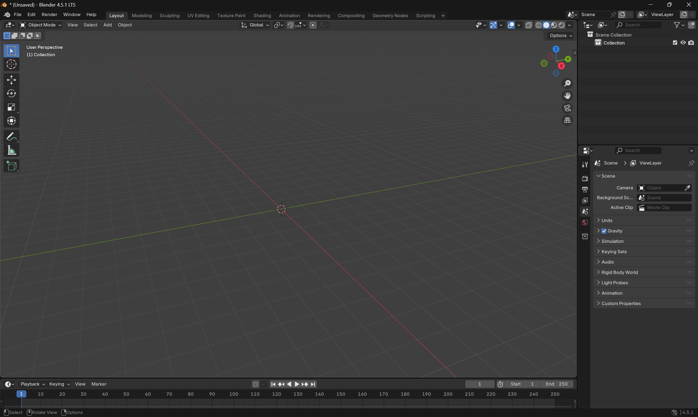
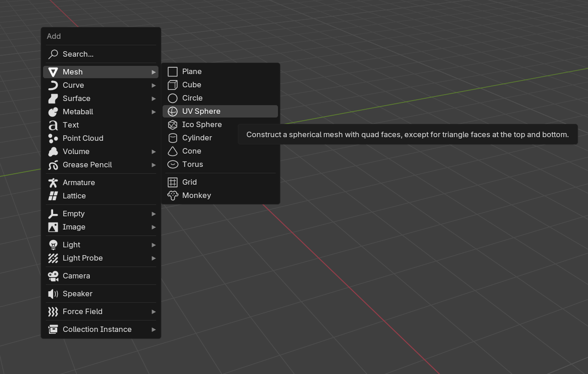
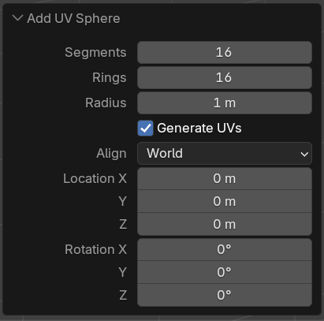
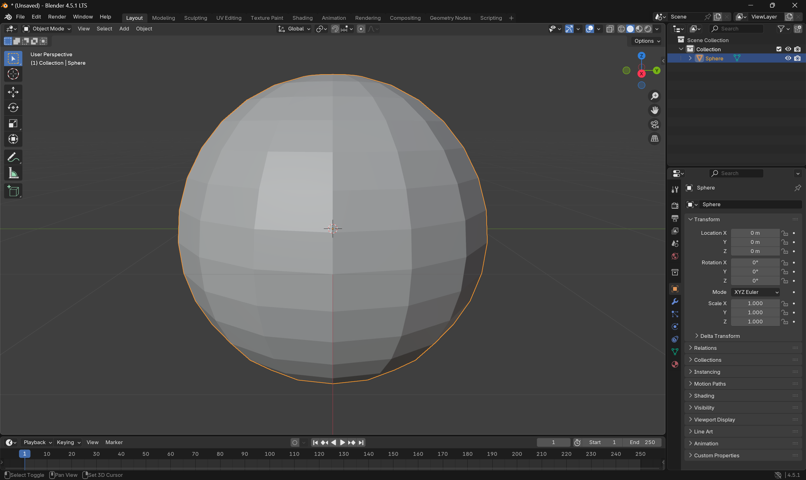
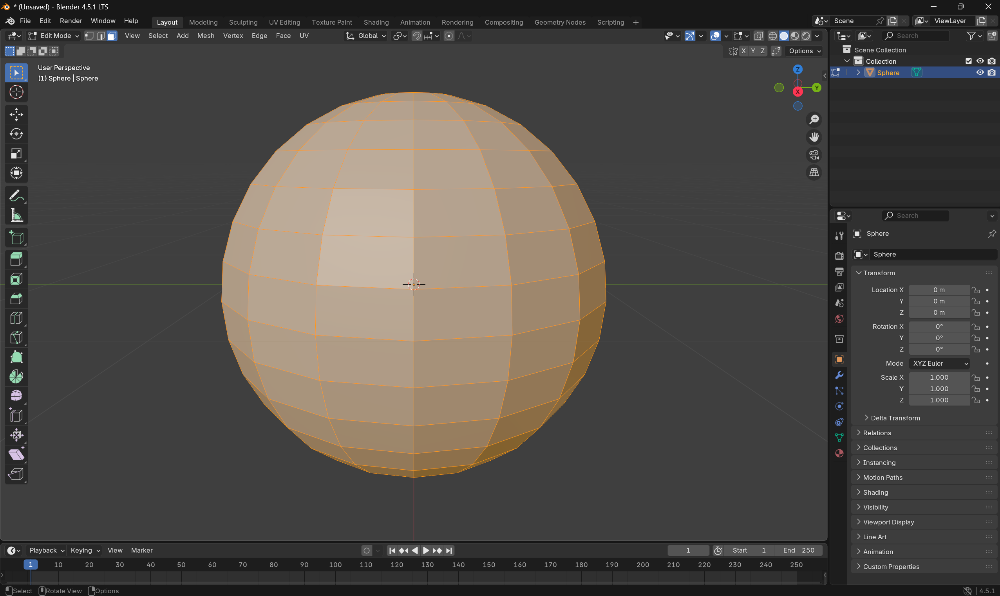
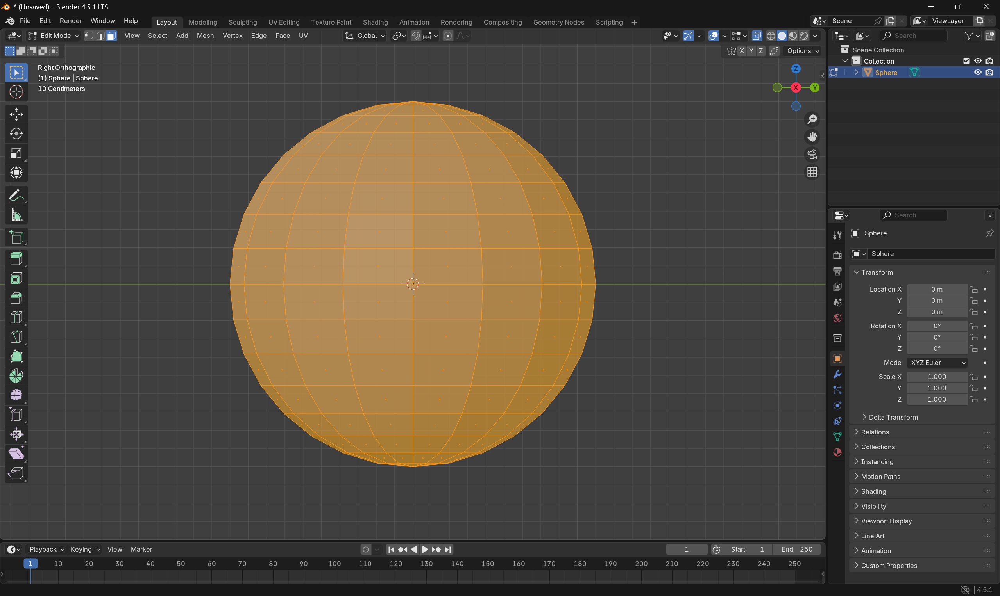
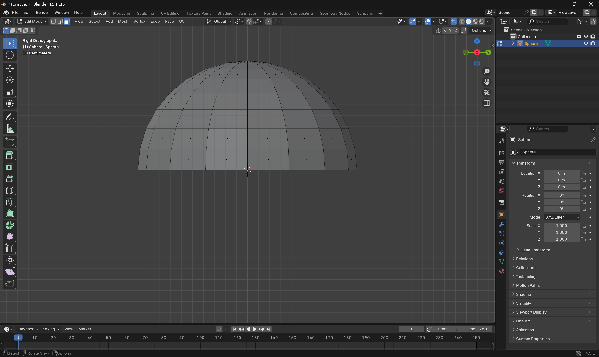

# Modeling A Basketball With Baked Textures

---

## Table of Contents
- [Introduction](#introduction)
- [Learning Objectives](#learning-objectives)
- [Part 1: Modeling In Blender](#step-1-open-blender-and-clear-the-scene)
- [Part 2: Bake Textures](#part-2-baking-and-importing-the-basketball-into-horizon-worlds)
- [Part 3: Export as FBX](#step-20-export-as-fbx)
- [Part 4: Import into Horizon Worlds](#step-21-import-into-horizon-worlds)

---

## Introduction
**Creator Skill Level:** All levels  
**Required Background Knowledge:** None  
**Recommended Background Knowledge:** Blender basics (navigating the viewport, selections, hotkeys)

**Description:**  
In this tutorial, you’ll model a basketball using Blender’s core mesh tools—starting from a UV sphere, shaping the iconic grooves, then preparing the model for Horizon Worlds. We’ll keep things performance-friendly for VR while showing both **hotkey** and **menu** paths so creators at every comfort level can follow along.

---

## Learning Objectives
By the end, you’ll be able to:  
- Create a basketball in Blender  
- Use the **Mirror Modifier** for symmetry  
- Bake multiple textures to one image
- Import a model into Horizon Worlds Desktop Editor

## Step 1: Open Blender and Clear the Scene
When you open a fresh Blender file, it usually has a cube, camera, and light. We don’t need them.

- **Hotkey:**  Close dialog. Press `A` → `X` → `Enter` to delete 
- **Menu:** `Select → All`, then right-click → `Delete`

---

**Optional Video Resource:**
<iframe width="560" height="315" src="https://www.youtube.com/embed/qXSKMLpbUXQ?si=iWBO9NZnvLK_e2ow" title="YouTube video player" frameborder="0" allow="accelerometer; autoplay; clipboard-write; encrypted-media; gyroscope; picture-in-picture; web-share" referrerpolicy="strict-origin-when-cross-origin" allowfullscreen></iframe>

---

## Step 2: Add a Sphere
Add the base shape.

- **Hotkey:** `Shift + A → Mesh → UV Sphere`  
- **Menu:** `Add → Mesh → UV Sphere`  
- In the “**Add UV Sphere**” panel (bottom-left), set **Segments = 16**

---

## Step 3: Delete the Bottom Half of the Sphere

### Select the Sphere for Editing
- Click the sphere to select it, then with the mouse hovering over the sphere:
- **Hotkey:** `Numpad .` to focus the selection (may also be mapped to `\`)
- **Menu:** `View → Frame Selected`

### Enter Edit Mode
- **Hotkey:** `Tab`  
- **Menu:** Mode dropdown → `Edit Mode`

### Switch to Side View
- **Hotkey:** `Numpad 3`  
- **Menu:** Click the red **X-axis view** icon

### Turn on X-Ray Mode
Lets you select **through** the mesh.

- **Hotkey:** `Alt + Z`  
- **Menu:** Toggle **X-Ray** (overlapping squares, top-right)

### Select and Delete the Bottom Half
- **Switch To Face Selection Mode** (`3` hotkey, or the overlapping squares in top-left)
- **Box Select (B)** or drag-select the entire bottom half  
- **Hotkey:** `X → Delete Faces`  
- **Menu:** Right-click → `Delete Faces`

### Turn X-Ray Mode Off
- **Hotkey:** `Alt + Z`  
- **Menu:** Click **X-Ray** again

---

## Step 4: Add a Mirror Modifier
- **Properties → Modifiers (wrench)** → `Add Modifier → Mirror`  
- Enable **Z axis**

---

## Step 5: Delete the Top Pole Vertex
- Orient camera to look at the top half (click mouse wheel, or scroll down on track pad)
- Switch to **Vertex Select mode** (`1` hotkey or Vertex Select icon in the top left)  
- Select the **top pole vertex**  
- Delete:  
  - **Hotkey:** `X → Vertices`  
  - **Menu:** `Edit → Delete → Vertices`

---

## Step 6: Bridge the Edge Loops
- Select the **14 surrounding vertices**, leave the 2 center ones unselected.
- **Note:** hold shift while selecting verts to select more than one at a time.
- Then, **Menu:** `Edge → Bridge Edge Loops`.

---

## Step 7: Add a Loop Cut in the Center
- **Hotkey:** `Ctrl + R`, hover over selection, left-click in the center twice, or press escape `esc` to center the cut line.
- **Note** In the left side tool menu is a loop cut tool.

---

## Step 8: Merge the Outer Vertices
- **Select Pairs:** see picture below.
- **Hotkey:** `M → At Center`  
- **Menu:** `Mesh → Merge → At Center`

---

## Step 9: Scale Vertices Inward Slightly
- Ensure **Vertex Select** mode (`1`)  
- Select the **five center vertices**

- Scale inward slightly:  
  - **Hotkey:** `S` pulling the lines slightly inward (see picture below)
  - Optionally use the **Toolbar:** Scale tool (square with arrows)
  - **Note:** if your scale is not close enough to that seen in the picture, in the bottom left you can adjust the values to `0.80`

---

## Step 10: Bevel the Grooves
- Switch to **Edge Select** (`2`)  
- Select 4 loops: `Alt + Left-Click` first → `Shift + Alt + Left-Click` the rest
  

- Bevel:  
  - **Hotkey:** `Ctrl/Command + B` → scroll wheel to 3 segments (**Note** you must use `command + B` on Mac)
  - **Menu:** `Edge → Bevel Edges → Segments = 3`  
  - **Toolbar:** Bevel tool (angled lines + dot)
  - **Note:** when done, you can adjust segments from the bottom left menu if it isn't already at 3, and width to 0.02

---

## Step 11: Shrink Selection
- **Shrink Selection:** `Ctrl + Numpad -` or `Select → More/Less → Less`

- **Scale Faces:**  
  - `S` hotkey, move mouse down to indent (see picture below) 
  - `Mesh → Transform → Scale`  
  - Scale tool (toolbar)

### Add Orange Material
- Switch to **Material Preview** (`Z → Material Preview`) or top right `Viewport Shading` globe icon
- Select the red ball Material icon to open the `Material Properties`
- **Material Properties → + New** → name `Basketball` → set color = orange  
- Blender assigns the color to the whole ball

### Add Black Groove Material
- With grooves selected → `+` slot → `+ New` → name `Grooves` → set color = black → **Assign**

---

## Step 12: Merge the Halves
- **Mirror Modifier → Merge Distance** until seam closes

---

## Step 13: Optional — Subdivision Modifier
- **Hotkey:** `Ctrl + 1/2/3`  
- **Menu:** Add Modifier → `Subdivision Surface`

---

## Step 14: Finalize the Basketball
1. **Remove Subdivision (optional):** Delete from Modifiers tab
   - If you added a Subdivision Surface modifier earlier but prefer the basketball to stay low-poly for performance, you can remove it.
   - In the **Properties panel → Modifiers tab (wrench icon)**, click the **X** next to the Subdivision Surface modifier to delete it.
2. **Return to Object Mode:** `Tab`

3. **Apply Mirror Modifier:** Modifiers tab → Arrow Dropdown `Apply` (**Important** you must be in `Object Mode`)

4. **Shade Options:**  
   - **Shade Smooth:** right-click → Shade Smooth  
   - **Shade Auto Smooth:** right-click → Shade Auto Smooth → tweak **Smooth by Angle** → Apply modifier  

## Note

Performance in Horizon Worlds matters. While Subdivision can make your basketball look smoother, it also increases polygon count. If your world already has a lot going on, keep it low-poly — trust me, no one’s going to count the segments of your basketball while they’re shooting hoops!

---

# Part 2: Baking and Importing the Basketball into Horizon Worlds

## Introduction

Now that your basketball is modeled and shaded smooth, the next step is to bake its materials into a single image texture and prepare it for Horizon Worlds. Baking combines all the materials (orange ball and black grooves) into one optimized PNG file, which we’ll then apply back to the ball before exporting. This ensures the basketball looks great and performs efficiently in Horizon.

---

## Step 15: Set Up for Baking
1. Switch to **UV Editing** workspace  
2. Enter **Edit Mode** 
3. Select off in the distance to deselect all 
4. In **Material Properties** click on the **Basketball** material and then hit the select button below it to only select the orange parts of the model
   - Press (`U → Unwrap Minimum Stretch`)

4. Click off to the side of the model in edit mode to deselect the orange material. Then in **Material Properties** click on the **Grooves** material and then hit the select button below it to only select the black parts of the model
   - Press (`U → Unwrap Minimum Stretch`)

  
5. Adjust UVs: move/scaling grooves so nothing overlaps
   - Use the hotkey **A** while your mouse is hovered over the UV texture panel. Now you should have only the groove UV’s all selected
   - Press the hotkey **S** to scale them down and then **G** to move them into the top left corner, so that they **don’t overlap** the **Basketball material** colors in the **UV Map**
   - While hovering over the model in edit mode use the hotkey **A** to select everything so you can make sure none of the UV’s are overlapping
   

---

## Step 16: Create a New Bake Image
- UV Editor → **+ New**  
- Name: `BBall_BR`  
- Size: `1024x1024` (or 128x128 for optimization)
- Click **New Image**

---

## Step 17: Bake the Diffuse Map
1. Switch to **Shading** workspace

2. In the Properties panel → Render tab (camera icon), change the Render Engine to Cycles.
   - **Baking** will not work in Eevee — you **must be in Cycles**

3. In the **Shader Editor**, confirm both materials (**Basketball** and **Grooves**) are still applied from the `Slot 1` drop down. If you see both materials on the ball, then they are applied
4. Add **Image Texture node** (`Shift + A → Texture → Image Texture`) → select `BBall_BR`

   - Important: You’ll need to do this for both materials
   - Use the **material dropdown** (top bar in the Shader Editor) to switch between **Basketball** and **Groove**
   - In each one, make sure the Image Texture node with **BBall_BR** is selected (the image panel will be lightly outlined in white)
   - This tells Blender where to bake the color information

5. In the **Render tab** → **Bake** section:
  - First, set **Bake Type** = **Diffuse**
  - Then, Under Contributions, uncheck **Direct** and **Indirect**, leaving only **Color** selected

6. Click **Bake**

### Troubleshooting: Why Black/One Color?
- Ensure node is **active in both materials**  
- Node must be set to `BBall_BR`  
- Must be using **Cycles**, not Eevee

---

## Step 18: Save the Baked Texture
- UV Editor → **Image → Save As** → `BBall_BR.png`
- Save the image as **BBall_BR.png** in a folder you’ll remember

---

## Step 19: Replace Materials with Baked Texture
To make the model clean and Horizon-ready, we’ll swap the multiple materials for one single baked material
- Switch to Layout workspace  
- In the **Material tab**, remove the old Basketball and Grooves materials (click the **minus icon**)

- Click **+ New** to create a new material → name `BBall`

- In the Shader Editor, click the yellow dot next to Base Color and add an **Image Texture node**

- Open the **BBall_BR.png** you saved

- Click **Open Image** to connect the **Image Texture** to the **Base Color** of the Principled BSDF

---

## Step 20: Export as FBX
- `File → Export → FBX (.fbx)`  
- Name `Basketball.fbx`  
- Click **Export FBX**

---

## Step 21: Import into Horizon Worlds
- Open Horizon Worlds Desktop Editor and go into the world you want to add the Basketball into
- Assets → **+ Add New → 3D Model**  
- Import `Basketball.fbx` and `BBall_BR.png`
- Uncheck **Preserve Offset Pivots** 

- Press **Import**
- Once imported, drag the basketball into your scene. Adjust it to your liking and have fun! Great Job!

---

## Note
Baking down to one texture keeps models **lightweight** and reduces **draw calls**.
