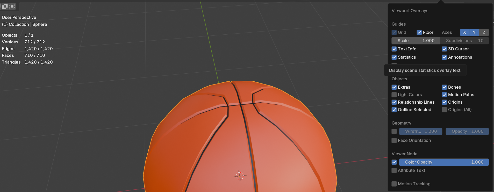

# Blender Tips & Tricks (for Horizon Worlds)

## Introduction  
**Creator Skill Level:** All Levels  
**Required Background Knowledge:** None  
**Recommended Background Knowledge:** Blender basics (viewport navigation, selecting objects, applying modifiers)  

**Description**  
In this tutorial, we’ll walk through essential Blender tips that are especially helpful for Horizon Worlds creators. These aren’t just abstract tricks — they’re the everyday shortcuts, optimizations, and workflows you’ll use when building worlds. By the end, you’ll know how to navigate faster, prepare models correctly, optimize geometry, and work with materials and UVs so everything looks right once imported into Horizon.  

---

## Table of Contents  
- [Frame Selected, Orbit, and Hand Grab](#frame-selected-orbit-and-hand-grab)  
- [Stats and Scene Scale](#stats-and-scene-scale)  
- [Shade Smooth / Flat](#shade-smooth--flat)  
- [Preview Modes & Backface Culling](#preview-modes--backface-culling)  
- [Double Verts, Flip Normals, Merge](#double-verts-flip-normals-merge)  
- [Triangles, Quads, and Ngons](#triangles-quads-and-ngons)  
- [Subdivide for Better Lighting](#subdivide-for-better-lighting)  
- [Boolean Cuts (Windows, Doors, Shapes)](#boolean-cuts-windows-doors-shapes)  
- [Separate by Material & Selection](#separate-by-material--selection)  
- [Optimization Tricks](#optimization-tricks)  
- [UV Color Atlas Workflow](#uv-color-atlas-workflow)  
- [Vertex Painting](#vertex-painting)  
- [Custom UV Projections](#custom-uv-projections)  
- [Inverted Shapes (Inside-Out Objects)](#inverted-shapes-inside-out-objects)  
- [Hotkey Cheat Sheet](#hotkey-cheat-sheet)  
- [Conclusion](#conclusion)  

---

**Video Resource:**
<iframe width="560" height="315" src="https://www.youtube.com/embed/8bHN0iHSCpk?si=xu4bSxr04fzox63t" title="YouTube video player" frameborder="0" allow="accelerometer; autoplay; clipboard-write; encrypted-media; gyroscope; picture-in-picture; web-share" referrerpolicy="strict-origin-when-cross-origin" allowfullscreen></iframe>   

**Note:** video is very helpful for visualizing some of these, there are images below too, and detailed step by step instructions.

---

## Frame Selected, Orbit, and Hand Grab  
- **Frame Selected**: Press **Numpad . (period)** to zoom to your object. If you don’t have a numpad: `View → Frame Selected` or `\`.  
- **Orbit**: Hold **Middle Mouse Button** to rotate around your selection. Add **Shift** (to pan) or **Ctrl** (to zoom). On track pads, try scrolling.  
- **Hand Grab**: Hold **Shift + Middle Mouse Button** to drag the viewport like a hand tool. You can also click the **Hand Icon** in the top toolbar to enable grab mode.  

---

## Stats and Scene Scale  
Enable **Statistics** under *Viewport Overlays*. This shows verts, faces, tris, and memory usage. Crucial for Horizon since vertex counts double when importing.  
- Horizon budgets are limited — keep an eye on these numbers as you build.  

---

## Shade Smooth / Flat  
- **While In Object Mode** select an object, then:
- **Right-Click → Shade Smooth** makes geometry appear soft.  
- **Right-Click → Shade Flat** keeps edges sharp.  
- **Auto Smooth** lets you define angles where smoothing breaks.  

  

---

## Preview Modes & Backface Culling  
- Switch between **Solid, Material Preview, Rendered** views for different checks.  
- Use **Wireframe (Z → Wireframe)** to check geometry.  
- **Backface Culling** is critical — Horizon doesn’t render backfaces. Turn this on in *Material Properties* to preview correctly.  

---

## Double Verts, Flip Normals, Merge  
- Remove duplicate verts: **M → By Distance**.  
- Fix inverted faces: **Alt+N → Flip Normals**.  
- Merge verts: **M → At Center**.  

**Doubling geometry for two-sided faces**:  
1. In **Edit Mode**, press **A** to select the mesh.  
2. Use **Shift+D** to duplicate.  
3. Immediately press **Esc** so the duplicate stays aligned in the same place.  
4. Flip the normals (**Alt+N → Flip**) so one copy faces outward and the other inward.  

This creates double-sided geometry that looks correct in Horizon.  

---

## Triangles, Quads, and Ngons  
- Horizon only supports **tris (3-sided faces)**, and will allow importing of **quads (4-sided faces)** by automatically converting to **tris**.  
- An **n-gon** is any face with more than 4 sides (like a pentagon, hexagon, etc.). Horizon doesn’t support these — they must be triangulated.  
- Always **triangulate** models with the **Triangulate Modifier** before exporting.
- **Note:** recommend keeping things triangulated in Blender so you can better see what they will look like before being brought into Horizon Worlds.

---

## Subdivide for Better Lighting  
Lighting in Horizon is calculated per triangle, this means you need more for better highlights and shadows. 

To subdivide:  
1. Enter **Edit Mode**.  
2. Select the part of the mesh you want to add detail to.  
3. Right-click → **Subdivide**.  

This adds more verts and faces, improving how light interacts. Be selective to avoid unnecessary extra geometry.
**Example:** imagine a campfire on a beach, you could subdivide the triangles near the fire so that it can cast light.

---

## Boolean Cuts (Windows, Doors, Shapes)  
Booleans let you use one shape to cut into another.  

Step-by-step:  
1. Create the object you want to **cut into** (e.g., a wall or cube).  
2. Create the object that will act as the **cutter** (e.g., a smaller cube for a window).  
3. Select the object to be cut, then go to **Modifiers → Add Modifier → Boolean**.  
4. Set Operation to **Difference**.  
5. Use the eyedropper (or dropdown) to select the cutter object.  
6. Apply the modifier, then delete or hide the cutter object.  

⚠ Booleans often create n-gons — remember to **triangulate afterwards**.  

---

## Separate by Material & Selection  
Sometimes you’ll want to split part of a model into its own object. Blender gives you two main ways:  

1. **Separate by Selection**  
   - Go into **Edit Mode**.  
   - Select the part of the mesh you want to split (faces, edges, or verts).  
   - Press **P → Selection**.  
   - The selected geometry becomes a new object.  

2. **Separate by Material**  
   - In **Edit Mode**, go to **Mesh → Separate → By Material**.  
   - Blender will automatically create new objects based on material assignments.  

3. **Select Linked Geometry (L)**  
   - In **Edit Mode**, hover your mouse over any connected part of a mesh.  
   - Press **L** to select the whole linked piece.  
   - Useful if you want to split out one piece of foliage, a single prop, or a duplicated mesh chunk.  

---

## Optimization Tricks  
Horizon has strict performance budgets. These tools keep models efficient:  

### Decimate Modifier  
1. Select your object.  
2. Add Modifier → **Decimate**.  
3. Choose a mode:  
   - **Collapse**: reduces geometry by percentage.  
   - **Planar**: merges flat surfaces under a set angle.  
   - **Unsubdivide**: removes edge loops where possible.  
4. Always **Apply** the modifier once you’re happy.

**Note:** you may even try applying one of these, and then alternating another.  

### Dissolve Geometry  
Only works in **Edit Mode** with geometry selected.  
- **X → Dissolve Verts/Faces/Edges** removes geometry cleanly without leaving holes.  
   - **Verts**: removes extra points.  
   - **Edges**: removes edge loops.  
   - **Faces**: merges faces into one.  

This keeps meshes tidy and lowers vert counts.  **Important:** don't forget to triangulate after dissolving.

### Other Cleanup Tools  
- **Join (Ctrl+J)**: combine objects into one to reduce draw calls.  
- **Delete Faces/Verts**: remove unseen geometry (like the underside of terrain).  

---

## UV Color Atlas Workflow  
Instead of multiple textures, use a single atlas with color blocks:  
1. In **UV Editing**, scale and move UV islands so they sit over a color block.  
2. All models can share this one texture, massively reducing draw calls.  

---

## Vertex Painting  
Vertex painting lets you paint colors directly onto the geometry itself.  

Step-by-step:  
1. Select your object.  
2. Switch to **Vertex Paint Mode** (menu at top left of viewport).  
3. In **Material Properties**, create a new material named `Object_VXC`.  
4. In the shader, set **Base Color → Attribute → Color Attribute** to display the vertex paint.  
5. Paint using the brush tools.
6. Exported FBX can be uploaded without a texture. To upload with a BR texture, name the material `Object_VXM`.

⚠ Horizon ignores the **alpha channel of vertex colors** — only RGB shows up.  

---

## Custom UV Projections  
Different projection types give better results depending on shape:  
- **Cube Projection**  
- **Cylinder Projection**  
- **Sphere Projection**  
- **Project From View (Bounds)**: maps UVs directly from your camera angle, easiest and seamless (but stretches in some areas).  

Try different projections to reduce stretching and make textures look clean.  

---

## Inverted Shapes (Inside-Out Objects)  
- In **Edit Mode**, select all faces.  
- Go to **Mesh → Normals → Flip**.  
- The model now renders from the inside out.  

Use this for things like glowing or magical “interior-only” objects (ie. a cccrystal ball).  

---

## Hotkey Cheat Sheet  

### Navigation  
- Frame Selected: **Numpad . (period)**  or `\` for some users
- Orbit: **Middle Mouse Button Drag**  or scroll for track pads
- Hand Grab: **Shift + Middle Mouse Button**  

### Editing Geometry  
- Merge by Distance: **M → By Distance**  
- Merge at Center: **M → At Center**  
- Flip Normals: **Alt+N → Flip**  
- Subdivide: **Right-Click → Subdivide**  
- Dissolve: **X → Dissolve Verts/Faces/Edges**  
- Delete: **X → Delete**  
- Select Linked: **L**  

### Object Tools  
- Duplicate: **Shift+D**  
- Join Objects: **Ctrl+J**  
- Apply Modifier: **Ctrl+A (Apply)**  
- Boolean Difference: **Add Modifier → Boolean → Difference**  

---

## Conclusion  
Blender has endless features, but these are the ones you’ll use constantly when building for Horizon Worlds. From proper triangulation and UV prep to draw call optimization and material naming, mastering these will make your workflow smoother and your worlds more performant.  

Remember:  
- **Always triangulate before exporting.**  
- **Keep verts and textures low.**  
- **Use Horizon’s material naming rules.**  

With these tricks, you’re ready to create clean, optimized, and great-looking models for Horizon.  
