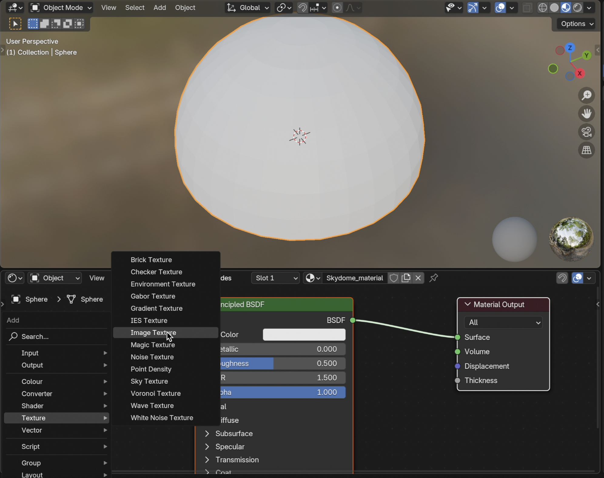
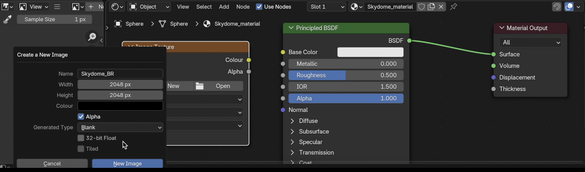
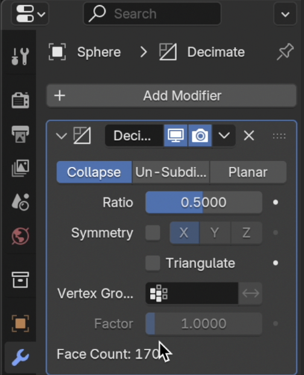
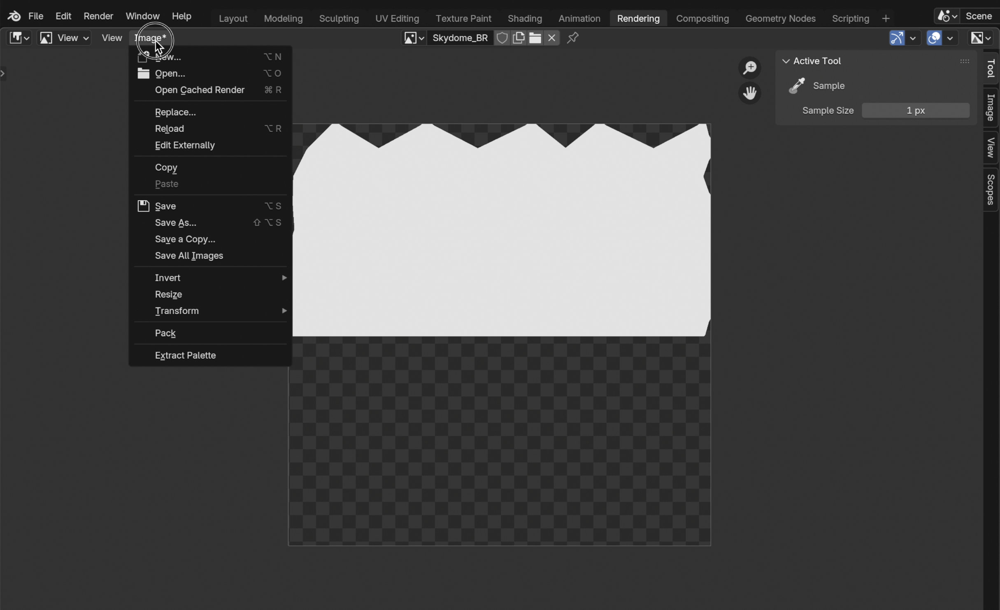
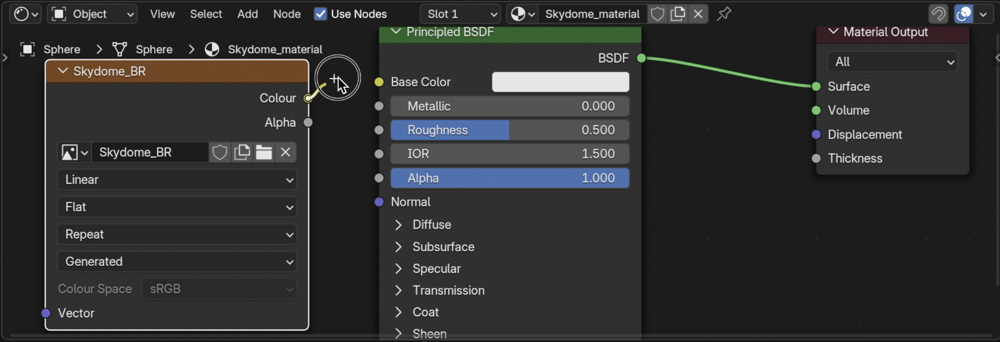

# Dynamic Colour Changing Skydome: From Blender to a Horizon World

This guide walks you through creating a low-poly skydome in **Blender**, optimising it, and exporting it as an `.fbx` file ready for Horizon Worlds. Connect the skydome to code to create a dynamic colour changing effect.

## Demo

Here’s a quick preview of the result in action:


---
## Prepare Low-Poly Skydome in Blender


## Step 1: Prepare Blender

1. [Download Blender](https://www.blender.org/download/) (latest version). If you don't already have it installed.
2. Switch to **Layout Workspace** for easy modelling if you are not already in the workspace.

3. Open Blender → Delete default cube (`X` → Delete).


---

## Step 2: Add a Sphere for the Skydome


1. `Shift + A` → Mesh → **UV Sphere**.

2. In the bottom-left panel (or press `F9`):
   - **Segments:** 32 (can reduce later for performance).
   - **Rings:** 16.

    

3. Scale up: `S` → type `50` → `Enter` (or larger as needed).


4. Flip Normals:
   - Press **Tab** Go to **Edit Mode** → Select All (`A`).
   - `Alt + N` → **Flip**.

---

## Step 3: Convert Sphere to a Dome

1. In **Edit Mode**, enable **Face Select**.


2. Select the **bottom half** (box select or circle select).


3. `X` → **Delete Faces**.

4. Now you have an open hemisphere dome.


---

## Step 4: Apply Transformations


1. `Ctrl + A` → **Apply All Transforms** (Location, Rotation, Scale).  
   Ensures correct scale when importing into Horizon.

---

## Step 5: Add Material


- Switch to **Shading Workspace**. 


- In **Material Properties**:

  1. Click **+ New** → Rename to **Skydome_material** → Use Default Base Colour: white.



  2. Add a new **Image Texture** node:  
   `Shift + A` → Texture → **Image Texture**.

   

  3. Click **New**, name it `Skydome_BR`.
   - **Size:** `2048 x 2048` (power of 2).  
   - **Color:** Black (default is fine).  

  4. Click **OK**.  

  5. In the Image Texture node, click **Select** so it’s active. (Don't connect yet)
 
- Best Practice: Use **one material** for performance. You can swap colours in code. 

---

## Step 6: Optimise Polygon Count
 

1. Switch to **Layout Workspace**. Object Mode → Select dome

 

2. Select Modifier tab → **Modifier Properties** → **Decimate Modifier**.

 

3. Set **Ratio**: 0.5 (50% poly reduction).

 

4. Apply modifier.

5. Check poly count: Top bar → **Object Properties → Statistics**.  
   This is a small model, but it is still good practice!

6. Save your file.

---


## Step 7: UV Unwrap for Textures

 

1. In **Edit Mode**: 

2. Select all faces (`A`).

3. Press `U` → **Smart UV Project**.

4. Accept defaults → Done.

---

## Step 8: Bake the Flat Color

 

1. Switch to **Render Properties** → set engine to **Cycles**.

 

2. Under **Bake**:  
   - **Bake Type:** Diffuse  
   - **Influence:** Only **Color** checked

 

3. With the material and the Image Texture node active:  
   - Click **Bake**.

 

4. When done, in the **UV/Image Editor**, save the image:  
   `Image → Save As → SkydomeMaterial_BR.png`.

You now have a **PNG texture** with your flat color baked.

---

## Step 9: Apply the Baked Texture to the Material


 

1. In **Shader Editor**:  
   - Plug your `Image Texture` node (`Skydome_BR.png`) into **Base Color** of the Principled BSDF.  
   - Remove all other nodes except the **Principled BSDF** and the **Image Texture**.  
2. Your material is now **texture-based** (so Horizon can read it).

 

3. Switch to material viewport. To preview the material. 
---


## Step 10: Export as FBX


 

1. File → **Export → FBX**.

2. Settings:
   - **Scale:** 1.00
   - **Apply Transform**
   - **Path Mode:** Copy (click **Embed Textures** if using any)
   - **Limit To:** Selected Objects
3. Save as `Skydome.fbx`.

---
Now you have:
- `Skydome.fbx` 
- `Skydome_BR.png

You now have a **low-poly skydome FBX** ready to use in Horizon Worlds.


---
## Upload to Horizon World Editor Using the Web.


## Step 1: Go to your account 
Go to the web portal for your creator account [Horizon World Creator assets page ](https://horizon.meta.com/creator/)  (login if you haven't already.)


1. Click → **Import.


2. Upload the two files:
   - **Skydome.fbx**
   - **Skydome_BR.png**
 
That's it!

---
## Create A Dynamic Sky in Horizon World

# Dynamic Skydome System

The next part of this tutorial shows how to set up the **Dynamic Skydome** in Horizon Worlds, using the skydome and a dynamic sky controller script.

---

## Step 1: Place skydome in the world

1.  **Drag** or **Right click** and place the dome in the world.
  (you should see the skydome model referenced in the Hierarchy)
  **Press F** to zoom out and see the skydome.


2. Move the skydome’s **position** property, if it is too high.


That's it. It's time to Code!

---

## Step 2: Dynamic Controller Script


Create a `Dynamic Sky Controller ` script that:

- Tracks current sky (`0–3`) from and array of colours.
- Shows only the correct colour.
- Fires a timed event when the colour changes.


1.  **Attach** script to the skydome.
2.  **Double click** the script `Dynamic Sky Controller ` script to open in your Code Editor.


## Step 3: 
### In your code editor: 
It opens the new class attached to the Skydome Entity.
```typescript
import * as hz from 'horizon/core';

class DynamicSkyController extends hz.Component<typeof DynamicSkyController> {
 static propsDefinition = {};
  
  start() {  }

   }
hz.Component.register(DynamicSkyController);
   ```
Let's think about what the code needs to do.
The code needs to do three things:
- Create colours.
- Change skydome with colours.
- Change colours at a random time.

At the **top** of the DynamicSkyController class.

Add: 
1.  Create an array of colours.
```typescript
//Sky Colours
private skyColours = [ new hz.Color(1,0,1), //Red
   new hz.Color(0,1,0),//Green
    new hz.Color(0,0,1), //Blue
     new hz.Color(1,1,0), //Yellow
     ]

    

```
N.B. You can add as many colours as you want or different colours it's up to you!

---

Add: 
2. A number property to access the colours in the array.
```typescript
 private currentSkyNumber = 0;
```
---

Add:
3. Create a const colour variable from one of the colours in the array. 

```typescript

start() {
 const selectedColour = this.skyColours[this.currentSkyNumber];
}
```
---

Add: 
4. Access the mesh of the entity (skydome) by casting it as **MeshEntity** and access the **tintColor** property of this entity. Set it to change with **selectedColour**.
```typescript

start() {
 const selectedColour = this.skyColours[this.currentSkyNumber];
//Access the mesh property of this entity And change tint colour
  const skyMesh = this.entity.as(hz.MeshEntity);
   skyMesh.style.tintColor.set(selectedColour);
   skyMesh.style.tintStrength.set(1);
}
```

---
## Test the skydome change effect.
1. **ctrl + S** to save and return to the editor.
2. **Press play** in Build mode.
3. Check the Skydome has changed colour. It should be red if your **currentSkyNumber** is set to 0: 


---
Add: 

The code needs to run more than once. Let's create a new function to do this.
5. 
- Create a function called **applySkyTint**

- Move the code from start into this function

- In start call this **applySkyTint**

- Return to the world and test the dome changes. 

```typescript
start() {
this.applySkyTint();
  }

//change skydome
  private applySkyTint()
  {
 const selectedColour = this.skyColours[this.currentSkyNumber];
//Access the mesh property of this entity And change tint colour
  const skyMesh = this.entity.as(hz.MeshEntity);
   skyMesh.style.tintColor.set(selectedColour);
   skyMesh.style.tintStrength.set(1);
}
```

---
Add: 

6. Create a timing function

- Create a function called **scheduleNextSkyColour**

- It uses a timer set to 3 seconds to get a random number with the upper limit of the **skyColours.length**, call: **applySkyTint** function.

- In **start** call this **scheduleNextSkyColour** function.

- Return to the world and test the dome changes.

- It should change twice and 3 seconds later change again. 

```typescript
start() {
   this.applySkyTint();
   this.scheduleNextSkyColour();
  }


//change colours randomly at a set time
  private scheduleNextSkyColour()
  {
   this.async.setTimeout(() => {
      this.currentSkyNumber = (this.currentSkyNumber + 1 ) % this.skyColours.length;
      this.applySkyTint();
 
    }, 3000);
  }
```
---
7. Call the function **scheduleNextSkyColour** within the method


```typescript
//change colours randomly at a set time
  private scheduleNextSkyColour()
  {
   this.async.setTimeout(() => {
      this.currentSkyNumber = (this.currentSkyNumber + 1 ) % this.skyColours.length;
      this.applySkyTint();
      //new code
     this.scheduleNextSkyColour();
    }, 3000);
  }
```
---

## Summary


- Created and optimised a **low-poly skydome** in Blender.
- **Baked flat color texture** into a PNG for compatibility. 
- Export a ready-to-use **FBX with embedded textures** for Horizon Worlds.   
- Created skydome entity with **colour variations** using the skydome's controller script.  
---

Helper Links to Learn More:
[https://developers.meta.com/horizon-worlds/reference/2.0.0/core_meshentity](https://developers.meta.com/horizon-worlds/reference/2.0.0/core_meshentity)

Thanks for reading, I hope you find this tutorial useful. Comments are welcome as I am learning too!

## Demo

Here’s a quick preview of the result in action:


Full script: 
```typescript
import * as hz from 'horizon/core';

class DynamicSkyController extends hz.Component<typeof DynamicSkyController> {
  static propsDefinition = {};
//Tasks
//Create Colours
//Change skydome with colours
//Change colours randomly at a set time

//Sky Colours
private skyColours = [ new hz.Color(1,0,1), //Red
   new hz.Color(0,1,0),//Green
   new hz.Color(0,0,1), //Blue
   new hz.Color(1,1,0), //Yellow
     ]
private currentSkyNumber = 0;

  start() {
   this.scheduleNextSkyColour();
  }

  //change skydome
  private applySkyTint()
  {
   const selectedColour = this.skyColours[this.currentSkyNumber];
   const skyMesh = this.entity.as(hz.MeshEntity);
   skyMesh.style.tintColor.set(selectedColour);
   skyMesh.style.tintStrength.set(1);
  }

  //change colours randomly at a set time
  private scheduleNextSkyColour()
  {
    this.async.setTimeout(() => {
      this.currentSkyNumber = (this.currentSkyNumber + 1 ) % this.skyColours.length;
      this.applySkyTint();
      this.scheduleNextSkyColour();
    }, 3000);
  }
}
hz.Component.register(DynamicSkyController);

```