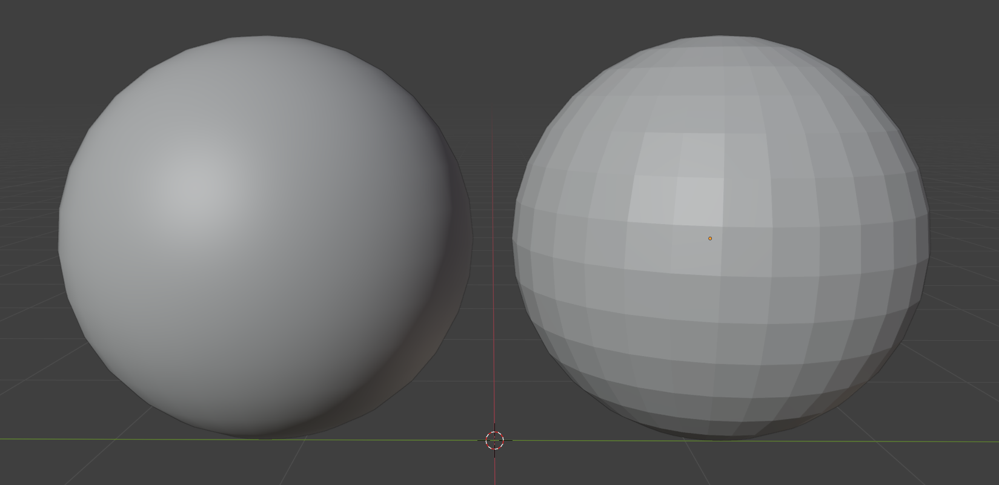
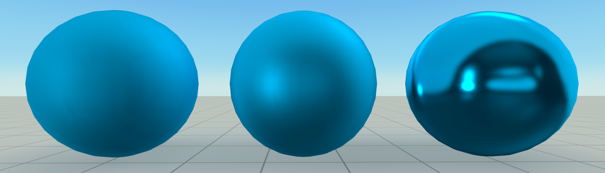
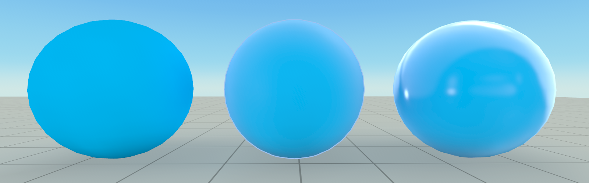
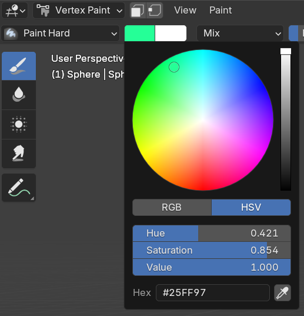
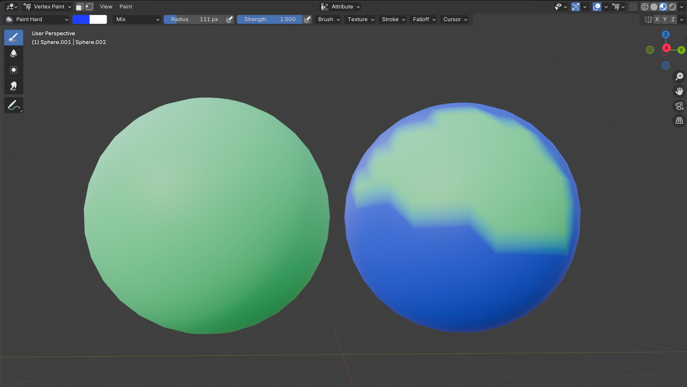

# Comprehensive Guide To Model Importing

> Learn how to import custom models into Horizon and the various options therein: textures, vertex colors, metal, roughness, shade flat/smooth, masking, transparency, User Interface Optimized (UIO), unlit, emission, and occlusion.

---

## Table of Contents

* [Overview](#overview)
* [Prerequisites](#prerequisites)
* [Learning Objectives](#learning-objectives)
* [Quick Start](#quick-start)
* [Import Naming Reference](#import-naming-reference)

* [Naming Conventions](#naming-conventions)
* [Examples Matrix](#examples-matrix)
* [Shade Flat & Shade Smooth](#shade-flat--shade-smooth)
* [Roughness Examples](#roughness-examples-0-50-100--with--without-metal)
* [Vertex Painting](#vertex-painting-alpha-unsupported)
* [Tips & Notes](#tips--notes)

---

## Overview

This guide explains how to prepare and import custom models into Horizon with the correct **material naming** to match uploaded **texture PNGs**. Correct names ensure the importer automatically wires textures and options (roughness, metal, emission, occlusion, masking, transparency, UIO, unlit).

## Prerequisites

* **Creator Skill Level:** All levels
* **Recommended Background:** Worlds Desktop Editor installed; basic navigation familiarity
* **Software:** Blender (for material names/exports), FBX exporter

## Learning Objectives

By the end, you will be able to:

* Import multiple model types and ensure they look as intended in Horizon
* Apply proper **material - texture** naming so the importer links assets automatically

## Quick Start

1. In Blender, name the material to **match** the base texture name **without** the suffix (e.g., `MyTexture`).
2. Export your mesh as `WhateverYouLike.fbx`.
3. Upload the FBX **with** the corresponding PNG(s) (e.g., `MyTexture_BR.png`).

> **Why naming matters:** The importer uses the underscore **`_`** plus a **suffix** on the PNG filename to detect the type (e.g., `BR`, `BA`, `MEO`, `MESA`). The **material name** in Blender must match the PNG’s **name** (e.g., `MyTexture`).

> **Note:** If your model is already an FBX file, and uses a single texture PNG, you can upload the FBX by itself (it will come in untextured). You can then upload the texture separate, and connect it from the model's properties panel in the Worlds Desktop Editor.

---

**Optional Video Resource:**
<iframe width="560" height="315" src="https://www.youtube.com/embed/Ab57FrqfiqA?si=T0txhfha_S5gKZ7F" title="YouTube video player" frameborder="0" allow="accelerometer; autoplay; clipboard-write; encrypted-media; gyroscope; picture-in-picture; web-share" referrerpolicy="strict-origin-when-cross-origin" allowfullscreen></iframe>

---

## Import Naming Reference

When bringing in materials, reference this quick guide for naming.

> **Important:** An underscore **`_`** in texture filenames is **reserved** for Worlds naming conventions. Use it **only** to introduce the import type suffix (e.g., `_BR`, `_BA`, `_MEO`).

If you’re new to Custom Model Imports (CMI): in Blender, name the material `MyTexture` and upload with a PNG named `MyTexture_BR.png`. The importer pairs them by the shared name **`MyTexture`**.

### Naming Conventions

* **Material (Blender):** `MyTexture`
* **Texture PNG(s):** `MyTexture_<SUFFIX>.png`
* **FBX filename:** any name is fine (e.g., `TexturedModel.fbx`)

**Common Suffixes**

| Suffix | Meaning                                | Typical Channels                                 |
| ------ | -------------------------------------- | ------------------------------------------------ |
| `B`    | Base Color (unlit)                     | RGB = color                                      |
| `BA`   | Base Color + Alpha                     | RGB = color, A = mask/alpha                      |
| `BR`   | Base Color + Roughness                 | RGB = color, A = roughness                       |
| `MEO`  | Metallic / Emission / Occlusion        | R = Metal, G = Emission, B = Occlusion           |
| `MESA` | Metallic / Emission / Specular / Alpha | R = Metal, G = Emission, B = Specular, A = Alpha |

> **Note:** Specular in `MESA` behaves like Occlusion. Setting to 100% means it is not occluded / shaded.

### Examples Matrix

> In all examples, replace **`MyTexture`** with your actual material name. The Blender **material name must match** the png. Blender material may include an optional suffix, shown in the "Blender Material Name" column. For PNGs, the suffixes define the behavior of their RGBA channels.

| FBX Example                             | Import Type                              | Upload With (PNG files)                  | Blender Material Name   | Notes                                                      |
| --------------------------------------- | ---------------------------------------- | ---------------------------------------- | ----------------------- | ---------------------------------------------------------- |
| `TexturedModel.fbx`                     | **Textured Base Color & Roughness (BR)** | `MyTexture_BR.png`                       | `MyTexture`             | —                                                          |
| `TexturedModelWithMetal.fbx`            | **Textured BR & Metal**                  | `MyTexture_BR.png`                       | `MyTexture_Metal`       | Uses material suffix to indicate metal              |
| `TexturedModelWithMEO.fbx`              | **Textured BR & MEO**                    | `MyTexture_BR.png`, `MyTexture_MEO.png`  | `MyTexture`             | Set Occlusion to **100%** to prevent shading               |
| `UnlitModel.fbx`                        | **Unlit Base Color**                     | `MyTexture_B.png`                        | `MyTexture_Unlit`       | Unlit shading                                              |
| `UnlitBlendModel.fbx`                   | **Unlit Blend (BA)**                     | `MyTexture_BA.png`                       | `MyTexture_Blend`       | Alpha used for transparency                                |
| `TransparentModel.fbx`                  | **Transparent (BR & MESA)**              | `MyTexture_BR.png`, `MyTexture_MESA.png` | `MyTexture_Transparent` | Specular acts like Occlusion                      |
| `MaskedModel.fbx`                       | **Masked (BA)**                          | `MyTexture_BA.png`                       | `MyTexture_Masked`      | Alpha is **masked** (partial opacity will be **dithered**) |
| `UIOModel.fbx`                          | **UI Optimized (UIO) BA**                | `MyTexture_BA.png`                       | `MyTexture_UIO`         | Higher mip mapping; also masked                            |
| `VertexPaintedModel.fbx`                | **Vertex Painted**                       | *(no PNG)*                               | `MyTexture_VXC`         | Uses per‑vertex color                                      |
| `TexturedVertexPaintedModel.fbx`        | **Vertex Painted BR**                    | `MyTexture_BR.png`                       | `MyTexture_VXM`         | Vertex color + BR texture                                  |
| `TexturedVertexPaintedModelWithMEO.fbx` | **Vertex Painted BR & MEO**              | `MyTexture_BR.png`, `MyTexture_MEO.png`  | `MyTexture_VXM`         | —                                                          |
| `MaskedTexturedVertexPaintedModel.fbx`  | **Vertex Painted BA**                    | `MyTexture_BA.png`                       | `MyTexture_MaskedVXM`   | Vertex color + masked alpha                                |

## Shade Flat & Shade Smooth

Flat shading displays each polygon face individually (crisp facets). Smooth shading interpolates normals across faces for a rounded look. 

**How to set in Blender**

1. Select mesh → right‑click → **Shade Smooth** (or **Shade Flat**).

---

## Roughness Examples (0-50-100) — With & Without Metal

In **Horizon**, you **do not** adjust a "roughness channel/slider" in the shader. Roughness is determined **solely by the alpha channel of your `BR` PNG**. You author this by **erasing alpha** on the texture in Blender’s **Texture Paint** mode.

> **Important:** The Blender Materials Tab **Roughness** slider does **not** affect Horizon imports. Only the **alpha** in `MyTexture_BR.png` is read.

### Authoring workflow (Blender)

1. **Material & File Naming** (must match exactly)

   * **No Metal:** Blender material name → `MyTexture`; PNG → `MyTexture_BR.png`
   * **With Metal:** Blender material name → `MyTexture_Metal`; PNG → `MyTexture_BR.png`
2. **Paint Roughness via Erase Alpha Brush**

   * Switch to **Texture Paint** workspace.
   * In the brush **Blend** dropdown, choose **Erase Alpha** (instead of *Mix*).
   * Set **Strength** to the amount of alpha you want to remove:

     * **1.0** → removes all alpha → **0% roughness** (very shiny)
     * **0.5** → removes half alpha → **50% roughness**
     * **0.0** (or don’t erase) → keeps full alpha → **100% roughness** (matte)
   * Paint on the texture where you want that roughness level. Optional, you may want to apply your texture as an image texture on the materials tab in Blender to see the UVs of your model to guide erasing the alpha.
3. **Save the Texture**

   * **Image → Save As…** and save as **`MyTexture_BR.png`**.
4. **Export FBX**

   * Back in **Material Properties Tab**, ensure your **material name follows the rules above**.
   * Export **FBX** and upload the **FBX + `MyTexture_BR.png`** to Horizon (include `MEO/MESA` if you’re using metal/emission/occlusion/specular as per your setup).

### Effect table

| Roughness (paint via **Erase Alpha**)                                    | Without Metal (dielectric)     | With Metal                                |
| ------------------------------------------------------------------------ | ------------------------------ | ----------------------------------------- |
| **0% (very shiny)** — Brush **Strength 1.0** → Alpha → **0**             | Very glossy, sharp reflections | Mirror‑like, tinted by base color         |
| **50%** — Brush **Strength 0.5** → Alpha ≈ **0.5**                       | Soft reflections               | Soft metal sheen              |
| **100% (matte)** — **Do not erase**  | Matte, diffused look            | Very flat metal |

### Visual reference

---

## Vertex Painting (Alpha Unsupported)

Vertex painting uses per‑vertex **RGB** color stored on the mesh. **Alpha in vertex colors is not supported**, so opacity must come from texture maps (`BA`/`MESA`) rather than vertex paint.

**Naming for imports**

* **VertexPaintedModel.fbx:** material `MyTexture_VXC` *(vertex color only)*.
* **TexturedVertexPaintedModel.fbx:** material `MyTexture_VXM` + `MyTexture_BR.png` *(vertex color + BR)*.
* **MaskedTexturedVertexPaintedModel.fbx:** material `MyTexture_MaskedVXM` + `MyTexture_BA.png` *(vertex color + mask)*.

**How to paint in Blender (4.x)**

1. Select mesh → switch to **Vertex Paint** from the Edit/Object mode drop down.
2. Paint with the Brush.

---

## Tips & Notes

* Avoid underscores: use **one** underscore only to attach the suffix (e.g., `MyTexture_BR.png` or in Blender: `MyTexture_Metal`).
* Prefer **power‑of‑two** texture sizes (128, 256, 512, 1024).
* For **masked** images, use textures that are cookie cutter like, ie. **hard edges** in alpha to prevent dithering.

> **Troubleshooting – Texture didn’t bind?**
>
> * Confirm the Blender **material name** matches the PNG **name** (`MyTexture`).
> * Check the PNG suffix is valid (`BR`, `BA`, `MEO`, `MESA`, `B`).
> * Ensure you uploaded the FBX **together with** its PNGs.
> * Ensure matching capitilization, ie. material `myTexture` won't connect to `MyTexture_BR.png`
> * Review upload errors in the Desktop Editor for more tips.

---

