# 🌐 Importing 3D Models from Maya into Horizon Worlds

A step-by-step guide to ensure proper importing from Maya into Horizon Worlds.

---

## 1. ✅ Set Your Scale Correctly

Before modeling, make sure your Maya project uses **meters**, not centimeters.

### How to Change Units in Maya:
1. Go to `Windows` → `Settings/Preferences` → `Preferences`
   
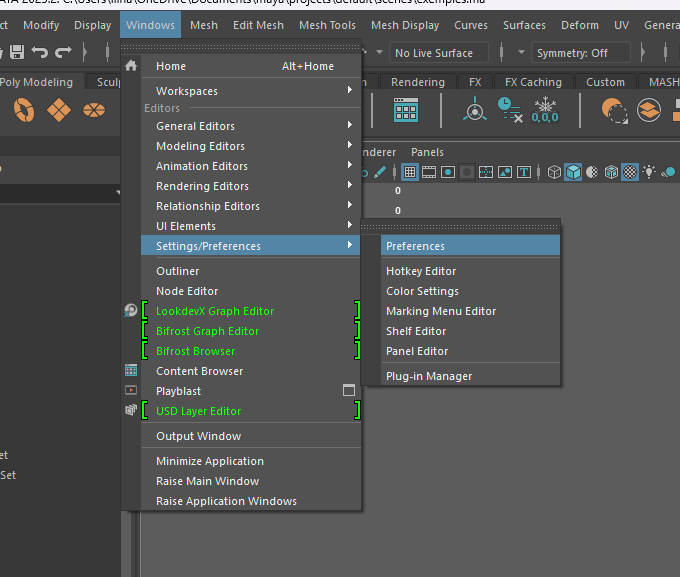

3. Under **Settings**, change **Working Units**: 
   - `Linear`: `meter`
  
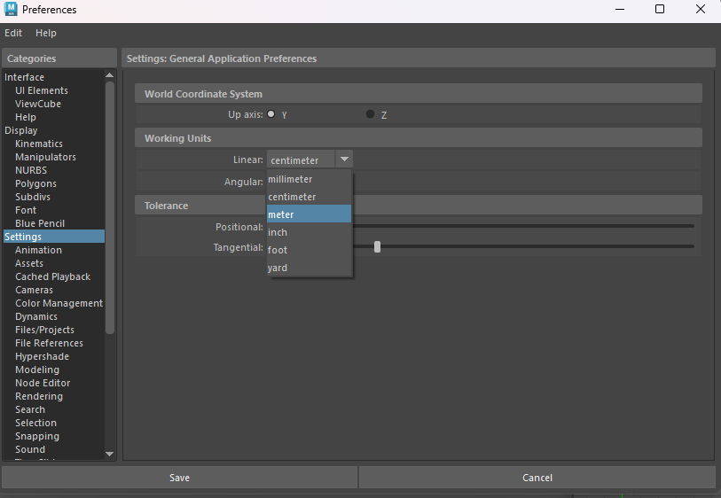

---

## 2. 🎨 Create Your Materials in Hypershade

### Steps:
1. Open **Hypershade**
   
 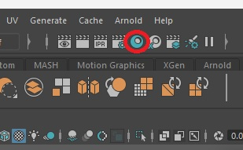
 
2. Click on the shader of choice (I usually stick with Lambert/Phong/Phong E) to create a material
   
 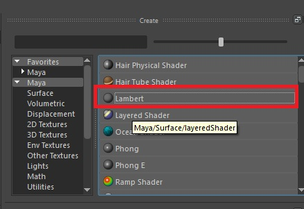
 
3. Click the checkered box next to **Color** to open the **Create Render Node** window
   
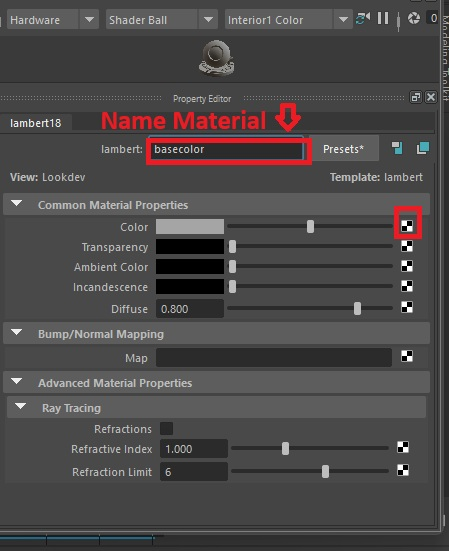

4. Select `File` → choose your `.png` texture

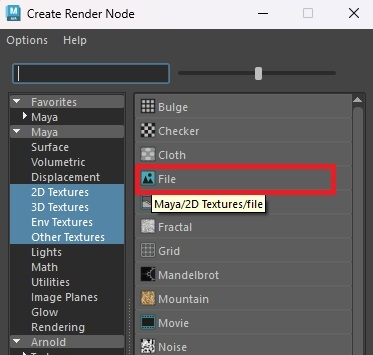

5. Drag the material onto your mesh using the **middle mouse button**
   
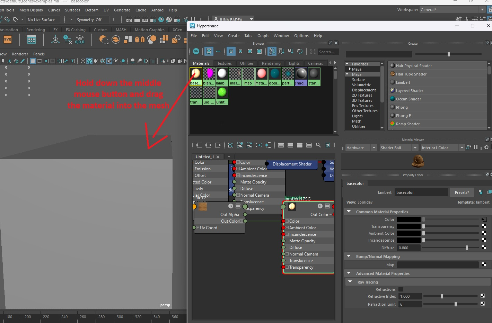

---

## 3. 📤 Export Your Mesh

1. Select your mesh 
2. Go to `File` → `Export Selection`

   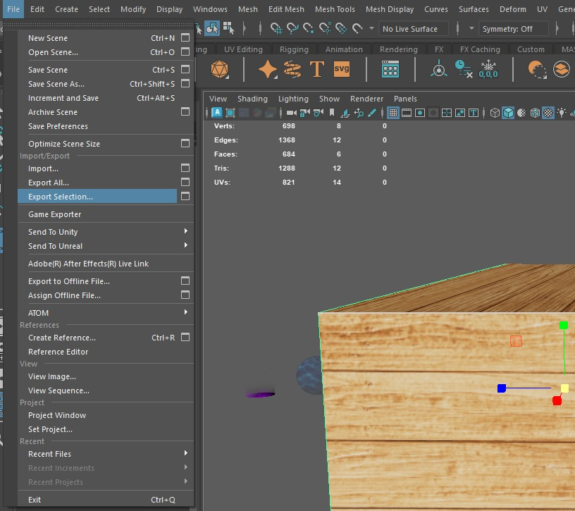
   
3. Choose `.FBX` format 
4. Save with a clear name in your asset folder

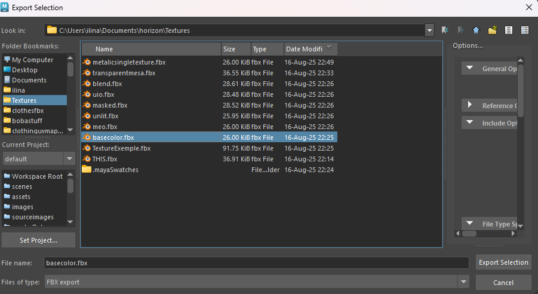

---

## 4. 🧩 Import into Horizon Worlds

### Option A: Desktop Editor
1. Open Horizon Desktop Editor and enter any world
2. Click **My Assets** → choose a folder → Click **Add New** → select **3D Model**

    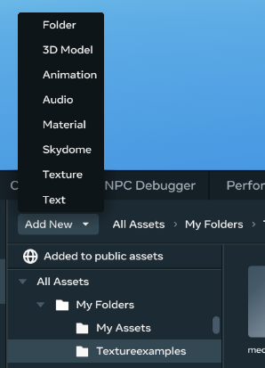
   
3. Upload your `.fbx` and `.png` files
  
   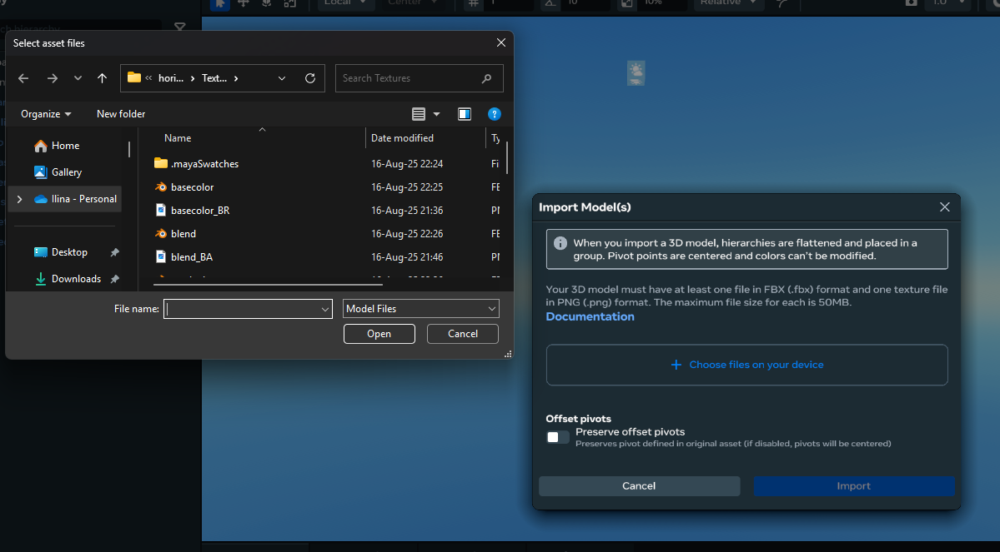
   
4. Make sure you have all your files. For example for an meo file you neeed two png files as shown below

 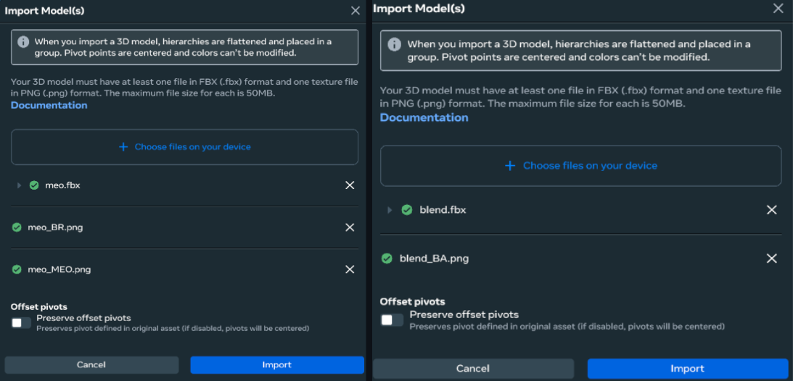 
   

### Option B: Web Editor
1. Go to [https://horizon.meta.com/creator/assets/](https://horizon.meta.com/creator/assets/) and
 choose a folder (default is "My Assets")
2. Click **Import** → select **3D Model**
   
 
   
3. Upload your `.fbx` and `.png` files

 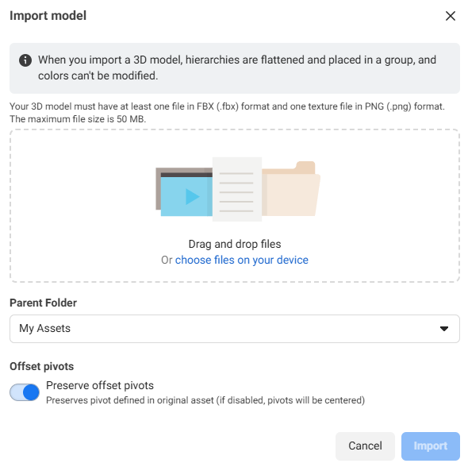
 
---

## 5. 🧪 Material Naming Conventions

Use these formats for smooth importing:

| Material Type             | Material Name             | PNG Naming Convention                      |
|---------------------------|---------------------------|----------------------------------------    |
| Single Texture PBR        | `basecolor`               | `basecolor_BR.png`                         |
| Metal PBR                 | `metalic_METAL`           | `metalic_BR.png`                           |
| Double Texture PBR        | `meo`                     | `meo_BR.png`, `meo_MEO.png`                |
| Unlit                     | `unlit_UNLIT`             | `unlit_B.png`                              |
| Unlit Blend               | `blend_BLEND`             | `blend_BA.png`                             |
| Transparent               | `transparent_TRANSPARENT` | `transparent_BR.png`,`transparent_MESA.png`|
| Masked                    | `masked_MASKED`           | `masked_BA.png`                            |
| UI Optimized              | `uio_UIO`                 | `uio_BA.png`                               |

💡Replace the word before the `_` with your desired name - just make sure it is the same for the material and `.png` file

### Examples

 1.Single Texture PBR 

 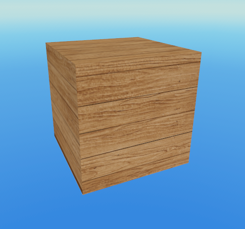

 2.Single Texture Metal PBR 

 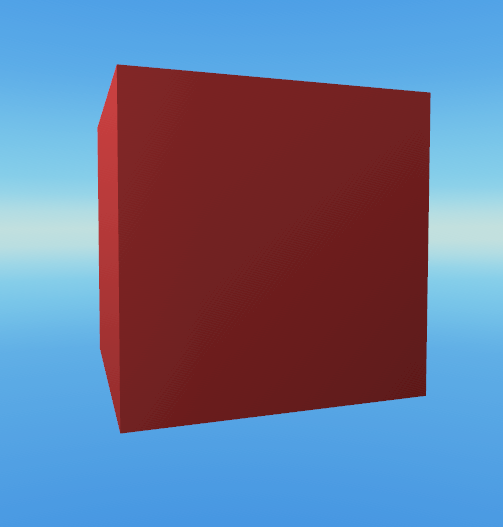

 3. Double Texture PBR

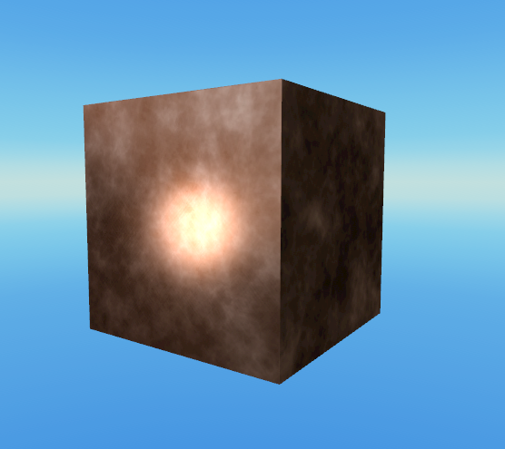

4. Unlit Materials

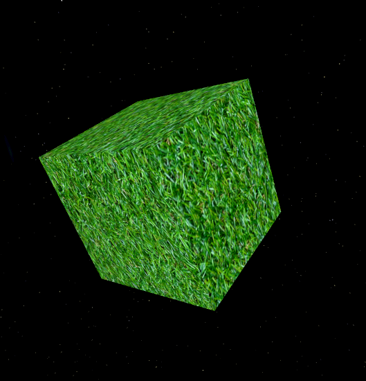

5. Unlit Blend Materials

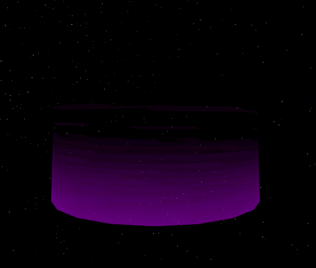

6. Transparent Materials

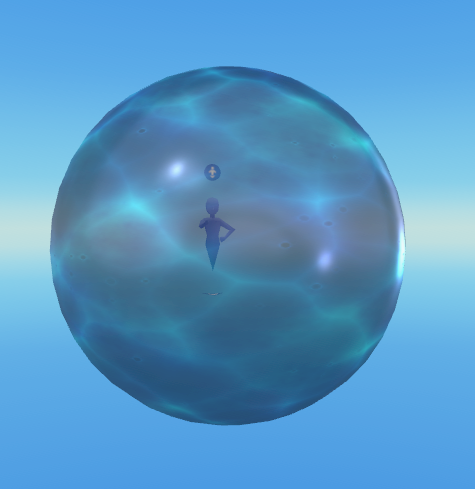

7. Masked Materials

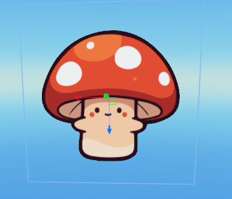

8.UI Optimized Materials

---

## 6. 💡 Quick Tips

- Each model must include:
  - One `.fbx` file
  - One or more `.png` textures
- Max file size: **50MB** per file

## 7. 🎥 Video

<iframe width="560" height="315" src="https://www.youtube.com/embed/gLEfX2ZjxbI?si=coYyZ3LMc5SIkQyR" title="YouTube video player" frameborder="0" allow="accelerometer; autoplay; clipboard-write; encrypted-media; gyroscope; picture-in-picture; web-share" referrerpolicy="strict-origin-when-cross-origin" allowfullscreen></iframe>