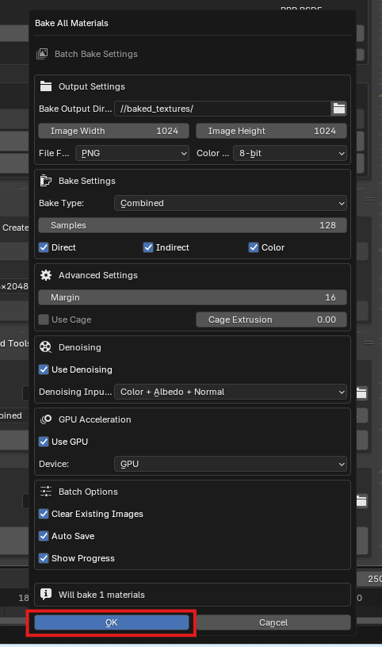
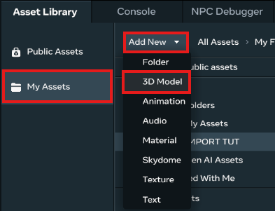
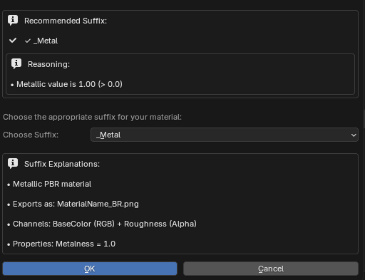
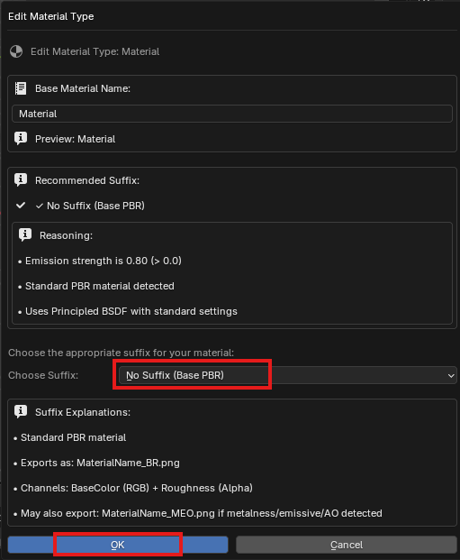

<iframe width="560" height="315" src="https://www.youtube.com/embed/74jpsePM7uA?si=Kbt5H4JC_PRQXxhp" title="YouTube video player" frameborder="0" allow="accelerometer; autoplay; clipboard-write; encrypted-media; gyroscope; picture-in-picture; web-share" referrerpolicy="strict-origin-when-cross-origin" allowfullscreen></iframe>

Title: **Importing 3D model using the Blender to Meta Horizon Exporter**

By An 3 (@an3ee)/an3ee3

**Skill level**: Beginner

### **Prerequisites:**

Pc

Blender 4.4 + (3D creation tool) <https://www.blender.org/download/>

Meta Horizon desktop editor
<https://developers.meta.com/horizon-worlds/learn/documentation/get-started/install-desktop-editor>

## **Blender to Horizon Worlds Exporter addon**

A comprehensive Blender add-on designed specifically for Meta Horizon Worlds asset creation. This tool provides material analysis, export tools, and a guided workflow wizard to help your assets meet Meta Horizon Worlds requirements.

**Download:** [https://github.com/simlabs101/blender-horizon-world-exporter](https://github.com/simlabs101/blender-horizon-world-exporter)

### **Installation Requirements:**
- Blender Version: 4.4.0 or higher
- Graphics Card: NVIDIA RTX 3070/4060 Ti or AMD RX 6700 XT or higher recommended (8GB+ VRAM)

**How to Install:**
1. Download the latest release zip file from the [Releases section](https://github.com/simlabs101/blender-horizon-world-exporter/releases) of the GitHub repository
2. Do not extract the zip file - keep it as a .zip file for installation
3. Follow the installation steps in section 2 of this guide below

## **Useful links**

Modelling best practices
<https://developers.meta.com/horizon-worlds/learn/documentation/custom-model-import/creating-custom-models-for-horizon-worlds/best-practices>

Useful Blender modelling tutorials
<https://developers.meta.com/horizon-worlds/learn/documentation/custom-model-import/creating-custom-models-for-horizon-worlds/creating-a-custom-model>

Meta Horizon documentation/ Asset requirements and materials guide
<https://developers.meta.com/horizon-worlds/learn/documentation/custom-model-import/creating-custom-models-for-horizon-worlds/materials-guidance-and-reference-for-custom-models>

**Description**: The addon simplifies the asset preparation process for
meta horizon worlds saving hours of manual work. It scans materials,
meshes, UV layouts, identifying and fixing compatibility issues before
exporting. It also provides detailed actionable recommendations.

**Steps overview**

1.  Creating 3D model in Blender and making changes to material
    properties

2.  Installing the addon

3.  Analysing materials using addon.

-   Make required changes and fixes to objects

-   Bake materials and export FBX

4.  Importing prepared assets into Horizon Worlds

5.  Setup for other textures types

6.  Importing readymade 3D Model into blender

7.  Using Wizard tool

8.  Additional features : UV generation

Blender best practises:

-   Use Alt+D instead of Shift+D to create instances instead of copying
    objects.

-   Model to real-world scale.

-   UV unwrap objects.

-   Ctrl + A to apply All Transformation

-   Track statistics by enabling Statistics

## 1. Creating 3D model in Blender or use an imported 3D model

**Blender Setup and Add-on Installation**

1.  **Create a project folder (IMAGE 1)**

    -   Make a folder on your computer to store exports and textures
        (**E.g. Exporter Tutorial)**

2.  **Open Blender (IMAGE2)**

    -   Launch Blender and select the **General** file option. 

3.  **Add an object**

    -   Insert an object into the scene (e.g., a cube, sphere, etc.).
        modify the object as desired. Mesh can be altered whilst in
        Object mode, edit mode or sculpt mode found in the top left
        hand. Material properties can be changed in the shading
        workspace. (**IMAGE 3)** 

    -   Import an existing 3D model. 3D models can be imported into the
        scene as gltf/ glb files from the File- Import menu. **(IMAGE
        4)**

![A screenshot of a computer AI-generated content may be incorrect.] (media/image7.png)

## 2. Installing the Addon

> **Enable the add-on**

a.  Go to **Edit \> Preferences \> Add-ons**. **(IMAGE 5)** 

b.  Click the dropdown arrow in the top-right corner and choose
    **Install from Disk** (or **Install from Device** depending on your
    Blender version). **(IMAGES 6)** 

c.  Locate the add-on file you downloaded and select it. **(IMAGE 7)**
    

> **Activate the Add-on**

d.  In the add-ons list, check the box next to the installed add-on to
    enable it. **(IMAGE 8)** 

> **Access the Add-on tab**

e.  To open or close the add-on's tab in the 3D Viewport, press **N** on
    your keyboard or click the small arrow on the right side of the
    screen. **(IMAGE 9 AND 10)**

For adjustments of materials and mesh use the following sections.
**(IMAGE 11)**

**Sections 1 (Scene Analysis)** is for scene analysis. Once the material
names are fixed with the correct suffix proceed to bake and export as
outlined in section 3.

**Section2 (Performance)** use for generating UVs (feature under
development)

**Section3 (Export & Advanced Tools)** for baking materials and
exporting

Materials guidelines: refer to meta guide (Link at the start of
tutorial)

https://developers.meta.com/horizon-worlds/learn/documentation/custom-model-import/creating-custom-models-for-horizon-worlds/materials-guidance-and-reference-for-custom-models

## 3 . Analysing Materials (Setting up materials for different texture types)

1.  **Single-Texture PBR**

1.  **Select scene or object** (select by scene hierarchy if there
    parented objects)

2.  In Section 1 **click Analyze Materials**. (IMAGE 12) . This will
    analyse the material and produce an analysis results within section
    1.

For single-texture PBR and single-texture
Metal PBR materials, the addon will automatically set it to the No
Suffix option. A check mark next to the material name indicates
acceptable naming format.

If you **open Edit Type** and hover over the dropdown menu, you'll see
a note explaining that No Suffix refers to the standard PBR material,
which includes Base Color and Roughness. ADD IMAGE for edit type

3.  Under Section 3, Texture Baking, **save the blender file** in the
    folder created at the start of the tutorial. **Click Bake All
    Materials (IMAGE 13)**

4.  The bake settings window will open. To bake the textures **click OK**. (IMAGE 14)

5.  A pop up will appear to the left showing that baking is in progress.
    It displays how many materials are baking and whether the bake was
    successful. Click anywhere on the workspace to minimize the pop-up
    window. NOTE exiting popup window at any time will close entire
    blender file. IMAGE
    15

6.  In the FBX Export area in Section 3. Ensure the objects are selected
    and **Click Export All Objects**. The Export settings will open.
    Here you can change the name of the file. This maybe useful if you
    would like to create another version of the object with a different
    texture. **Click OK**. IMAGE
    16

A Baked \_Textures folder and an Exports folder will be created inside
of the folder we created at the start of the tutorial. IMAGE 17 

## 4.  Importing into Meta Horizon

1.  **Return to Meta Horizon Desktop Editor**

2.  **Click on My Assets**

3.  **Add new**

4. **Select 3D Model** from the list

**IMAGE 30**

5. An Import window will appear. **Deselect Preserve Offset Pivots**
    and **choose the texture files and then the fbx file from your
    device and click Import**

The model will appear with a little loading clock icon.
If it loads successfully a little message will appear with a green
tick. Import errors will display a yellow icon with an exclamation
mark on the file. You can hover over the yellow icon to see the error message.

6. When asset has finished loading click and drag into scene.

## 5 . Setup for other texture types

Other textures supported by horizon can be set up in the following way.

### 1. For single texture PBR see (part 3 of the steps overview section above).

Two or more objects using the same material, will be identified and
allow for unique material name to be created and the names to be
formatted coorectly for each of the objects.

1.  Select all objects and click Analyze Materials. Click Make Materials
    Unique. Other objects get unique copies of the material name (e.g.
    materialName.001, materialName.002). The Create Unique Materials
    prompt will appear. Click OK.

2.  Click Fix All Material Names to format the names according to Meta
    guidelines (removing characters like -, ., , /, \*, \$, &)

**IMAGE 17.1** 

### 2.  **Single Texture Metal PBR**

A single texture with a metal PBR combines BaseColor, Roughness,
Metalness (with Metalness set to 1).

1.  To prepare a single texture metal PBR, **first select the objec**t
    then **click analyse material**.

2.  **Click on Edit Type**. The addon will recommend the appropriate
    suffix \_Metal. IMAGE 18

3.  **Click OK**

4.  **Bake material**. The exported material texture file will have \_BR
    extension.

### 3.  **Double-Texture PBR**

Two textures give control over more of the PBR properties.

1.  To prepare a double textured PBR, **select the object**.

2.  Under material properties **make the necessary adjustments** to the
    channels BaseColor, Roughness, Metalness, Emissive and Ambient
    Occlusion.

3.  Whilst object is still selected **run Analyze Materials**.

4.  You will have to then **click** **Edit Type to choose No Suffix
    option** as this will export an \_BR file and an \_MEO file which is
    required for this type of material. IMAGE
    19
    

### 4.  **Unlit Materials (IMAGE 20)**

If you want a material that does not receive or cast lighting or
shading, then the material should be material type \_unlit. The bake
file will save as \_B (for basecolor)

1.  Select object

2.  Analyze Material

3.  Edit Type to \_unlit

### 5.  **Unlit Blend Materials (IMAGE 21)**

When you change the alpha channel, the suffix suggestion will be
\_transparent, however, you will need to Edit Type and **change this
\_Blend**.

1.  **Analyze Materials**

2.  **Click Edit Type**,

3.  **Choose \_ Blend**

This bake material will have a file name ending in \_BA.

### 6.  **Transparent Materials (IMAGE 22)**

Transparent materials allow light to pass through. It combines
Basecolor+ Roughness and Metal + Emissive + Specular + Alpha.

For transparent materials, the material type should be set to
\_transparent

4.  **Analyze Materials**

5.  **Click Edit Type**,

6.  **Choose \_ Transparent**

This bake will output 2 files with names ending in \_BR and \_MESA.

### 7.  **Masked Materials**

**Masked Material in Horizon Worlds**

It's a material type where pixels are either fully visible or fully
invisible. Instead of true glass-like translucency, it uses a mask (an
alpha cutoff): if the texture's alpha value is above a threshold →
it's rendered solid; if below → it's invisible.

**Why Horizon Uses Masked Instead of Transparent**

-   VR rendering is performance sensitive --- masked materials are much
    cheaper to render.

-   You still get the appearance of cutouts, holes, or water-like
    surfaces without heavy overdraw.

-   It keeps objects performant when imported from external tools
    (Blender, etc.).

> **Practical Uses in Horizon**

-   Faux water surfaces

-   Glass or windows with "cutout" shapes

-   Leaves, foliage, fences, grilles, or netting (things with holes)

-   UI / stylized effects like portals

**Setting up masked materials in Blender** (use an image with a transparent background.)

**A. Go to the shader workspace.**

2\. Set the alpha to 0.5. on the Apha channel on the Principled BSDF
node

3\. Add an image texture node from the Add dropdown menu

4\. Open your image with transparent background on the image texture
node

5\. **Plug the color from the image texture node to color input on
Principled BSDF**. **Then plug the alpha from the image texture node to
the Principled BSDF alpha input.**

6\. Ensure that the object is fully UV unwrapped. ( for basic unwrap, go
to the UV editing workspace, hover over the object press A on the
keyboard to select all. Then press U to bring up the unwrap menu, select
Smart UV project.)

IMAGE 23.2

**IMAGE 23.1**

 **B. Head back to the Layout workspace to use the addon** IMAGE 23.1

1\. Analyze Materials

2\. Set Edit Type to \_Masked

3\. Bake and export your files. This will output a \_BA texture file

### 8.  **Vertex Color PBR (IMAGE 24, 24.1, 24.2, 24.3, 24.4)**

Set up a basic Vertex color in blender:

1.  To create more vertices to hold the paint, subdivide the object. To
    subdivide **go to Edit mode ( Shortcut key: Tab)** and **right click
    on the object**, then **click on subdivide.**

2.  To apply the vertex color, from the dropdown menu **select Vertex
    Paint mode**, adjust the brush radius, color and strength if
    necessary. Make sure the viewport shading is on solid view. This
    will enable you to see the vertex paint on the object.

3.  Return to object mode, **select the object** and then with the
    Horizon worlds addon **click Analyze Material** and **Edit Type**,
    **select \_VXC** from the dropdown. Baking is not required and there
    will not be a texture file exported. You will need to **then Export
    FBX**.

### 9.  **Vertex Color Single-Texture PBR**

This blends vertex color data with a single BaseColor texture allowing
for layering of broad color or value changes---like tints and highlights
without needing multiple textures.

**Why It's Useful in Horizon Worlds**

-   Efficiency: By leveraging vertex colors alongside just one texture,
    you reduce the number of textures needed---simplifying UV management
    and saving on memory.

-   Performance: Fewer texture reads are needed, which is ideal for VR
    performance constraints

**Set up in blender**

Make sure the viewport shading is on solid view. This will enable you to
see the vertex paint. IMAGE
25

Go to the data properties ( the upside down green triangle) under the
Color Attribute click the plus to add an attribute. Name this attribute.
IMAGE 26

Go to the Shading workspace IMAGE 27

Add a Colour Attributes node (Add-Input) and from its dropdown menu
select the colour attribute you created earlier.

Add an Image Texture node (Add-Textures), choose an image from Open
Image icon.

Get a Math node(Add-Converter), set it to Multiply from the drop-down
menu in the node and plug into the BaseColor of the Principled BSDF.

Plug the color of the Image Texture into top value of the Multiply node.

Plug the color of the Color Attribute into the bottom value of the
Multiply node. Using Alpha instead or Color, gives a more vibrant
texture when imported into Horizon.

While in Solid View in the viewport shading, go to Vertex Paint mode and
paint your object.

In object mode, select the object**, return to the addon**, and Analyze
Material. **Edit type should be set to \_VXM**.

Bake and then export files. A texture file with the extension \_BR will
be exported.

10. **Vertex Color Double-Texture PBR**

A\) Seting up in Blender

Select object

Go to vertex paint. Make desired changes.

Go to the Shading workspace ( or hover over the top of the boundary line
between two work areas until a plus appears, then left click and drag.
Select from top left hand dropdown for a different editor type.)

Add an Image Texture node( Add- Texture) and open image from device.

Plug the Image Texture color to the BSDF color.

Change Metal, Roughness, Emission , Ambient Occlusion as needed.

IMAGE 28, 28.1, 28.2 

B\) Head back to the Layout workspace, in Object mode and use the use
the addon

Select object and Analyse Material.

**Edit type should be set to \_VXM**. IMAGE 28.1, 

Bake and then export files. A texture file with the extension \_BR and
an \_MEO files will be exported.

When the asset is imported into Horizon the vertex paint should be
visible. IMAGE 28.2

## 6 . Preparing Imported 3D models

1.  Before you start, save the blender file.

2.  Import model as glb **IMAGE 4, IMAGE
    29**

3.  Rescale object and apply All transformations (Ctrl +A)

4.  Go to Top righthand menu (Outliner window)

5.  Right click on object name

6.  Click 'select hierarchy **IMAGE
    29.1**
    

7.  Open the addon **IMAGES 9,
    10**
    

8.  Click Analyze Materials. You will need to Edit Material Type for
    your desired look.

9.  Objects using the same materials will be identified. This can be
    fixed by clicking Make Materials Unique.

10. Click Fix All Material Names for correct name format.

11. Bake and export your files. The files will be in the baked_textures
    and exports folders.

12. Return to the Horizon desktop editor and import your files.

**IMAGE 17.3**

## 7 . Using the Wizard tool for simple 3D models

The Quick Start section lets you prepare files for an asset using the
Wizard feature. The wizard guides you through the necessary steps and
exports both the materials and the FBX file. It's best suited for simple
3D models with basic meshes that don't require high-resolution visuals.

1.  Before you start, save the blender file.

2.  Select object

3.  Open the addon

4.  At top click Launch Export Wizard

5.  Click 'start analysis'

6.  It will run you through the steps. Unless you need to change
    anything, just click next at very step

7.  The bake will start and the baking in progress pop up will appear.
    When baking is successful click inside the work space to minimize
    popup.

8.  This will only export textures

9.  Scroll down to section 3 FBX Export.

10. Click Export selected objects.

11. The Export settings window will appear.

12. Here you can change the name of the fbx.

13. Click ok.

14. The exported fbx will be in an Exports folder and the textures will
    be in the Baked_textures folder

## 8 . Additional features

There are few addon feature that are currently under development to
simplify UV unwrapping and UV atlas map generation under Section 2.
