# Creating & Importing 3D Assets from Blender to Desktop Editor
Author: Bhanu Partap

## Creating Materials & Textures in Blender for Meta Horizon (Hindi/English)
<iframe width="560" height="315" src="https://www.youtube.com/embed/p3h0o7S0d1k?si=TkQ3YIbcIgPwm8bM" title="YouTube video player" frameborder="0" allow="accelerometer; autoplay; clipboard-write; encrypted-media; gyroscope; picture-in-picture; web-share" referrerpolicy="strict-origin-when-cross-origin" allowfullscreen></iframe>

## Introduction

This tutorial is a focused, end‑to‑end pipeline for bringing custom 3D assets from Blender into the Desktop Editor cleanly, repeatably, and without guesswork. It teaches the exact naming, texture packing, and import steps that make materials “just work” on first import, with practical tips for UVs, color space, and performance. It’s designed to be followed while building, with screenshots and short checklists so progress is visible at every step.

### Why this matters

Most creators struggle with small but critical details: picking the right material type, packing textures (BR / MEO / MESA / BA), deciding Unlit vs Transparent vs Masked, and using consistent names that the importer recognizes. This tutorial closes those gaps with simple rules, clear names, and compact decision guides—so assets look correct under different lighting, and imports are predictable and fast.

### What you’ll learn

- A reliable Blender → FBX → Desktop Editor workflow (units, UVs, texture paint, export, import).
- Material setups by use‑case:
  - Standard Image (BR)
  - Metal Image (BR + MEO)
  - Transparent (BR + MESA)
  - Unlit (B) and Unlit Blend (BA)
  - Masked (BA)
  - UIO (BA) for scriptable/animatable UI images
- Texture authoring basics: BaseColor vs data channels, roughness in alpha, emission preview, quick baking for consistent color.
- Import techniques: selecting FBX + textures together, when to disable Preview, and rapid verification steps.
- Troubleshooting and optimization: scale/orientation checks, alpha do’s/don’ts, texture sizes, and material reuse.

- Requirements: `Blender`, `MHCP Desktop Editor`, `Meta Horizon App`
>
- Audience: Beginners on Meta Horizon who wants to  build custom models for Horizon Worlds via Custom Model Import (CMI) and using Blender, Desktop Editor For first Time.
> 
- Outcome: A correctly shaded assets inside the Desktop Editor with textures mapped as intended via supported material types.  

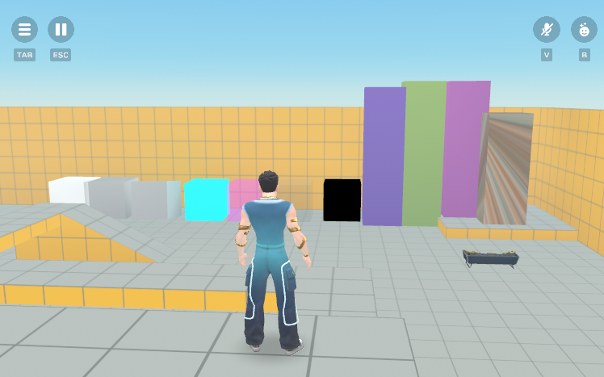

---

## MHCP material types (overview)

- <b>Standard Image</b>
  - FBX: Image.fbx
   Material: Image
    Upload: Image_BR.png (RGB BaseColor, A Roughness).
    >
- <b>Metal Image</b>
  - FBX: Image.fbx
   Material: Image
    Upload: Image_BR.png + Image_MEO.png.
  >
- <b>Unlit</b>
  - FBX: UnlitImage.fbx
   Material: Image_Unlit
   Upload: Image_B.png.
  >
- <b>Unlit Blend</b>
  - FBX: UnlitBlendImage.fbx
   Material: Image_Blend
    Upload: Image_BA.png.
  >
- <b>Transparent</b>
  - FBX: TransparentImage.fbx
   Material: Image_Transparent
   Upload: Image_BR.png + Image_MESA.png.
  >
- <b>Masked</b>
  - FBX: MaskedImage.fbx
   Material: Image_Masked
    Upload: Image_BA.png.
  >
- <b>UIO (Animated Image)</b>
  - FBX: UIOImage.fbx
   Material: Image_UIO
    Upload: Image_BA.png (+ frames for animation).

---

## Creating Various Material Types

### Basic 3D Model 

-Quick Start (Blender FBX to Desktop Editor)

Use this minimal path to get a simple mesh from Blender into the Desktop Editor and placed in a world scene.

#### Step 1 - Start in Blender (Layout)
- Open Blender and ensure the workspace is set to Layout (the default startup workspace for a new file).
- In the Scene Collection, select the Cube, Camera and Light objects and delete them.

> Deleting Everythind From Collection:
> - 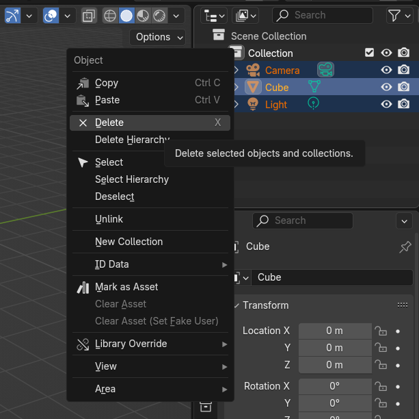

- Now Create a <b>New Cube</b>: `Mesh` → `Add` → `Cube`

> Adding Cube to workspace:
> - 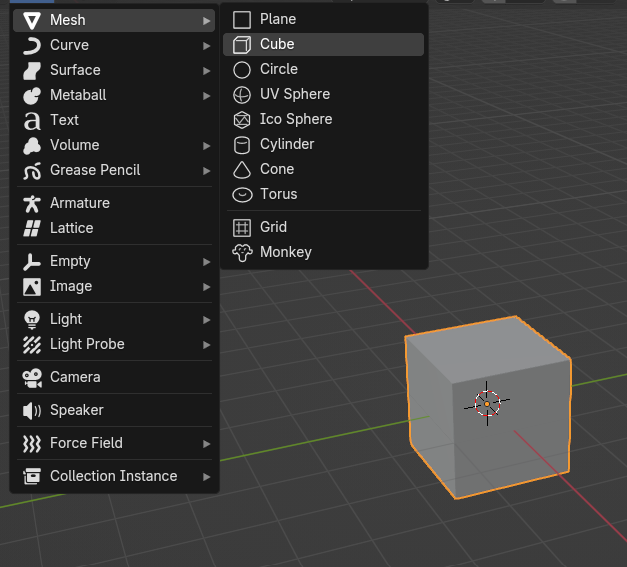

#### Step 2 - Export as FBX
- Go to File → Export → FBX (.fbx), choose a location, and name the file (for example, Cube.fbx).
- Leave textures as external files in this quick start to keep naming clear and manageable in the importer.

> Exporting Our First 3D Model:
> - 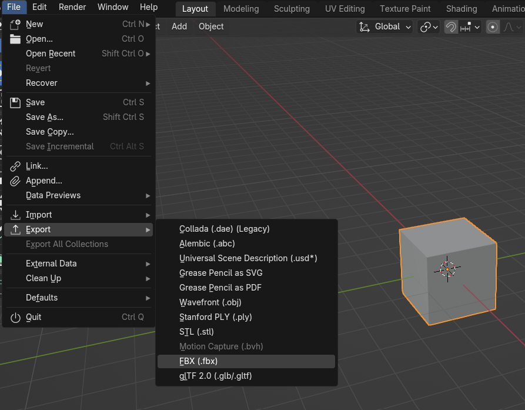

#### Step 3 - Importing 3D Model in the Desktop Editor
- Launch the Desktop Editor and open any world where testing is safe <i>(for example a Tutorials world or a sandbox world).</i> 
- Navigate to the Asset Library area where personal assets can be added and managed. 
- In My Assets, click Add New and choose 3D Model to begin importing the FBX asset.
`Add New` → `3D Model` → `Cube.fbx (That we exported From Blender)`

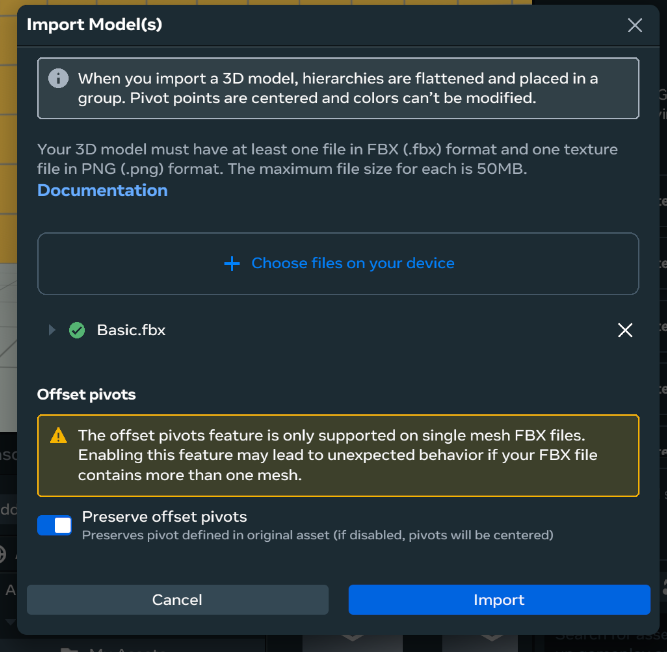 

- Drag the newly imported model from My Assets into the scene to create an instance in the world.
- Once placed, the model can be moved, rotated, and scaled using the transform tools, which will be covered in detail later in this tutorial.

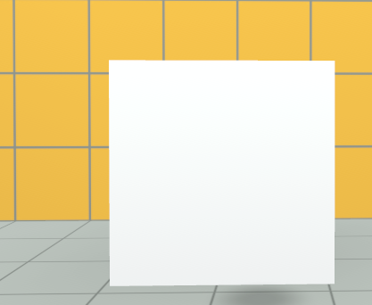

---

### Standard Image

-  _BR (Basic Image + Roughness in Alpha)

#### What this does (one‑line concept)
RGB stores the BaseColor for the surface, and the Alpha channel stores Roughness where 0 = mirror and 1 = fully matte, so a white alpha (1.0) gives a matte look.

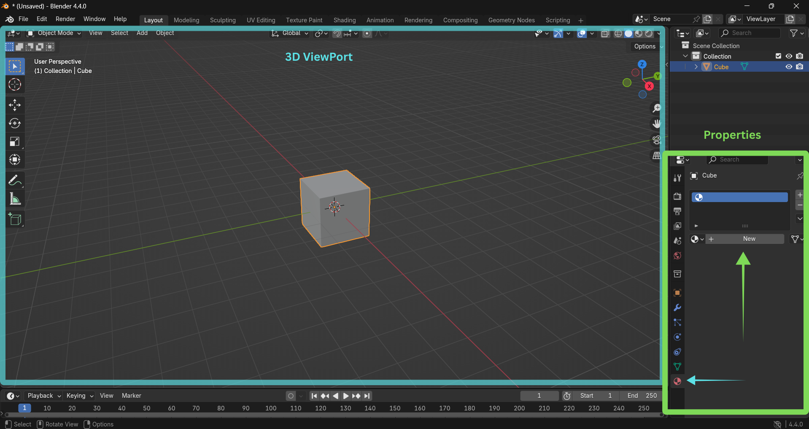
---

#### Step 1 — Name the material and export the mesh (FBX)
- In Blender, assign a single material to the mesh and name it “Cube”. 
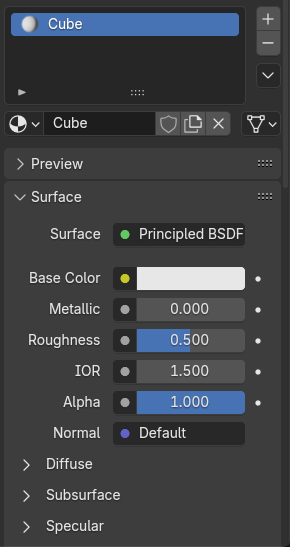
- `File` → `Export` → `FBX (.fbx), export the mesh (e.g., Cube.fbx)`
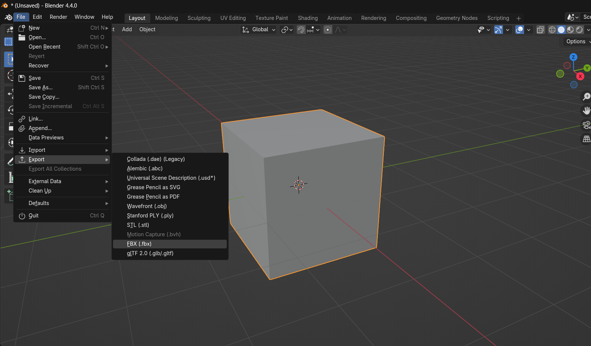

#### Step 2 — Create the BR image in Texture Paint
Switch to <b>Texture Paint</b> and click New to create a new image for this material. 
> - 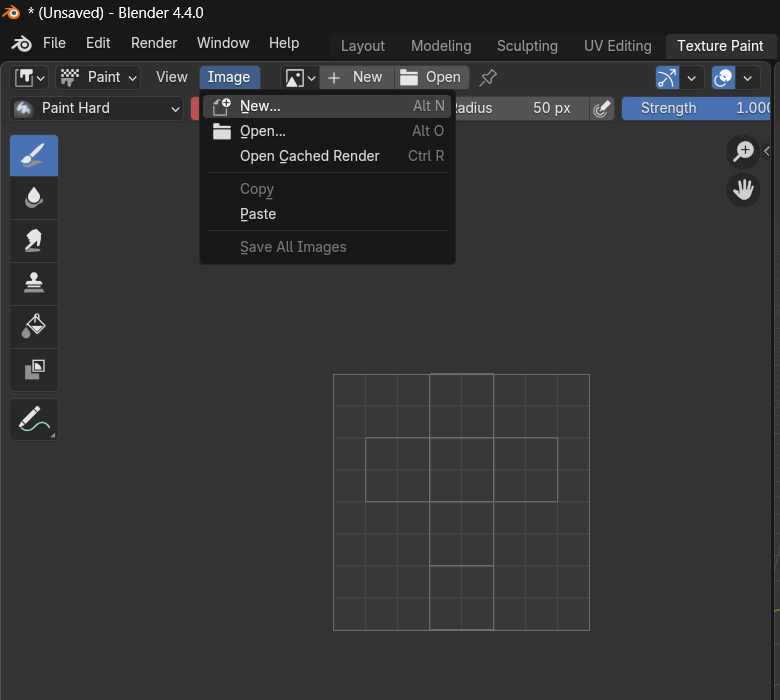
Set `Width` and `Height` to <b>4096</b> x  <b>4096</b> for 4K (power‑of‑two sizes are recommended for performance and mipmapping).

> Setting RGB Values
> - 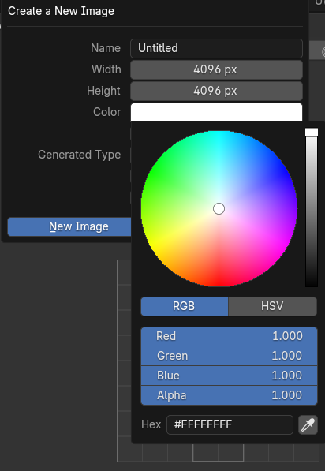

Set the Default Color to pure white (RGBA = 1,1,1,1) so the BaseColor starts white and the alpha defaults to fully matte roughness. 
- Create the image and immediately save it as <b>Cube_BR.png</b> so the name matches the material and BR suffix convention. 
> Why white? White RGB avoids a dark BaseColor default, while alpha = 1.0 yields a matte surface until you paint or replace channels later.

 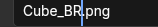

#### Step 3 — Import into Desktop Editor (My Assets)
- Open the <b>Desktop Editor</b>, navigate to a test world (e.g., Tutorials) and go to `My Assets` → `Add New` → `3D Model`.
- Select both files together: the `FBX` (Cube.fbx) and the texture (Cube_BR.png) so the importer can bind the BR map to the material.
- Turn Preview off during import to speed processing and avoid unnecessary preview overhead while the files upload and bind.
- Expect a matte look initially (alpha=1 roughness); painting or swapping the BR image later will change glossiness without altering the pipeline.

> Tip: Cube.fbx
Material Name: “Cube” in Blender
File Name: Cube.fbx (Image.fbx)
Image Name: Cube_BR.png (Image_BR.png)

---
### Metal Image 

- BR + MEO (Double Textures)

#### What this does (one‑line concept)
- <b>BR:</b> RGB stores BaseColor (sRGB), Alpha stores Roughness (linear, 0 = mirror, 1 = matte). 
- <b>MEO:</b> R = Metal (0 dielectric, 1 metal), G = Emission (intensity), B = Occlusion (AO), A = optional alpha. 

#### Step 1 — Name the material and export the mesh (FBX)
- Go to `Materials (properties section)` -> `Click New` 
- In Blender, assign a single material to the mesh and name it <b>“Cube”</b>. (MaterialName)
- `File` → `Export` → `FBX (.fbx), export the mesh (e.g., Cube.fbx)`

#### Step 2 — Create the BR image in Texture Paint
- Switch to <b>Texture Paint</b> and click New to create a new image for this material. 
- Set `Width` and `Height` to <b>4096</b> x  <b>4096</b> for 4K (power‑of‑two sizes are recommended for performance and mipmapping).

- Create the same image as we have made <b>'Cube_BR.png'</b> and save it.

#### Step 3 — Create Image_MEO (packed Metal/Emission/Occlusion)

- R=Metal, G=Emission, B=Occlusion (AO), and A optional, 
- Play with <i>RGBs</i> and then save as <b>Image_MEO.png</b>. 
- Typical authoring flow: bake or export individual maps (Metal, Emission, AO) and pack them into RGB channels using an image tool or painter export preset. 

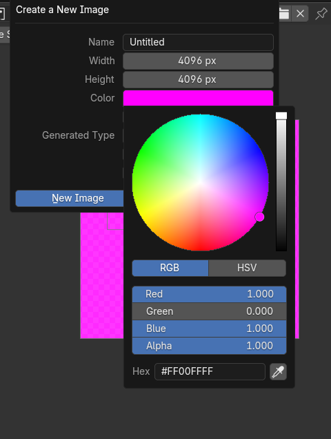
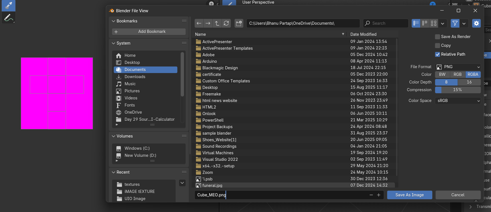

#### Step 4 — Import into Desktop Editor

- Open the Desktop Editor, Select and upload all three together: <b>Cube.fbx</b>, <b>Cube_BR.png</b>, and <b>Cube_MEO.png</b> so the importer can bind channels per the cheat sheet. 

- Turn Preview off during upload to speed processing and avoid preview overhead; re‑enable previews after verifying the binding. 

> Screenshot placeholder:
> - 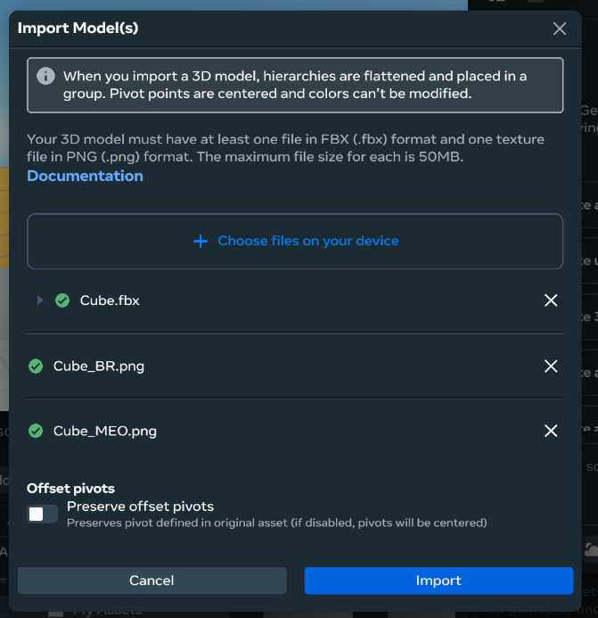 

#### Verify in scene
- Drag the imported model into the scene and confirm BaseColor is correct, Roughness feels right, and the metal/emission response looks as intended.
- If AO appears too strong or weak, revisit the B channel in MEO or test with different lighting to validate its contribution visually.
> Screenshot placeholder:
> - 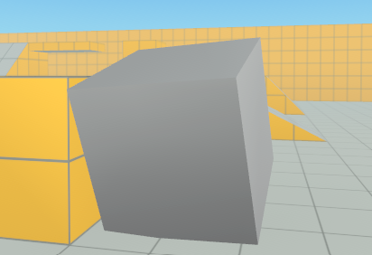 
---

#### Common pitfalls and quick fixes
- Too shiny or plasticky: Roughness alpha is too dark in BR; then we can increase <b>Alpha channel</b>. 
- No metal response: `MEO’s` <b>R(Red)</b> channel may be `0`; verify packing/export preset and re‑export. 
- Texture not binding: Confirm names are exact (Image.fbx, Image_BR.png, Image_MEO.png) as if material is “Image.” 

> MESA packs R=Metal, G=Emission, B=Specular, A optional and will be introduced when covering transparent materials to keep workflows separated and clear.

#### Channel reference⬇️ (from [Meta Horizon Docs](https://developers.meta.com/horizon-worlds/learn/documentation/custom-model-import/creating-custom-models-for-horizon-worlds/materials-guidance-and-reference-for-custom-models))

| Channel | MEO mapping | MESA mapping |
|---|---|---|
| Red | Metal| Metal|
| Green | Emission| Emission|
| Blue | Occlusion| Specular|
| Alpha | Alpha (when applicable)| Alpha (when applicable)|

---

### Transparent Material

— BR + MESA (Double Textures)

#### (one‑line concept)
MESA: `R = Metal` (0 dielectric, 1 metal), `G = Emission` (intensity), `B = Specular` (dielectric reflectivity), `A = Alpha` (opacity).

For `glass Effect`: keep Metal near 0, Specular higher (≈0.5–1), Roughness low (≈0.05–0.2), and Alpha below 1 (e.g., 0.2 = very transparent).

#### Step 1 — Name material and export FBX
- In Blender, assign a single material and name it exactly <b>“Glass_Transparent”</b>. (Image_Transparent)
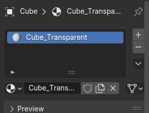

- `File` → `Export` → `FBX` (.fbx) and save as <b>Glass.fbx</b>. [2]

#### Step 2 — Create Glass_BR & Glass_MEO

Create same <b>'Glass_BR.png'</b>

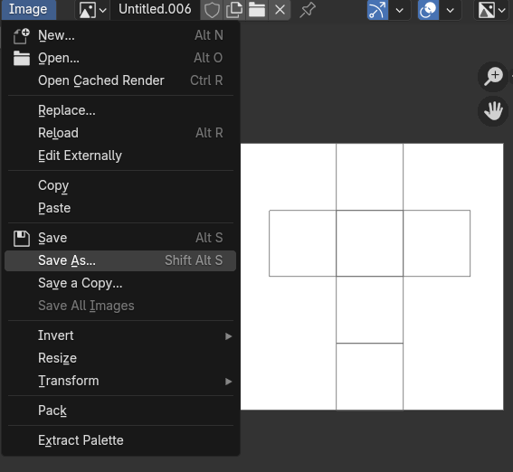

Create New Image after applying edits and save as <b>Glass_MESA.png.</b>
> Screenshot placeholder:
> - 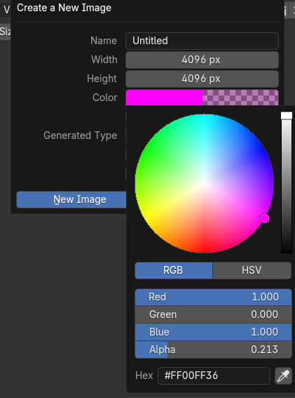

#### Step 3 — Import into Desktop Editor
- Upload Your 3D Model by Selecting and uploading all three together: `Glass.fbx`, `Glass_BR.png`, and `Glass_MESA.png`.
- Turn Preview off

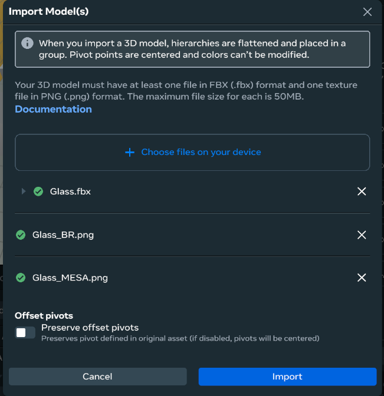

> The Result:
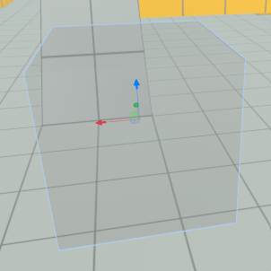

#### Common pitfalls and quick fixes
- `Opaque` instead of `transparent`: <b>Alpha</b> channel too high (near 1); reduce Alpha in MESA toward 0.2–0.4 for glass. 
- `Dull reflections:` Specular (B) too low; raise B to 0.5–1.0 and ensure BR roughness alpha is not too bright.
---

### Unlit Materials

 — BaseColor only (suffix: _Unlit)

Materials that do not receive or cast lighting/shading are unlit; the material name in the FBX must end with “_Unlit”, and any extra channels (like a 4th alpha channel) are discarded.

#### Step 1 — Create material for your 3D Model
- Assign a single material to the mesh and rename it: `Cube_Unlit`. (Image_Unlit)
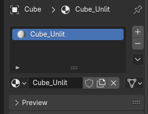
- This exact suffix <b>“_Unlit”</b> signals the unlit path on import.
- `File`  → `Export` → `FBX (.fbx)` → name it <b>Cube.fbx</b>
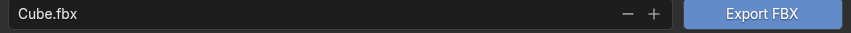

#### Step 2 — Create the “B” image (Texture Paint)
- Open `Texture Paint` → `New`.
- `Resolution:` 4096 × 4096 (4K; use power‑of‑two sizes as needed).
- `Color:` Set BaseColor as desired; the example sets R=0 for a cyan tint.
- `Alpha:` Disable alpha (turn it off) so only RGB is saved.
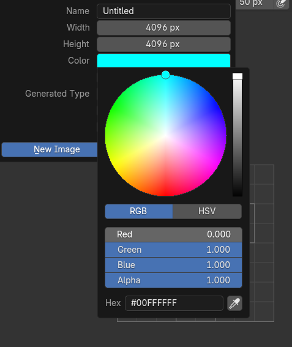
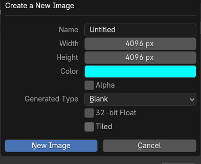

Save as: <b>Cube_B.png</b> (B = BaseColor only, no alpha).

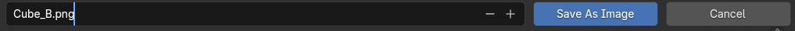

> Why no alpha? Unlit discards extra channels, so disabling alpha keeps the file clean and avoids confusion.

#### Step 3 — Import into Desktop Editor
- My Assets → Add New → 3D Model.
- Select and upload `Cube.fbx` + `Cube_B.png` together.
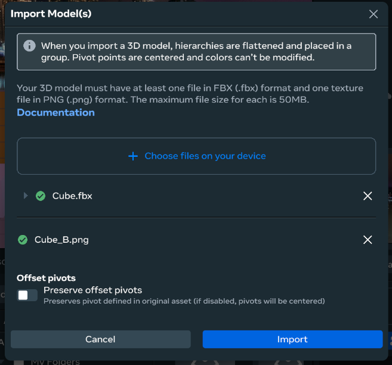
- Turn Preview off during upload to speed processing; re‑enable after verifying.

#### Step 4 — Verify in scene
- Drag the model into the scene; it should appear full‑bright and unchanged by lights/shadows.
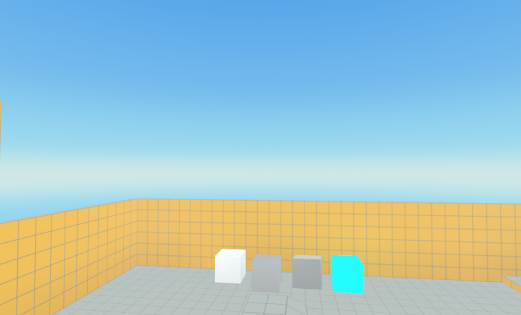
- Day/night changes won’t affect the unlit color; it will look consistent against the environment.
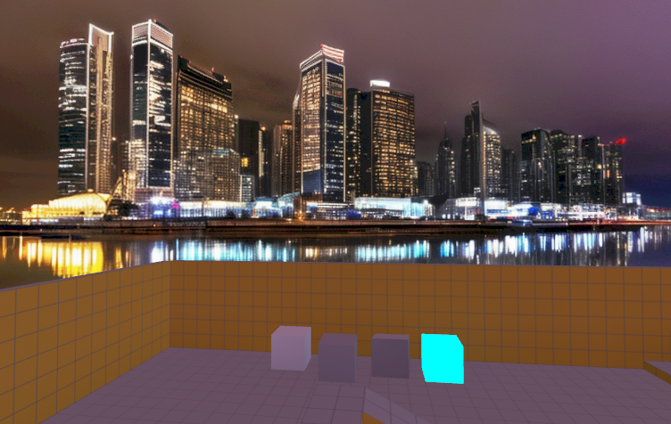

#### When to use
- Flat art, UI cards, icons, decals, or signage that must look the same in light and dark scenes.
- No specular, reflections, or lighting response — the texture appears full-bright.

---

### Unlit Blend 

- BaseColor + Alpha (suffix: _Blend)

- Blended materials that do not receive or cast lighting/shading are unlit and blended; the material name in the FBX must end with “_Blend”. 
- Unlit blended materials have no specular or reflection properties.

---

#### Step 1 — Naming to material
- Assign a single material and rename it: <b>Cube_Blend</b>.
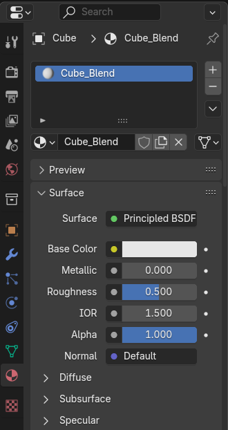
- The “_Blend” suffix enables the unlit+blend path on import.
- `File` → `Export` → `FBX (.fbx)` → use <b>Cube.fbx</b> (or rename it if you want).

#### Step 2 — Create the “BA” image (Texture Paint)
- Open Texture Paint (or Image/UV Editor) → New.
- Resolution: <b>4096px</b> × <b>4096px</b> (4K; adjust if not needed).
-  `Color: ` Set BaseColor as desired; the example sets G=0 (reduces green) for a Margenta.
- `Alpha: ` Enable alpha and set A ≈ 0.5 (mid transparency) for a blended look.
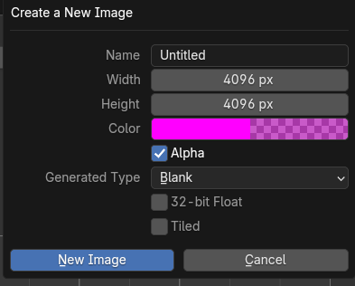
- Save as: `Cube_BA.png` (B = BaseColor, A = Alpha/opacity).

> Alpha guide: A=1 is opaque; A=0 is fully transparent; A≈0.5 is a balanced blend.

#### Step 3 — Import into Desktop Editor
- My Assets → Add New → 3D Model.
- Select and upload `Cube.fbx` + `Cube_BA.png` together.
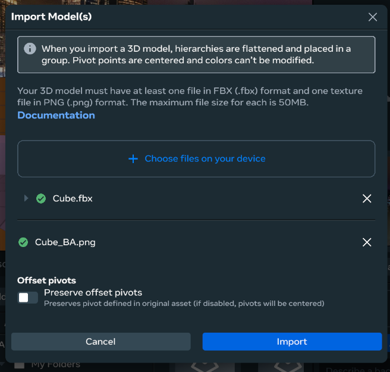
- Turn Preview off during upload to speed processing; re‑enable after verifying.

#### Verify in scene
- Drag into the scene; the texture should appear full‑bright with smooth transparency based on the alpha.
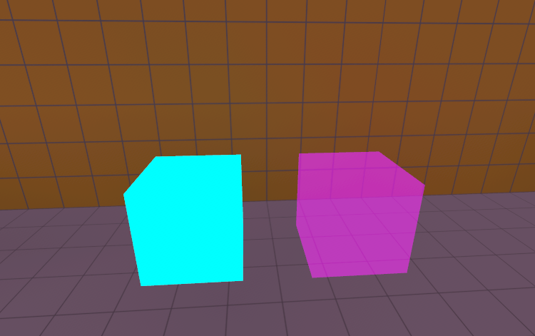
- No specular or reflections; adjust the A channel in `Cube_BA.png` to refine opacity.

---

### Masked Image

— BaseColor + Alpha cutout (suffix: _Masked)

> We are using Masked images when a hard cutout (on/off) is needed, such as grilles, fences, foliage cards, or repeating architectural patterns that use simple colors and shape cutouts.

#### Step 1 — Name the Blender material
Assign a single material and rename it: <b>Cube_Masked</b>.

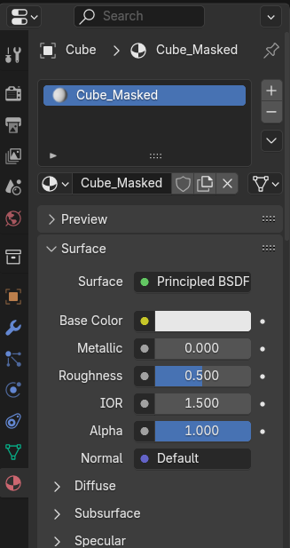

`File` → `Export` → `FBX (.fbx)` → name it `Cube.fbx`. (or Image.fbx)

#### Step 2 — Creating the BA image

- Open Texture Paint → New.
- Resolution: 4096 × 4096 (4K; you can choose smaller if performance/size matters).

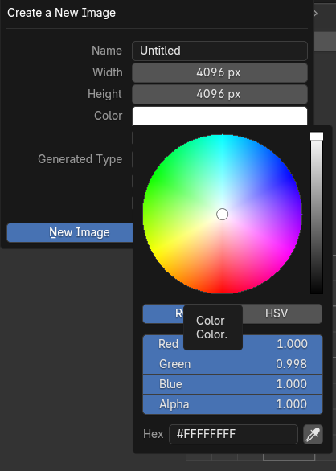

- Default color: RGBA = 1,1,1,1 (pure white) so the surface starts fully visible and matte-neutral.
- Save as: <b>Cube_BA.png</b> (B = BaseColor, A = Alpha mask).

- Open the Image Editor (click the image icon in the header or press <kbd>Shift</kbd> + <kbd>F10</kbd>).

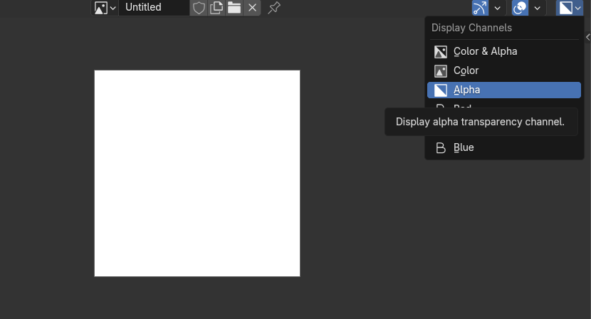

- Open the `Cube_BA.png` image, then use `Display Channels` → `Alpha` to preview the mask.
- <b>Why we are doing this?</b>: Viewing alpha reveals the mask—white areas remain visible; black areas will be cut out.

- Then save the image

#### Step 3 — Import into Desktop Editor

- `Worlds Desktop Editor` -> `My Assets` → `Add New` → `3D Model`.
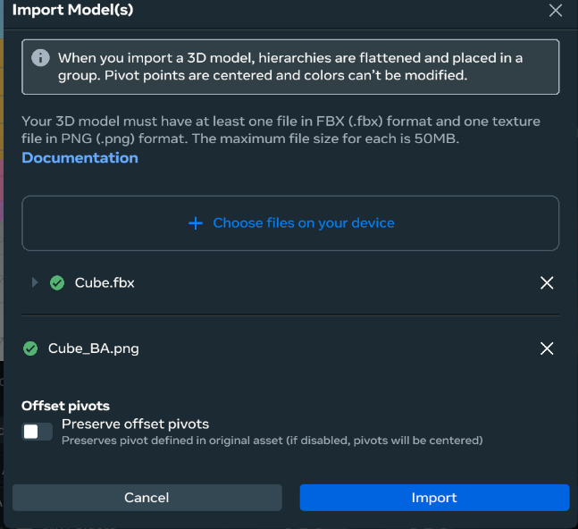
- Select and upload both files together: `Cube.fbx` + `Cube_BA.png`.
- Turn Preview off during upload to speed processing; re‑enable previews after verifying the binding.

#### Step 6 — Verify and iterate
- Drag the model into the scene and `scale it`, then give it any color in properties section at right hand side.
- Then duplicate it using <kbd>Ctrl</kbd> + <kbd>D</kbd> and create two more building like this.
> Here is the result
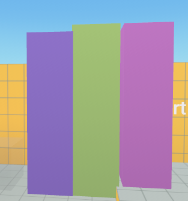

---

### UIO Image 

— BA (Animated/Scriptable)

Use this when an image should be easily swapped or animated via scripts; we will learn scripts from Basic and then perform UIO (This is very basic info about UIO) 
Recommended basic default: RGB = 1 (white), Alpha = 1 (opaque); earlier RGB=0 was only a placeholder example, not a requirement.

#### Step 1 — Name the material
- Assign a single material and name it: <b>Cube_UIO</b> 
> Screenshot placeholder: 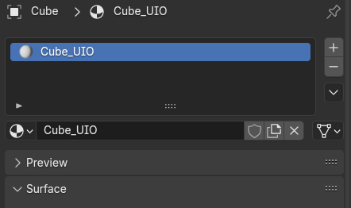

- File → Export → FBX (.fbx) → save as <b>UIOImage.fbx</b>

#### Step 2 — Create the BA image 
- Create similar image as we have created for `Masked Image` and name it <b>'Cube_BA'</b>. As Here I have done RGB=1, but you can also set it to 1.
> Screenshot placeholder: 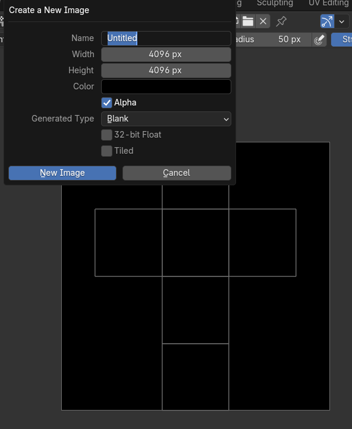

#### Step 3 — (Optional) Blender preview wiring
- Go to `Shading` -> `Add` -> `Texture` -> `Image Texture` -> `Load Cube_BA.png` -> `connect Color` → `Base Color on Principled BSDF for visual feedback.`
>
- Then go to `UV Editing` -> <KBD>A</KBD> (to select all) -> <KBD>U</KBD> to unwrap -> `Smart UV Project` (then click save)
>
- Go to `Render` -> `Render Properties` -> `Render Engine` -> Cycles ->` Scroll Down` -> `Bake` (You can change the Bake Type) - click on bake 
> 
- Save the Image from Image Editor as we have done for `Masked Image`

#### Step 4 — Import into Desktop Editor
- My Assets → Add New → 3D Model.

- Select and upload both files together: `Cube.fbx` + `Cube_BA.png`.

- Turn Preview off during upload for faster processing; re‑enable after verifying binding in the scene. 

---

### Custom Image Texture

- Poly Haven to Emission Bake (BR workflow)

##### What we will do (Summary)
Use a real-world texture (e.g., bricks) from [Poly Haven](https://polyhaven.com/a/red_bricks_02) , preview it unlit via Emission in Blender, bake it to an image, then import the FBX plus the baked PNG into the Desktop Editor. 

---

#### Step 0 — Download texture from Poly Haven

- Go to Poly Haven and search for a brick texture, then download a PNG or PBR set at the desired resolution (CC0, free to use).

#### Step 1 — Make a material for bricks (rough look)
- Create or select a mesh (e.g., a cube) and add a new material named <b>“Cube”</b> to align with a BaseColor + Roughness workflow later.
- Switch to the Shading workspace for node-based edits and set up a clean preview graph for texture baking.
- File → Export → FBX (.fbx), name it “Cube.fbx”

#### Step 2 — Emission preview wiring (unlit look)
- In the `Shader Editor`, remove existing nodes of Principle BSDF with Material Output, then `Add` → `Texture` → `Image Texture` and load the brick PNG just downloaded. Change From `Flat` to `Tube` 
>
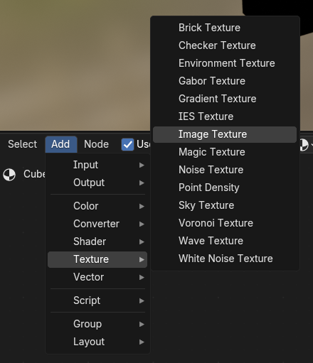
>
- `Add` → `Shader` → `Emission`, connect Image Texture Color → Emission Color, and connect Emission → `Material Output` (Surface).
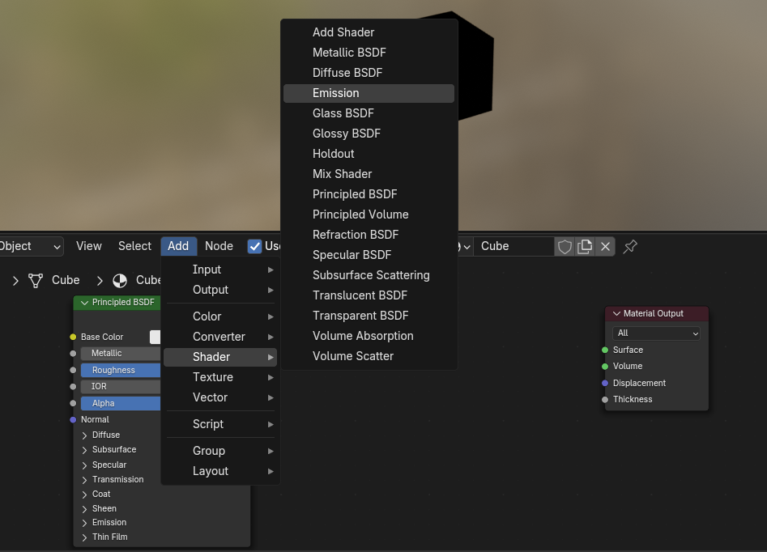
>
- Emission makes textures self‑lit, ignoring scene lights and shadows entirely.
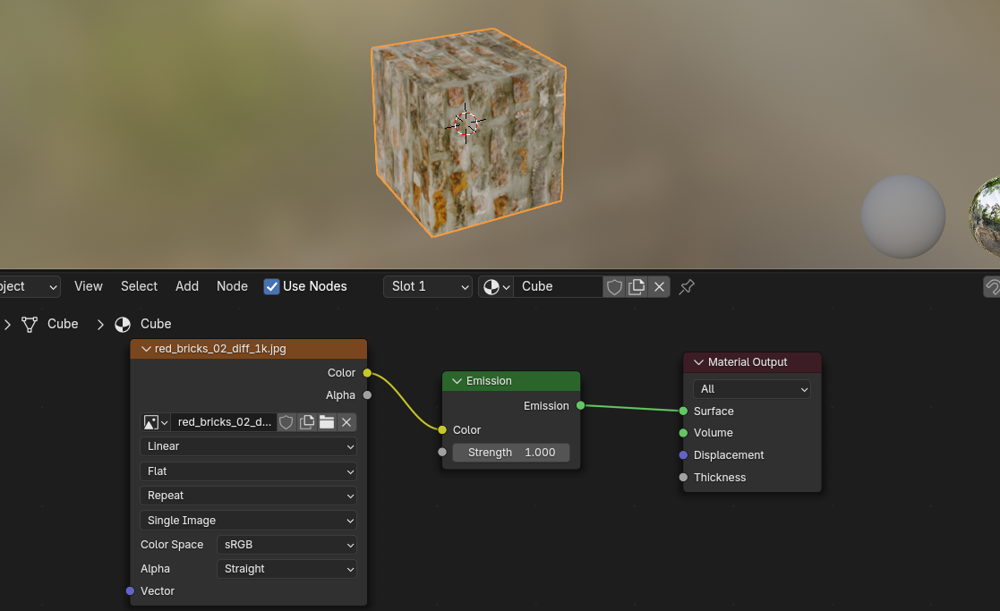

> Note: Emission preview is for clean color bakes; roughness/metal won’t appear in an Emit bake and must be packed separately if needed.

#### Step 3 — UV unwrap and pack (Smart UV Project)
- Go to `UV Editing` → press <KBD>A</KBD> to select all faces → <KBD>U</KBD> for unwrapping → choose `Smart UV Project` for quick, low‑distortion unwraps. 
>
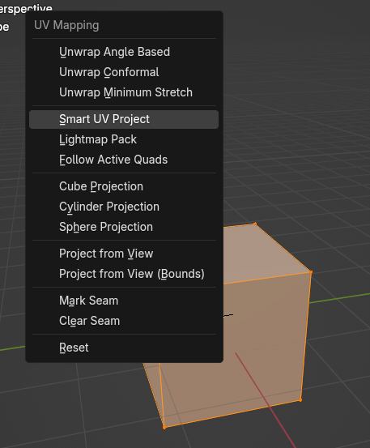
>
- In Smart UV options, enable `“Scale to Bounds”` to fill the 0–1 UV space efficiently before baking. 
>
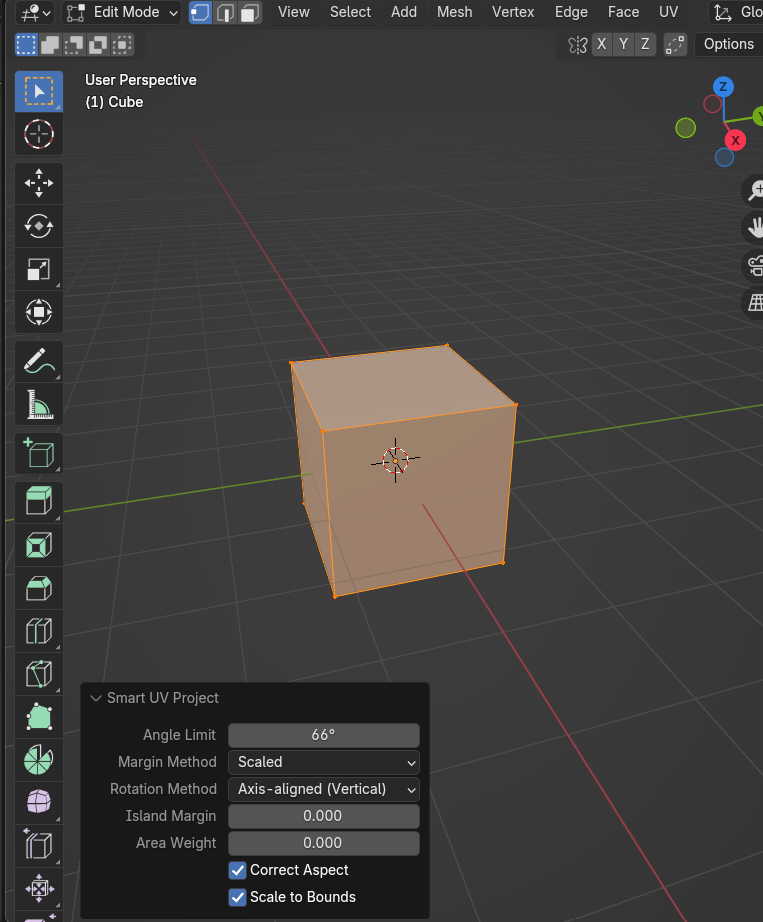
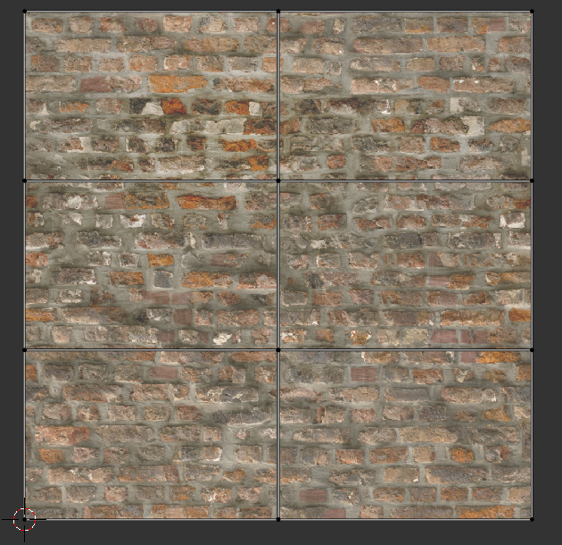
>
- Save the .blend after unwrapping to preserve the UV layout for consistent bakes and exports.

#### Step 4 — Bake the texture (Emit)
- In `Render Properties`, set Render Engine to `Cycles` from `EVEE` to enable texture baking tools and passes. 
>
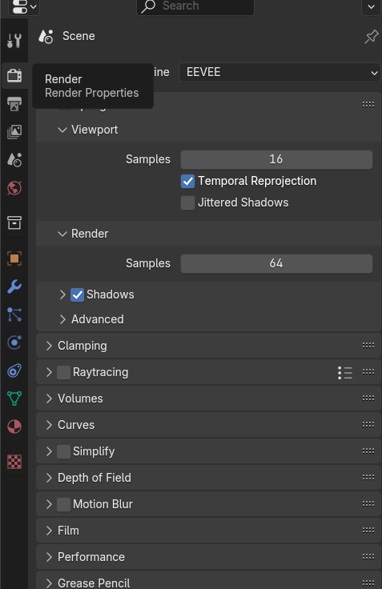
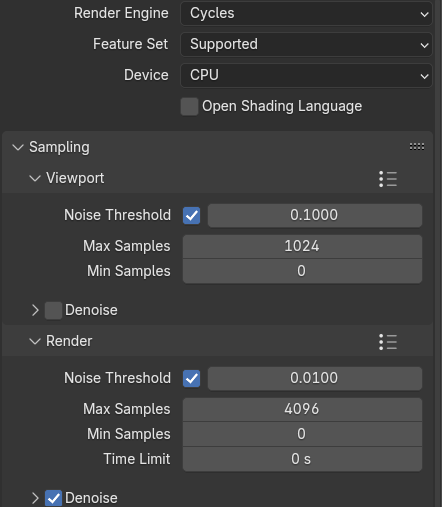
>
- In the Bake panel, set Bake Type to `Emit` so Blender writes the Emission color into the active image. 
- Emit bakes are fast and lighting‑independent, ideal for “what‑you-see-is-what‑you-get” color capture.
>
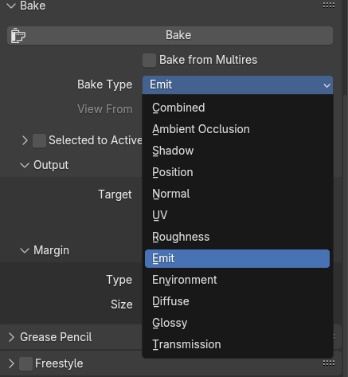
>
- Select the object, ensure the target Image Texture node is active, then click Bake and wait for completion. 

> Tip: Emit bake ignores scene lighting and captures pure texture color for consistent results across environments. 

#### Step 5 — Save the baked image
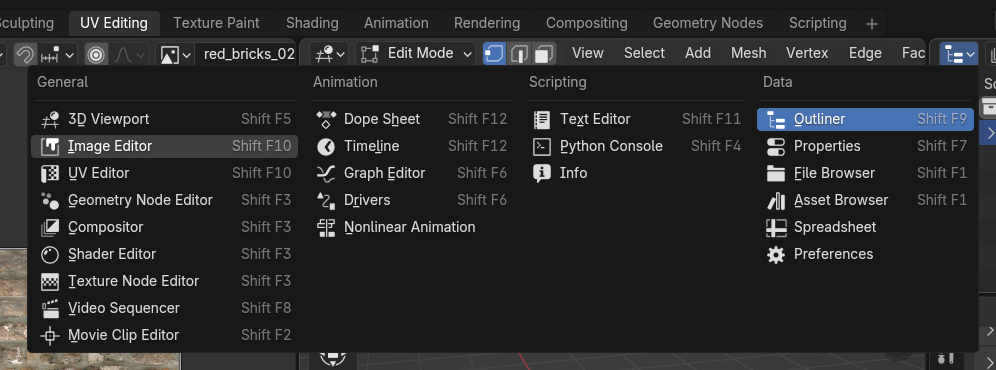
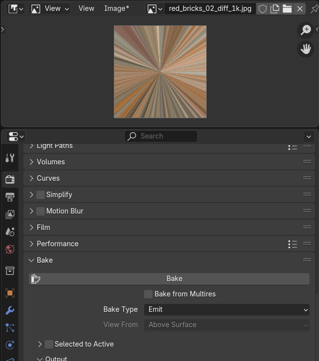
- In the Image Editor, choose Image → Save As and name it “Brick_BR.png” if also planning a BR packing later.

#### Step 7 — Import into Desktop Editor
- Open a world in the Desktop Editor → Asset Library → My Assets → Add New → 3D Model.
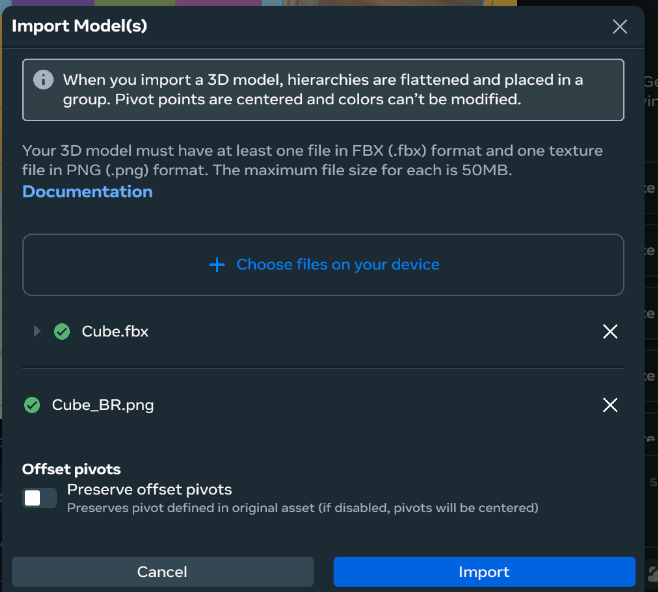
- Select and upload both files together: Cube.fbx + Cube_BR.png so the importer can bind the color map to the model.
- Turn Preview off during upload to speed processing; re‑enable after verifying appearance in the scene. 
> Results
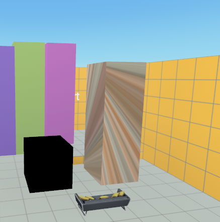

---

### Important Terms 

###### Geometry and scenes

- Scene  
  The working “stage” that contains all objects (meshes, lights, cameras, UI planes) and their hierarchy/collections.

- Mesh  
  A 3D object made of vertices (points), edges (lines), and faces (polygons) that define shape and surface.

###### UVs and textures

- UVs / UV Map  
  2D coordinates that “unwrap” a 3D surface so 2D images (textures) can be painted/baked onto it.

###### Color and data spaces

- sRGB vs Linear  
  Color textures (BaseColor, Emissive) are sRGB; data textures (Metal, Roughness, Specular, AO, Alpha) are linear.

- Specular  
  Reflectivity for dielectrics; higher specular gives stronger highlights for non‑metal surfaces

---

## All Resources (Including 3D Models in .fbx and textures)

[Google Drive Link](https://drive.google.com/drive/folders/12Z9b3jzt1D9V1rNspBiMBG_ZNrWoeuhM?usp=sharing) !!!

---
