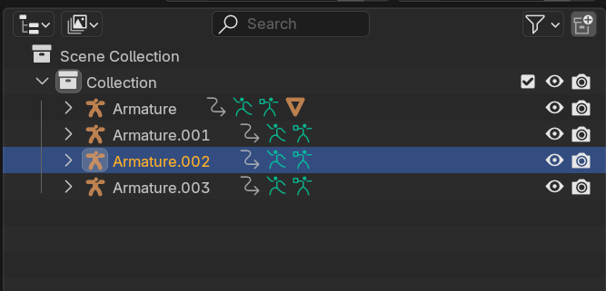

---

# **NPC StoryTelling with Animations**
# **Mixamo → Blender → Worlds Desktop Editor**

## **Step-by-Step Beginner Guide for Animation Import and Editing**
NPCs are a powerful storyteller tool to invite and retain users to your world.  An empty world feels unwelcoming. An active NPC who is a part of your world - a blacksmith hammering or a waitress serving coffee - can start telling the story by just being there.  This document will allow you to create a customized animation series for NPCs in your world by combining animations.  It assumes some basic knowledge of Blender and Worlds Desktop Editor.  This guide is beginner friendly and it has a lot of steps, but it will work.  Ensure that you read and follow each step carefully. Please share and tag me in your successes!  I want to see what you make!

*UtterlyOtter 10 Sep 2025*

---

## **Before You Begin**

You will need:

* **Mixamo account** (free)

* **Blender** (free - I used version 4.3)

* **Horizon Worlds Desktop Editor** installed

* Learn Site where you can download the Avatar Skeleton Rig and the Zip file.  [https://developers.meta.com/horizon-worlds/learn/documentation/full-bodied-avatars/creating-avatar-animations](https://developers.meta.com/horizon-worlds/learn/documentation/full-bodied-avatars/creating-avatar-animations)

* **Avatar Skeleton Rig** file

* **fbx2anim.zip** file  
    

**Download & Prepare Tools**

1. **Avatar Skeleton Rig**  
    This is the “base skeleton” your animation will use. Save it somewhere easy to find (e.g., `Animations/Avatar Skeleton Rig`).
    
   
   * The file will come in as a long string of numbers.  Rename it to `AvatarSkeltonRig`

2. **fbx2anim.zip**

    
   
   * Download and unzip it.

   * Move the unzipped folder into:  
      `C:/bin`  
      (The path should end up like `C:/bin/fbx2anim/fbx2anim.exe`)

   * **Important:** Don’t rename the `.exe` file. If your computer hides file extensions, you’ll only see `fbx2anim` — that’s fine.

   * You don’t need to open or run this program — the Horizon Worlds Desktop Editor will use it automatically when converting animations.

   

3. **Organize Your Folders**  
    Here is a suggested folder structure like this for keeping files tidy:

    Animations  

   

---

## **Step 1 – Get Your Animation from Mixamo**

1. Go to [Mixamo](https://www.mixamo.com/) and log in.

   * Click **Upload Character** and choose your **Avatar Skeleton Rig** file.

   * Once it loads, search for the animation you want.

   * **Check “In Place”** if you want the animation to stay in one spot instead of moving forward.

   * **Download the animation:**

     1. For your **first** animation, choose **FBX** → **With Skin**.

     2. For any **additional** animations, choose **FBX** → **Without Skin**.

   * Save them into the correct folder (`Skin` or `NoSkin`) so you don’t mix them up.

**Beginner Tip:** Always start with a neutral or “Idle” animation as your first one — it makes transitions smoother later.

---

## **Step 2 – Import the First Animation into Blender**

1. Open **Blender**.

2. Delete the default cube

3. Go to **File → Import → FBX**. This will open the Blender file explorer. **(Read the next step before you click import)**  
     
     
     
4. Look for your first animation (the one with skin).  Find your desired animation and select it.  Before you click the Import FBX button ensure you check **Armature \-\> Automatic Bone Orientation**    
   * **A** is the **3D Viewpoint Window**. This is where you will import the armatures (.fbx files)
   * **B** is the **Outliner Window**.  This will list all the items in the scene
   * **C** is right above the **Timeline Window**.  We will be spending a lot of time in this lower left corner
   * **D** is above the **Frame Rendering Range** input.  You will need to adjust this as you edit your animation
     
     
     
5. Once the animation is imported, At the bottom, hover your cursor in the **Timeline**, press **Spacebar** to preview the animation.  Press **Spacebar** again to halt the animation

6. In the top-right panel (Labeled Scene Collection), click **Armature** to select it.

7. On the bottom left, to the left of “Playback” click the Dropdown menu of Editor Type.
8. Change the panel from “Timeline” to **Dope Sheet**.  

9. In the Dope Sheet, change the mode from “Dope Sheet” to **Action Editor**. 

10. Ensure the armature is selected in the **Outliner Window**.
11. At the bottom of the screen, you will see a name like `Armature|Mixamo.com|Layer0`. Rename it to something short, like `Idle`. 

12. Press the **Push Down** button (small arrow icon) to send this animation into the **NLA Editor** (Non-Linear Animation).

---

## **Step 3 – Add a Second Animation**

1. **File → Import → FBX** → choose your second animation (without skin).
2. In the picture below I have imported 3 animations without skin.  You can see the original armature and the three new ones listed in the scene editor on the top right 

3. If it is too confusing to have the armatures stacked on top of one another, select one armature in the upper right screen capture, move your cursor to hover over the figure in the middle of the screen, then press ‘G’ then ‘X’ and then move the armature to the side along the X axis. 
4. In the Outliner Window under Scene Collection, click on one of the new **Armature** (it will probably be called something like `Armature.001`).       
5. To see each armature move, press the space bar to play animations.  Press the space bar again to stop animations.

6. In the Action Editor, rename this animation (e.g., `FallBack`).

7. Press the **Push Down** button again to send it into the NLA Editor.

8. Now delete this second armature:

   * Select it in Scene Collection.

   * Press `Delete`.

   * **Why?** Because the animation is already stored in the NLA for your main armature — you don’t need the extra skeleton.  
9. Repeat for each armature that you add.  You need to keep the original armature with skin.

---

## **Step 4 – Arrange Animations in the NLA**

1. Change the bottom-left panel to **Non-Linear Animation**. 

3. Click your Idle strip (orange bar). 

4. In the menu above the strip select **Add → Action → \[Choose Second Animation\]**.   
5. The next animation strip will appear above the original and at the location of the blue frame position marker  

6. Click the second animation and move it so it starts **slightly before** Idle ends — let them overlap just a little.  
7. Select the second animation strip:

   * On the right, set **Extrapolation** to `Nothing`.  

   * Set **Blend In** to `7`.

8. Select the Idle strip:

   * Set **Extrapolation** to `Nothing`.

   * Set **Blend Out** to `7`.  
       
9. Press **Spacebar** to preview the transition.  
10. Repeat   
    * Click the top animation  
    * In the menu above the strip select **Add → Action → \[Choose Next Animation\]**.  
    * Click the newest animation and move it to desired location  
    * Change Extrapolation to **Nothing**  
    * Change the **blend in, blend out** for every overlap of animations as needed  
      

---

## **Step 5 – Bake the Final Animation**

		Read carefully - there are a lot of steps

1. Select **all strips** in the NLA. 

2. In the Scene Collection, also select the **Armature**. 

3. Go to **Strip Menu → Bake Action**.  

4. In the pop-up:     

   * **Uncheck** “Only Selected Bones”.

   * **Check** “Visual Keying”.

   * Set Bake Data to **Pose**  
     .

5. Click OK.

6. You will see a new combined animation in the Action Editor.  

7. Delete the older tracks — keep only the baked one.   

---

## **Step 6 – Export for Horizon Worlds**

1. Select the new combined animation in Action Editor and the skinned avator using the **Outliner Window**

2. Export as FBX.  
   1. Select **Armature**  
      1. Change Primary Bones to **X Axis**  
      2. Change Secondary Bones to **Y Axis**  
      3. Ensure you select **Add Leaf Bones**
      4. Select your file folder you previously created named **Export**
      5. Click **OK**

   

3. Open Horizon Worlds Desktop Editor and import as shown in this learn guide.  Look for the Heading **Import The Animation Into Horizon Worlds** [https://developers.meta.com/horizon-worlds/learn/documentation/full-bodied-avatars/creating-avatar-animations#import-the-animation-into-horizon-worlds]

4. The Worlds Destop Editor will automatically use `fbx2anim.exe` from `C:/bin` to convert your file.

5. Troubleshooting
   1. If you get the error **unexpected error occurred during processing** try closing **Worlds Desktop Editor** (WDE) and opening it with  **Run as Administrator**  
   2. If you find that you are unable to open it as **Administrator**, try to Right click the app...go to properties (or ALT + Enter), go to security.  You may find **Run as Administrator** there
   3. If you still do not have **Run as Administrator**,
   		1. Find the WDE shortcut
     	2. Go to file location
      	3. Right click to properties
      	4. Click the security tab
      	5. Clicked EVERYONE
      	6. Edit
      	7. Click Full Control
      	8. Click Okay
      	9. Power Cycle the PC, then you should have **Run as Administrator** available.  But it appears to be temporary so you may have to do this the next time you want to import

## **Step 7 – Create a NPC to Test Your Animation**

1.  Create your NPC using this learn guide  [https://developers.meta.com/horizon-worlds/learn/documentation/desktop-editor/npcs/scripted-avatar-npcs/create-scripted-avatar-npc] 
2.  Search the Asset library on WDE and get the **Dance Manager** asset by Vidyuu to test out your animation.  note: the ai API has been deprecated but the animation is still working

---
Some Helpful videos to do more fun animation
	[https://www.youtube.com/watch?v=yFURoPlZJxs](https://www.youtube.com/watch?v=yFURoPlZJxs)  
	[https://www.youtube.com/watch?v=XEzbonBtTtE](https://www.youtube.com/watch?v=XEzbonBtTtE)  
To extend the animation  
	[https://www.youtube.com/watch?v=aGFP\_yxR6iY](https://www.youtube.com/watch?v=aGFP_yxR6iY)  
	[https://www.youtube.com/shorts/jqWkbWJF-qg](https://www.youtube.com/shorts/jqWkbWJF-qg)

To have the animation follow a path.  [https://www.youtube.com/watch?v=j75UliY0BNM](https://www.youtube.com/watch?v=j75UliY0BNM)  
Using graph editor to smooth transitions  [https://www.youtube.com/watch?v=NIP8QibQ7XU](https://www.youtube.com/watch?v=NIP8QibQ7XU)  
[https://www.youtube.com/watch?v=YcZBwJMdw6M](https://www.youtube.com/watch?v=YcZBwJMdw6M)  
