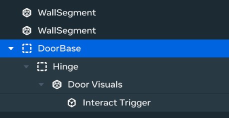
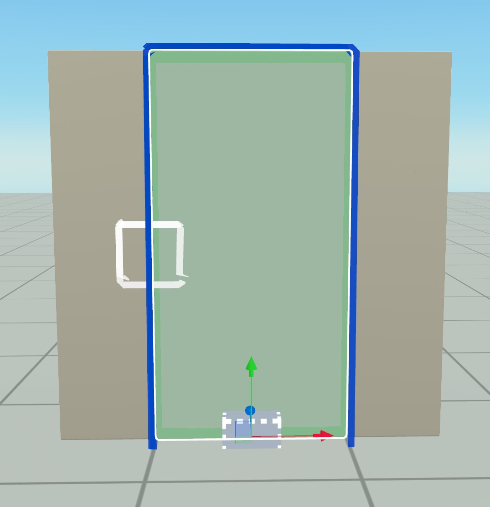
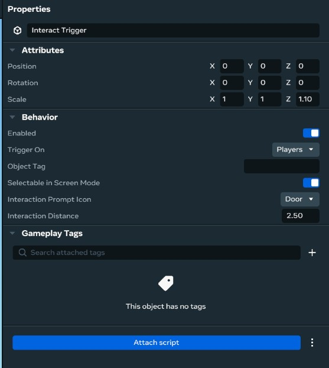
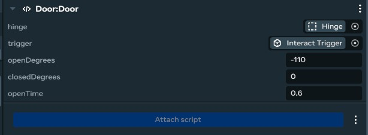

# Making an Interactable Door In Horizon Worlds

It has been said that a door is the greatest challenge in game dev, and if you want to do it right it can be a little more complicated than you'd expect, 
but let's break it down step by step.

## Structure

When working with doors, I've found that this hierarchy works best, and I'll tell you why after explaining how to set it up.




While setting up position sensitive hierarchies like this, it's recommended to have your transform mode set to local and pivot so you can tell where entity origins are.


Start by creating an empty base entity and making sure it's centered in the scene, or at least has a y position of 0 so it's lined up with the ground.

Then choose whatever visuals you want for the door. There are many options in the asset browser, but make sure to go with one that has the frame and door as separate entities otherwise it might be a little hard to make the door open. 
For this example I'm using a scaled default cube to keep it simple.
Parent your visuals to the root empty we made earlier and center its position directly over it. If your visuals entity has a centered root then one way to do this is setting its local x and y position to 0.

Then add a new empty entity, name it hinge, and parent it to the root entity. Move it so that it's lined up with the hinge of the door, and then parent the door visuals entity to the hinge.

To finish out, drag in a trigger gismo and parent it to either the hinge entity or the door visuals entity. In this case I have it parented to the visuals because it needs to be about the same scale as the visuals cube, but in other 
setups it might be cleaner to have it parented directly to the hinge instead. Move/Scale the trigger so that it's barely larger then the door visuals. 
Make sure it's not the same size or smaller, otherwise we won't see the interact prompt or it'll flicker a little. 

Then to set up the trigger to be interactable, turn `Selectable in Screen Mode` on, and set the `Interaction Prompt Icon` to `Door`.



Now for the explanation, why have two empty entities as parents to our door visuals, when we could probbably get away with just the door visuals and a trigger?

For the root, the idea is that since this is something we're probably going to want to reuse a ton, we'll want to think about how the finished product will behave when turned into an asset that we reuse a ton. 
When you drag an asset into the scene, it snaps to the ground, but the part of it that snaps to the ground is the origin/root of the entity. So if pivot of the door was in the visual center, 
our door would be halfway into the ground when dragged in, so having a "root" entity lined up with the ground is just a nice quality of life thing.

The purpose of the pivot is when you can't or don't want to edit the visuals entity or mesh, and that entity doesn't rotate around the hinge, but might instead rotate around it's center, or the random pivot that AI tools generally give you. 
It is possible to account for this in a script, but then you go from setting one variable, to instead dealing with quaterinons and trigonometry. The hinge entity is a much easier solution most of the time, and lets you easily swap out door visuals later if you want too.

## Script

First let's create a door component by selecting our root entity and clicking `Attach Script` at the bottom of the inspector, then selecting New Script.


Then, if your code editor don't automatically pop up, you can open it by clicking the three dots next to your newly added component/script and clicking the edit option.

First let's get our properties set up and assign them in the editor:

```typescript
static propsDefinition = {
  // Entity to rotate
  hinge: {type: hz.PropTypes.Entity },
  // Trigger to toggle door state
  trigger: {type: hz.PropTypes.Entity },

  // Angle in degrees to rotate tne hinge to when open
  openDegrees: { type: hz.PropTypes.Number, default: -110 },
  // Angle in degrees to rotate tne hinge to when closed
  closedDegrees: { type: hz.PropTypes.Number, default: 0 },

  // Time it takes the door to open/close
  openTime: { type: hz.PropTypes.Number, default: 0.6 },
};
```



Now when writing a door script, you might imagine setting it up like this:

```typescript
  // This is an example of what not to do, don't copy paste it.

  // Door rotation in degrees
  private rotation: number = 0;
  // Is the door open or closed?
  private doorState: boolean = false;

  start() {
    // Always good to give ourselves understandable error messages
    const hinge = this.props.hinge;
    if(!hinge) {
      console.error("Door hinge not set!");
      return;
    }
    const trigger = this.props.trigger?.as(hz.TriggerGizmo);
    if(!trigger) {
      console.error("Door trigger not set!");
      return;
    }
    
    // Listen for when players interact with our door
    this.connectCodeBlockEvent(trigger, hz.CodeBlockEvents.OnPlayerEnterTrigger, (player)=> {
      this.toggle();
    });

    this.connectLocalBroadcastEvent(hz.World.onUpdate, ({deltaTime})=> {
      // Figure out how much to move the door this frame
      const step = this.props.degreesPerSecond * deltaTime;

      const openDirection = Math.sign(this.props.openDegrees - this.props.closedDegrees); 
      if (this.doorState)
        this.rotation += openDirection * step;
      else
        this.rotation += openDirection * step;

      // Make sure the door doesn't move past it's limits
      const min = Math.min(this.props.closedDegrees, this.props.openDegrees);
      const max = Math.max(this.props.closedDegrees, this.props.openDegrees);
      this.rotation = Math.max(Math.min(this.rotation, max), min);

      const newLocalRot = hz.Quaternion.fromEuler(hz.Vec3.up.mul(this.rotation));
      this.props.hinge!.transform.localRotation.set(newLocalRot);
    });
  }

  toggle() {
    this.setDoorState(!this.doorState);
  }

  setDoorState(newState: boolean) {
    this.doorState = newState;
  }
```

Now this will probably work just fine however it can be better in two main ways:

### Smoothness

When animating stuff, sudden changes in velocity can be jarring. Right now the door goes from not moving at all, to moving at full
speed in a single frame. While it functions, making it feel like a quality animation isn't that that much more work, and
actually makes the code easier in some places.

First step is to stop thinking about the "rotation" of the door. When doing procedural animations like this where you go between multiple
states, it's usually better to track a 0 to 1 value representing how "done" the animation is. 

Usually we call this variable the "weight", 
since it generally gets passed to a lerp() function to convert it to a rotation, and the way "linear interpolations" work is a "weighted average". 
The more you know!

The benifit of using a "weight" instead of direct value for rotation, is that it decouples tranformation from the state of the animation
and lets us do a little post processing on it.

We need a couple generic math utility functions to do this:
```typescript
class MathUtil {
  // Make sure a value is only 0, 1, or somewhere in-between
  static clamp01(weight: number): number {
    return Math.max(0, Math.min(weight, 1));
  }

  // Linearly interpolate between a and b.
  static lerp(a: number, b:number, weight: number): number {
    return a * (1 - weight) + b * weight;
  }

  // Take a 0 to 1 value and turn it into a 0 to 1 value that moves less at the edges
  static smoothStep(weight: number): number {
    return (Math.atan((weight - 0.5) * Math.PI) / 2) + 0.5;
  }
}
```
Don't worry about their implementations too much, since generally you'd use a library. They're just very good tools to have 
when doing 3D math and are provided by almost every game or graphics environment. However, we're using our own here to make the tutorial easy to follow.

Using our util functions + the weight variable our update event looks more like this:
```typescript
this.connectLocalBroadcastEvent(hz.World.onUpdate, ({deltaTime})=> {
  // Figure out how much to move the door this frame
  const step = deltaTime * (1 / this.props.openTime);
  // If we're closing instead of opening, invert step.
  if(!this.doorState)
    step *= -1;
  this.openWeight = MathUtil.clamp01(this.openWeight + step);
  this.updateDoorRotation();
});
```

And then using that weight to update the door rotation looks like this:

```typescript
private updateDoorRotation() {
  // convert from a linear value with a sudden start/stop, to one 
  // that smoothly transitions between moving and not
  let smoothWeight = MathUtil.smoothStep(this.openWeight);
  // Lerp between open and closed values based on the smoothed out weight
  let rotation = MathUtil.lerp(this.closedRadians, this.openRadians, smoothWeight);
  // Rotate around the handles local y axis
  this.props.hinge!.transform.localRotation.set(hz.Quaternion.fromAxisAngle(hz.Vec3.up, rotation));
}
```
I also switched from `Quaternion.fromEuler` to `fromAxisAngle` since it's a little conceptually cleaner.

### Performance

If you look back at the first code example, we subscribe to OnUpdate in start. This works well, and it may be fine for most cases.
However, most doors don't move until a player walks up and interacts with them. Theoretically in a large world we could have hundreds
or even thousands of doors, and in that situation even though almost none of those doors are moving, we're still setting all of their 
rotations every single frame. 

Now, the benefit of *event* based architectures like horizons is we can react to what the player does instead of 
checking things every frame. Whenever you call `this.connectEvent` functions, they return a handle that lets us stop listening to an
event when we no longer need it.

For our door, this means we can start listening to OnUpdate when a player interacts with a door, and then stop listening when the door 
stops moving, so we could have hundreds or thousands of doors in one scene, and none of them would run any code except for when they *need* to.

To do this we make a couple changes:
1. Move `this.connectLocalBroadcastEvent()` out of update to the end of setDoorState()
2. Store the handle it returns as `this.movementEvent`
3. When we detect that the door has moved to one of its limits call `this.movementEvent.disconnect()`
4. Do a little bit of checking to make sure we don't listen to OnUpdate multiple times.

## Final Script:

```typescript
import * as hz from 'horizon/core';

class MathUtil {
  // Make sure a value is only 0, 1, or somewhere in-between
  static clamp01(weight: number): number {
    return Math.max(0, Math.min(weight, 1));
  }

  // Linearly interpolate between a and b.
  static lerp(a: number, b:number, weight: number): number {
    return a * (1 - weight) + b * weight;
  }

  // Take a 0 to 1 value and turn it into a 0 to 1 value that moves less at the edges
  static smoothStep(weight: number): number {
    return (Math.atan((weight - 0.5) * Math.PI) / 2) + 0.5;
  }
}

class Door extends hz.Component<typeof Door> {
  static propsDefinition = {
    // Entity to rotate
    hinge: {type: hz.PropTypes.Entity },
    // Trigger to toggle door state
    trigger: {type: hz.PropTypes.Entity },

    // Angle in degrees to rotate tne hinge to when open
    openDegrees: { type: hz.PropTypes.Number, default: -110 },
    // Angle in degrees to rotate tne hinge to when closed
    closedDegrees: { type: hz.PropTypes.Number, default: 0 },

    // Time it takes the door to open/close
    openTime: { type: hz.PropTypes.Number, default: 0.6 },
  };

  // How open the door is, from 0 to 1.
  private openWeight: number = 0;
  // Is the door open or closed?
  private doorState: boolean = false;
  // Handle to the update event we use to move the door when needed
  private movementEvent: hz.EventSubscription | null = null;

  // Cached rotations in radians
  private openRadians: number = 0;
  private closedRadians: number = 0;

  start() {
    // Always good to give ourselves understandable error messages
    const hinge = this.props.hinge;
    if(!hinge) {
      console.error("Door hinge not set!");
      return;
    }
    const trigger = this.props.trigger?.as(hz.TriggerGizmo);
    if(!trigger) {
      console.error("Door trigger not set!");
      return;
    }

    // Radians are easier to work with in code, but degrees are more understandable in-editor
    // We can have our cake and eat it too by converting degrees -> radians on start
    this.openRadians = this.props.openDegrees * (Math.PI / 180);
    this.closedRadians = this.props.closedDegrees * (Math.PI / 180);

    // Make sure we have a consistent starting state
    this.updateDoorRotation();
    
    // Listen for when players interact with our door
    this.connectCodeBlockEvent(trigger, hz.CodeBlockEvents.OnPlayerEnterTrigger, (player)=> {
      this.toggle();
    });
  }

  private updateDoorRotation() {
    // convert from a linear value with a sudden start/stop, to one 
    // that smoothly transitions between moving and not
    let smoothWeight = MathUtil.smoothStep(this.openWeight);
    // Lerp between open and closed values based on the smoothed out weight
    let rotation = MathUtil.lerp(this.closedRadians, this.openRadians, smoothWeight);
    // Rotate around the handles local y axis
    this.props.hinge!.transform.localRotation.set(hz.Quaternion.fromAxisAngle(hz.Vec3.up, rotation));
  }

  toggle() {
    this.setDoorState(!this.doorState);
  }

  setDoorState(newState: boolean) 
  {
    this.doorState = newState;

    // Check if we're currently moving the door so we don't have multiple movement events
    if (this.movementEvent)
      return; 

    // If we're not moving the door, connect up an event to move it.
    this.movementEvent = this.connectLocalBroadcastEvent(hz.World.onUpdate, ({deltaTime})=> {
      // Figure out how much to move the door this frame
      let step = deltaTime * (1 / this.props.openTime);
      // If we're closing instead of opening, invert step.
      if(!this.doorState)
        step *= -1;
      this.openWeight = MathUtil.clamp01(this.openWeight + step);
      this.updateDoorRotation();

      // If the door is fully open or closed, we can stop moving it.
      if ((this.doorState && this.openWeight == 1) 
        || (!this.doorState && this.openWeight == 0))
      {
        this.movementEvent!.disconnect();
        this.movementEvent = null;
      }
    });
  }
}
```


