# From Darkness to Light :star2: : Master All Lighting Gizmos in 60 Minutes

**Author: Yash Moharir**

**Tutorial Version:** 1.0  
**Last Updated:** 10 September 2024   

---

## :clipboard: Overview

This comprehensive tutorial teaches you how to master all three lighting systems in Meta Horizon Worlds: Static Light Gizmos, Dynamic Light Gizmos, and the Environment Gizmo. We will progress from basics to advanced topics using TypeScript. You will learn to create atmospheric lighting effects, optimize performance, and implement advanced lighting techniques using TypeScript scripting to bring your worlds to life with professional-quality illumination. 

**Creator Skill Level:** All levels!

**We'll build your skills in this tutorial as follows:**


1. **Start with the basics** - Understanding all lighting gizmos and their properties
2. **Level up with pro techniques** - Throughout these examples, you'll learn both standard implementations and undocumented techniques I've uncovered. These 'lightbulb moments' (pun intended) came from solving real-world lighting challenges in my own projects (No TypeScript needed!)
3. **Master advanced scripting** - Create complex, interactive lighting systems with TypeScript


**Requirements:**
- Windows PC with Meta Horizon Worlds Desktop Editor
- Basic familiarity with the Desktop Editor
- A sample new world

**For Advanced Section:**
- VS Code  
- Basic TypeScript knowledge 

---

## :dart: Learning Objectives

To complete this tutorial, you will accomplish the following tasks:

:white_check_mark: Understand the differences between static and dynamic lighting gizmos
:white_check_mark: Master all four static light shapes (Cuboid, Ellipsoid, Disk, Rectangle) and their use cases
:white_check_mark: Implement dynamic point and spot lights with proper falloff settings
:white_check_mark: Configure Environment Gizmo for atmosphere, fog, and time of day
:white_check_mark: Create visible light sources by combining shapes with light gizmos
:white_check_mark: Apply professional lighting techniques without code (glowing symbols, architectural glow, interior lighting, sunlight simulation)
:white_check_mark: Script four dynamic effects with TypeScript (color cycling, flickering, pulsing, follow-me light)
:white_check_mark: Build complete lighting scenarios (cozy interior, dramatic stage, dungeon crawler)
:white_check_mark: Optimize lighting performance for smooth gameplay
:white_check_mark: Troubleshoot common lighting issues using the master guide

---

## :books: Table of Contents

**Part 1: Understanding All Lighting Gizmos**
- [1.1 Overview of Lighting Systems](#11-overview-of-lighting-systems)
- [1.2 Static Light Gizmos](#12-static-light-gizmos)
- [1.3 Dynamic Light Gizmos](#13-dynamic-light-gizmos)
- [1.4 Quick Decision Guide](#14-quick-decision-guide)
- [1.5 Environment Gizmo](#15-environment-gizmo)
- [1.6 Quick Reference Card](#16-quick-reference-card)

**Part 2: From Basic to Brilliant: Lighting Without Code**
- [2.1 Essential Technique: Creating Visible Light Sources](#21-essential-technique-creating-visible-light-sources)
- [2.2 Professional Lighting Techniques](#22-professional-lighting-techniques)
  - [Making Symbols Glow](#technique-1-making-symbols-glow)
  - [Uniform Architectural Glow](#technique-2-uniform-architectural-glow)
  - [Bringing Buildings to Life](#technique-3-bringing-buildings-to-life-with-interior-lighting)
  - [Simulating Natural Sunlight](#technique-4-simulating-natural-sunlight)
- [2.3 Quick Reference: Effect Settings](#23-quick-reference-effect-settings)

**Part 3: Bringing Lights to Life with TypeScript**
- [3.1 Color-Cycling Light Effect](#31-color-cycling-light-effect)
- [3.2 Flickering Candle/Torch Light](#32-flickering-candletorch-light)
- [3.3 Pulsing Light System](#33-pulsing-light-system-breathing-life-into-static-scenes)
- [3.4 Follow-Me Light: Creating Tension Through Limited Vision](#34-follow-me-light-creating-tension-through-limited-vision)

**Part 4: Bringing It All Together**
- [4.1 Complete Scene Tutorials](#41-complete-scene-tutorials)
- [4.2 Master Troubleshooting Guide](#42-master-troubleshooting-guide)
- [4.3 Learning Challenges](#43-learning-challenges)
- [4.4 Performance Guidelines](#44-performance-guidelines)
- [4.5 Getting Help](#45-getting-help)
 
---

# Part 1: Understanding All Lighting Gizmos

## :star2: Introduction

Lighting transforms basic geometry into compelling environments in Meta Horizon Worlds. This section covers the three lighting systems - Static (fixed), Dynamic (scriptable), and Environment (global) - giving you the foundation to create everything from cozy interiors to dramatic stages.

>**Already familiar with lighting basics?** 
:fast_forward: [Skip to Part 2: Professional Techniques (No Code)](#part-2-from-basic-to-brilliant-lighting-without-code) or [Jump to Part 3: TypeScript Lighting](#part-3-level-up---bringing-lights-to-life-with-typescript)

## 1.1 Overview of Lighting Systems

Meta Horizon Worlds provides three lighting systems, each serving specific purposes:

### :small_blue_diamond: Static Lights
Fixed lights that cannot move or change during runtime. Perfect for ambient room lighting, windows, and architectural features. Good performance with no limit on quantity.

### :small_orange_diamond: Dynamic Lights  
Scriptable lights that can move, change color, and respond to triggers. Ideal for torches, vehicle headlights, and interactive effects. Limited to 20 per world due to performance cost.

### :globe_with_meridians: Environment Gizmo
Global lighting control that sets the overall atmosphere, time of day, and fog effects for your entire world.

## 1.2 Static Light Gizmos

### :heavy_plus_sign: Adding a Static Light

1. In Desktop Editor Build mode, select **Build (Top-Left) > Gizmos** from menu bar
2. Search for "static" and drag the gizmo into your scene
3. Position using transform handles (press "W" for move tool)

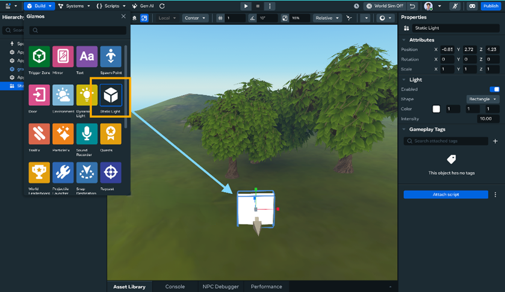

> **:memo: Note:** The light geometry (colored shapes in Build mode) automatically hides during Preview/Play mode. Only the light effect remains visible.

### :flashlight: Static Light Shapes

#### Rectangle - Directional
- Best for: Windows, doorways, and screens
- Features a directional arrow for precise aiming

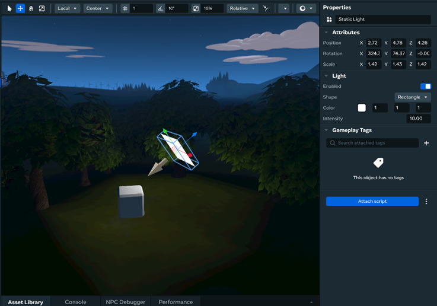

#### Disk - Directional  
- Best for: Ceiling spots, portals, and moon/sun effects
- Features a directional arrow for precise aiming

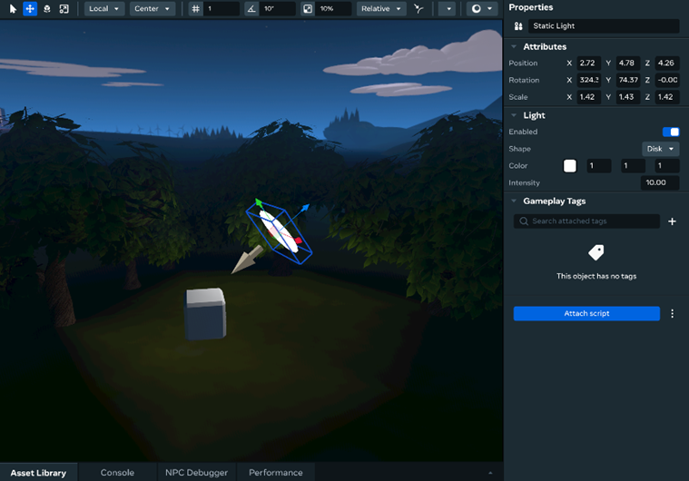

#### Ellipsoid - Omnidirectional
- Best for: Orbs, magical glows, and ambient room lighting
- Radiates light equally in all directions

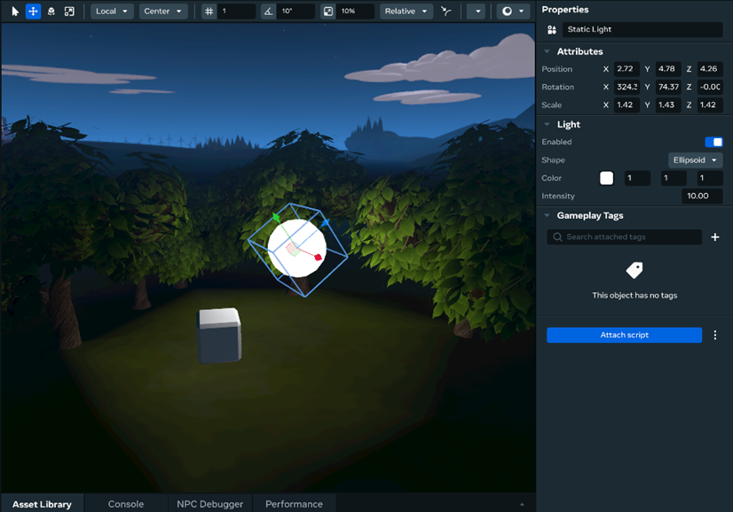

#### Cuboid - Omnidirectional
- Best for: Large area fills and architectural lighting
- Provides broader coverage than Ellipsoid

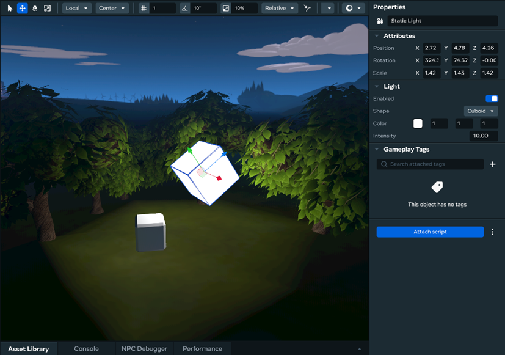

### :art: Static Light Properties

| Property | Range | Description |
|----------|-------|-------------|
| **Enabled** | On/Off | Toggles the light |
| **Shape** | 4 types | Directional: Disk/Rectangle, Omnidirectional: Cuboid/Ellipsoid |
| **Color** | Any | RGB color picker |
| **Intensity** | 0-100 | Brightness (typically use 15-40) |

## 1.3 Dynamic Light Gizmos

### :heavy_plus_sign: Adding a Dynamic Light

1. In Desktop Editor Build mode, select **Build (Top-Left) > Gizmos**
2. Search for "dynamic light" and drag into scene.
3. Configure properties in the Properties panel

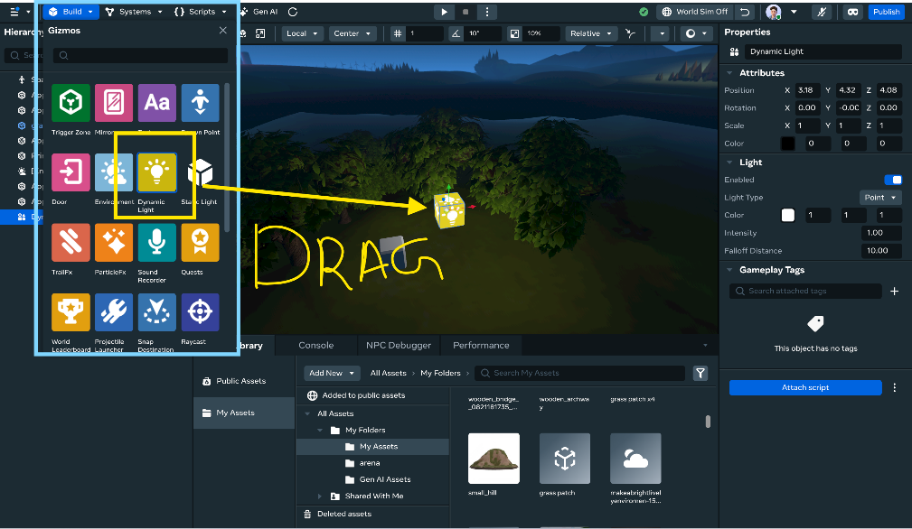

### :bulb: Dynamic Light Types

#### Point Light
Emits light in all directions from a single point, like a lightbulb or candle. Perfect for lamps, torches, and glowing objects.

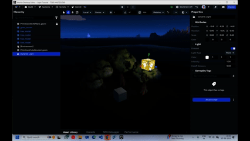

#### Spot Light
Emits a focused cone of light, like a flashlight or stage spotlight. Ideal for dramatic highlights and directional effects.

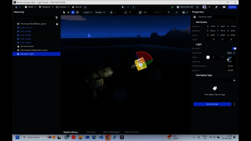

### :gear: Dynamic Light Properties

| Property | Range | Description |
|----------|-------|-------------|
| **Enabled** | On/Off | Toggle light |
| **Light Type** | Point/Spot | Cannot be changed via script |
| **Color** | RGB | Scriptable |
| **Intensity** | 0-10 | Scriptable brightness |
| **Falloff Distance** | 0-100 | How far light travels |
| **Spread** | 0-100 | Cone width (Spot only) |

> ### :warning: Critical Limitations
>
> - Maximum 20 dynamic lights per world
> - High performance cost (real-time calculations)
> - Do NOT respect entity visibility settings (use 'enabled' property)
> - Light Type cannot be changed via scripting

### :wrench: Scriptable Properties

Via TypeScript, you can control:
- Color
- Intensity  
- Enabled/Disabled
- Falloff Distance
- Spread (Spot lights only)

## 1.4 Quick Decision Guide

### :dart: When to Use Each Light Type

| **Choose Static When:** | **Choose Dynamic When:** |
|------------------------|-------------------------|
| :white_check_mark: Light doesn't need to move | :white_check_mark: Light needs to move with objects |
| :white_check_mark: Light state won't change | :white_check_mark: Light needs triggers |
| :white_check_mark: Performance is critical | :white_check_mark: Interactivity is essential |
| :white_check_mark: Lighting large areas | :white_check_mark: Creating focused effects |
| :white_check_mark: Building architectural lighting | :white_check_mark: Gameplay mechanics with light |
| :white_check_mark: Need many lights in scene | :white_check_mark: Need scripted control |

## 1.5 Environment Gizmo

The Environment Gizmo controls your world's overall atmosphere - think of it as the master lighting controller.

### :pushpin: Adding Environment Gizmo

1. In Desktop Editor Build mode, select **Build (Top-Left) > Gizmos**
2. Search for "Environment" and drag into scene
3. Configure in Properties panel

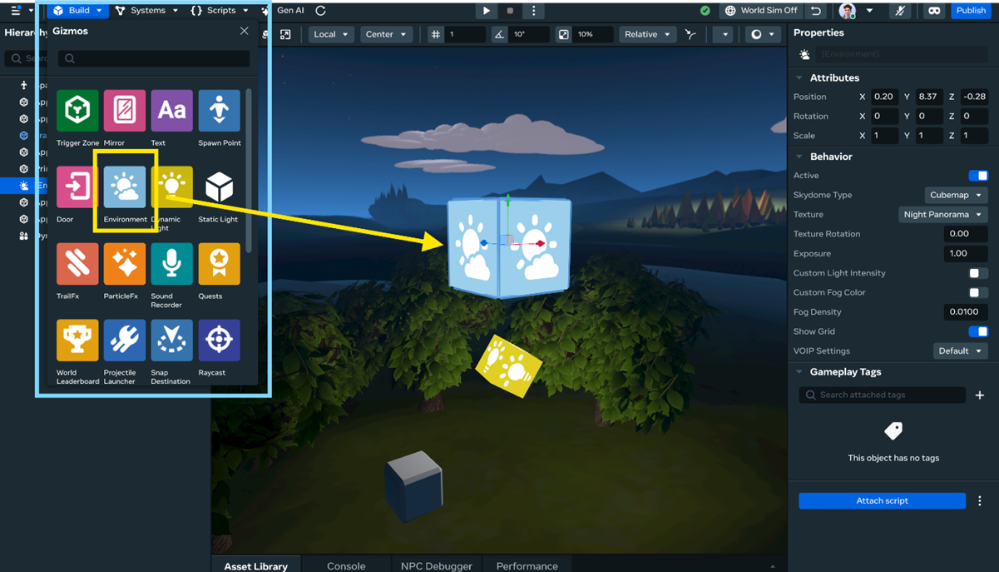

### :sunrise: Key Lighting Properties

| Property | Range | Effect |
|----------|-------|--------|
| **Exposure** | 0.0-2.0 | Overall world brightness |
| **Light Intensity** | 0.0-2.0 | Fine-tune when Custom Light Intensity enabled |
| **Fog Density** | 0.0000-0.1000 | Atmospheric haze thickness |
| **Fog Color** | Any | Tints the atmospheric fog |

### :cloud: Skydome Presets

Each Cubemap preset includes different ambient light levels:
- **Day presets**: Bright ambient lighting
- **Night presets**: Minimal ambient, better for dramatic lighting
- **Custom Gradient**: Manual sky color control

### :bulb: Pro Tip
Set environment lighting first as your "base layer." Dark environments need more individual lights, while bright environments may only need accent lighting.

### :arrows_counterclockwise: Dynamic Day/Night Cycles

While Environment properties aren't directly scriptable, you can:
1. Create multiple Environment Gizmos with different settings
2. Use SpawnController to swap them on timers
3. Only the most recent gizmo affects the world

## 1.6 Quick Reference Card

### :zap: Dynamic Light Settings

| Effect You Want | Intensity | Falloff | Spread (Spot) |
|----------------|-----------|---------|---------------|
| Candle glow | 2-3 | 10-15 | - |
| Room lamp | 4-5 | 20-30 | - |
| Stage spotlight | 7-8 | 40-50 | 30-40 |
| Emergency strobe | 9-10 | 60-80 | 60-80 |
| Flashlight beam | 5-6 | 30-40 | 15-25 |

### :sparkles: Static Light Settings

| Scene Type | Shape | Intensity | Color |
|------------|-------|-----------|--------|
| Cozy room | Ellipsoid | 15-20 | Warm (#FFE4B5) |
| Moonlight | Disk | 25-30 | Cool (#B0C4DE) |
| Window | Rectangle | 8-12 | Neutral (#FFFFFF) |
| Ambient fill | Cuboid | 10-15 | Match scene |

---

# Part 2: From Basic to Brilliant: Lighting Without Code

Throughout these examples, you'll learn both standard implementations and undocumented techniques I've uncovered. These 'lightbulb moments' (pun intended) came from solving real-world lighting challenges in my own projects

## 2.1 Essential Technique: Creating Visible Light Sources

Before diving into effects, here's a fundamental concept: light gizmos themselves are invisible during gameplay - only their illumination shows. To create convincing light sources (lamps, torches, glowing orbs), you need to combine shapes with lights.

### The Problem: Invisible Light Sources

When you add a light gizmo:

| Build Mode | Preview/Play Mode |
|------------|-------------------|
| 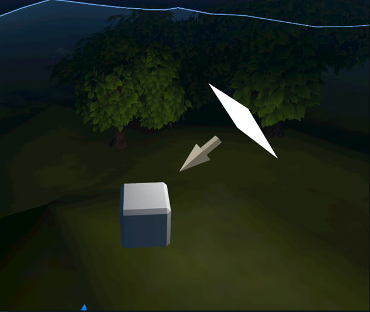 | 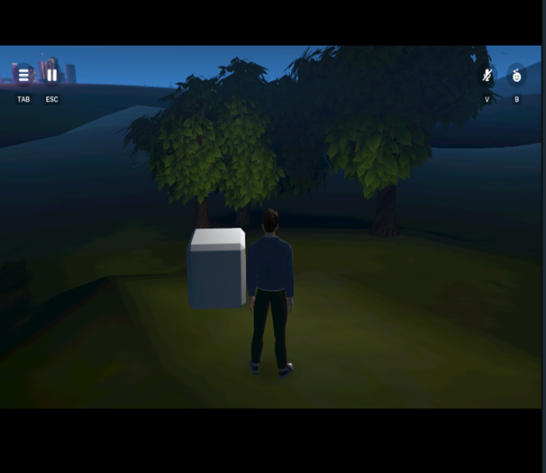 |
| Light gizmo visible as colored shape | Only the lighting effect is visible |

### The Solution: Combining Shapes with Lights

**Time:** 1 minute | **Difficulty:** Beginner

#### Steps:
1. **Add your light source shape/asset** (lamp, orb, crystal)
2. **Add appropriate light gizmo** inside or near it
3. **Match light color** to the object's material
4. **Adjust intensity** based on object size (larger = higher intensity)

| Build Mode Setup | Preview/Play Result |
|-----------------|---------------------|
| 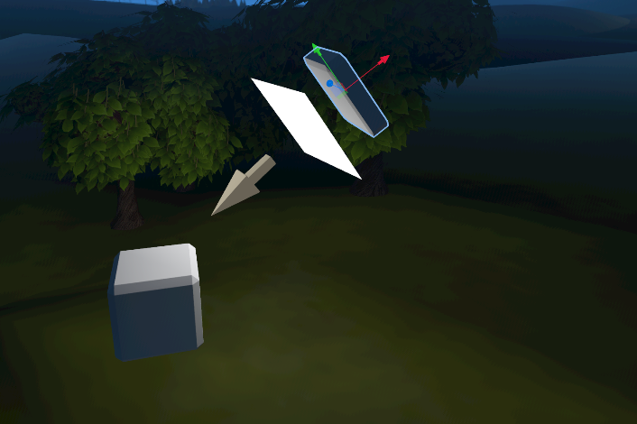 | 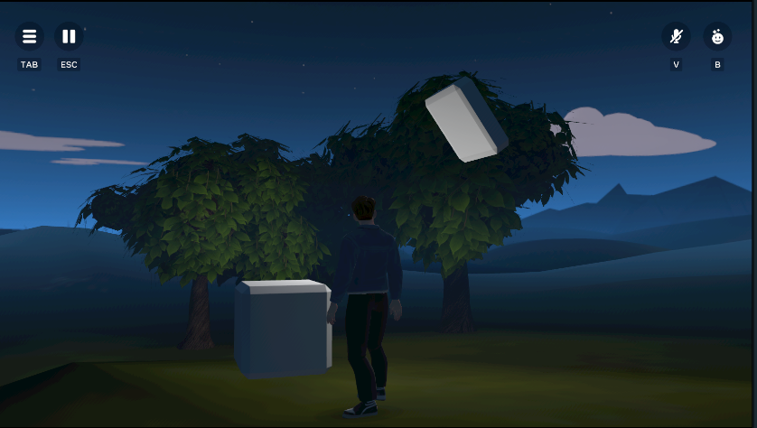 |
| Adding a rectangular directional light in front of a shape | Result: Shape appears as the light source |

> :bulb: **Pro Tip:** Position lights slightly outside solid objects to avoid light bleeding through the back.

---

## 2.2 Professional Lighting Techniques

### Technique 1: Making Symbols Glow

**Time:** 3 minutes | **Difficulty:** Easy | **Gizmos:** 1 Static Ellipsoid

When you want specific parts of an asset to appear self-illuminated (like magical runes or emblems), strategic light placement makes all the difference.

#### Step-by-Step:
1. **Select your symbol/emblem asset**
2. **Add Static Light Gizmo** (Build > Gizmos > "static")
3. **Set Shape:** Ellipsoid
4. **Position:** 0.5-1.0 units in front of symbol
5. **Scale:** Scale according to desired glow effect.
6. **Color:** Match your desired glow effect
7. **Intensity:** 10-15 for subtle glow, 15+ for strong effect
#### Placement Comparison:

#### Standard Placement: 
Illuminates the entire scene evenly.

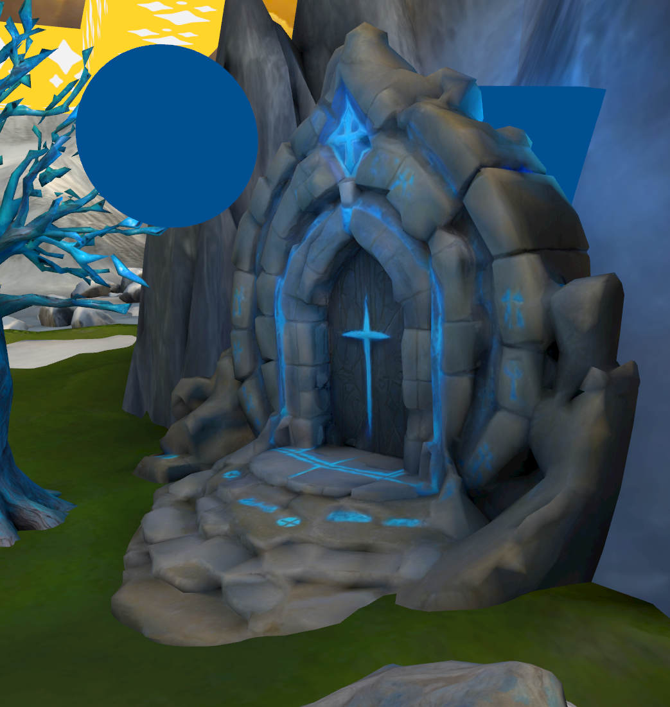

#### Focused Glow Technique:
Makes the emblem appear as the light source itself.


> :warning: **Avoid:** Placing lights inside objects causes light bleeding through the back. Instead, position slightly in front or add a second light behind for better effect.

#### Final Result:

The emblem now appears to emit its own light.

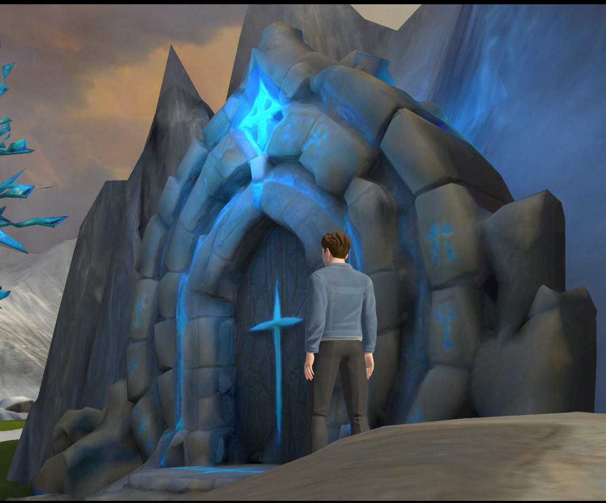

**Common Uses:**
- Magical runes and glyphs
- UI elements in 3D space
- Power-up indicators
- Quest markers

---

### Technique 2: Uniform Architectural Glow

**Time:** 2 minutes | **Difficulty:** Easy | **Gizmos:** 1 Static Cuboid

Make columns, pillars, or totems appear to glow uniformly from within.

#### Step-by-Step:
1. **Select your architectural element** (column, totem, pillar)
2. **Add Static Light Gizmo**
3. **Set Shape:** Cuboid 
4. **Position:** Center of the object
5. **Scale:** Extend slightly beyond object surface (10-20% larger)
6. **Adjust settings:**
   - Color: Match desired effect (e.g., Green #00FF88)
   - Intensity: 5-10 for subtle, 15-25 for strong
   - In this case, the cuboid is at a 45-degree angle to the totem

#### Setup and Result:
Example setup looks like this (in build mode) :

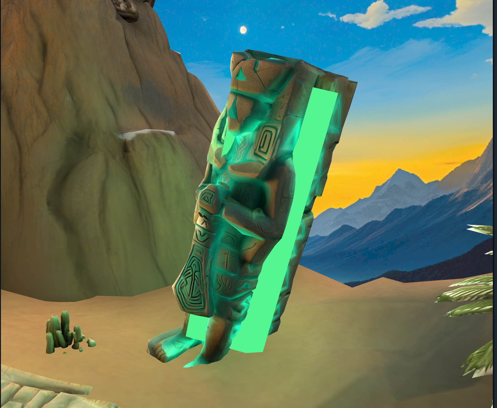

| Without the light effect | With the light effect |
|--------------------|-----------------------|
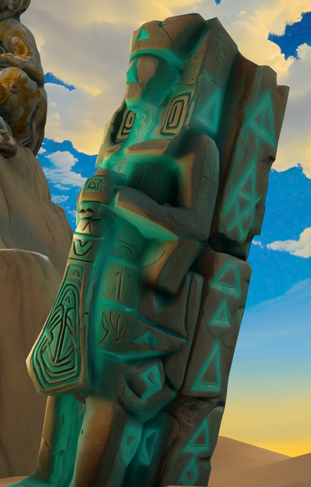 |  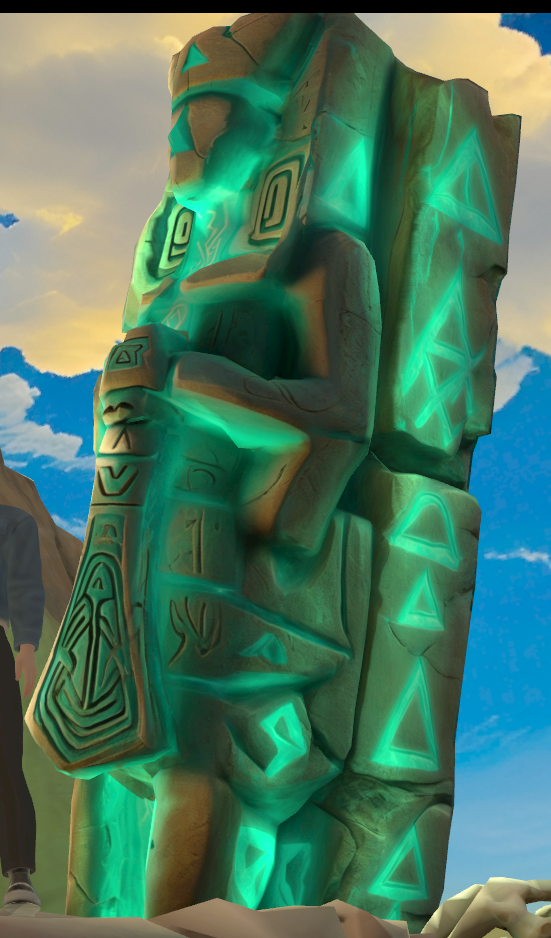 |
| Symbols don't glow and scene looks dull | The Scene comes alive with the light effect |

As a result it appears that the totem is glowing and radiating light.

**Common Uses:**
- Energy pillars in sci-fi worlds
- Magical crystals
- Glowing architectural features
- Sacred monuments

---


### Technique 3: Bringing Buildings to Life with Interior Lighting

**Time:** 5 minutes | **Difficulty:** Easy | **Gizmos:** 1 Static Lights

When you generate/use 3D assets for houses or cabins, they will most likely be empty (just a facade). In order to make them look like they are alive you can add a warm light inside the asset to emit light through the windows. This can work with any building with window cavities.

#### Step-by-Step:
1. **Select the house/cabin** asset where you want to add light
2. **Add cuboid or ellipsoid light** inside and give it a color of your choice, or a warm color (or a spooky color if you want).
3. **Adjust the scale and intensity** according to desired light emission from asset.
4. **Bonus:** add a light and a fog particle effect near the chimney to make the chimney and cabin alive.

#### The light placement inside of the hollow asset:
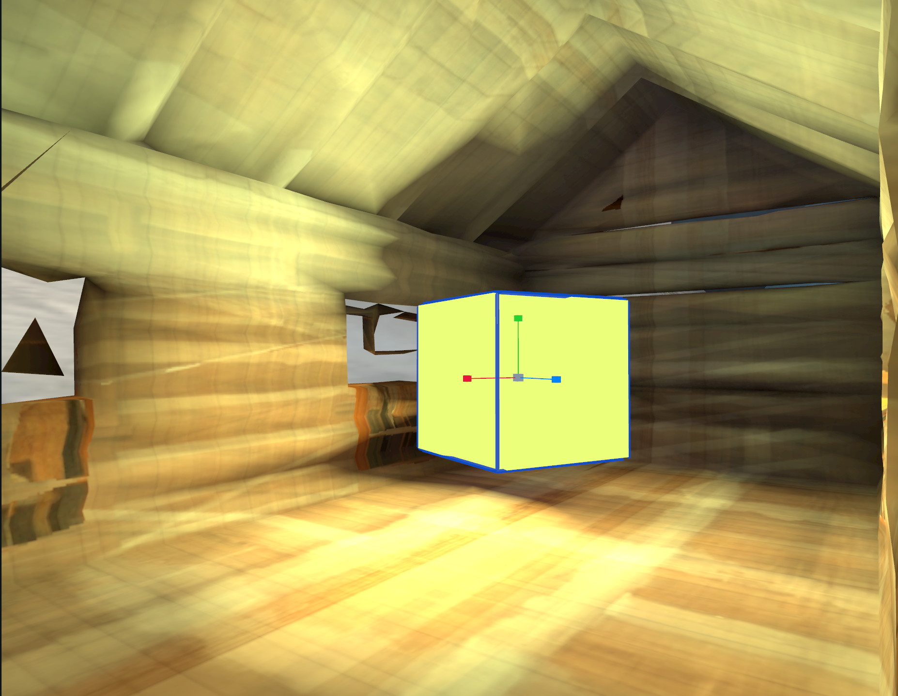 

#### The result from outside to players:

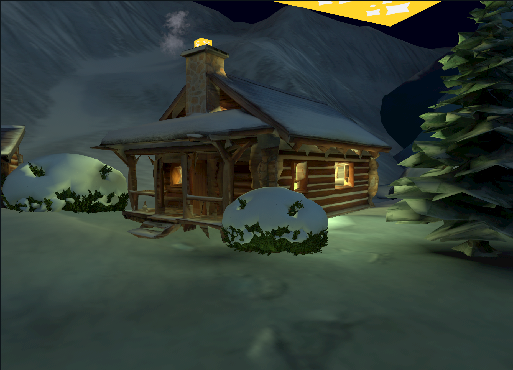 
##### Day view :
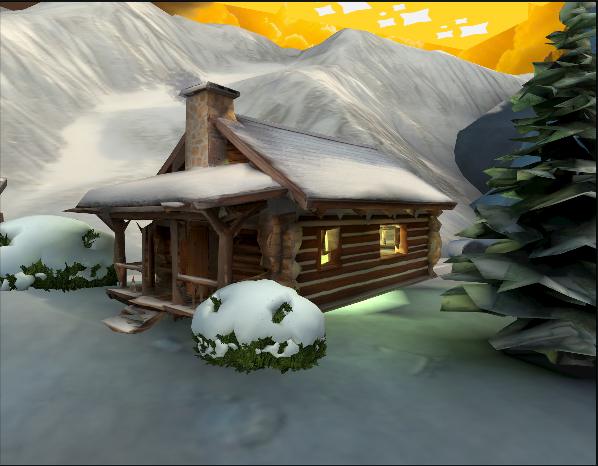 

**Common Uses:**
- Skyscrapers
- Cabin in the woods/winter cabins
- Village/town scenes
- Horror environments

  

### Technique 4: Simulating Natural Sunlight

**Time:** 5 minutes | **Difficulty:** Intermediate | **Gizmos:** 1-2 Static Lights + Environment

Large Ellipsoid lights can effectively simulate natural sunlight in your world, creating warm, ambient illumination.

#### Step-by-Step:
1. **Set Environment Gizmo** to appropriate time of day
2. **Add Static Light Gizmo**
3. **Choose shape based on sun position:**

| Sun Position | Light Shape | Settings |
|-------------|------------|----------|
| **Center/Above** | Large Ellipsoid | Position: High above world center<br>Scale: Cover 70% of playable area<br>Intensity: 40-50 |
| **Edge/Horizon** | Disk (Directional) | Position: World edge<br>Rotation: Aim toward center<br>Intensity: 40-50 | 

4. **Match color to time of day:**
   - Dawn/Dusk: Warm orange (#FFA500)
   - Noon: Neutral white (#FFFFFF)
   - Golden Hour: Soft yellow (#FFD700)

5. **Fine-tune with Environment settings:**
   - Adjust Exposure: 0.8-1.2
   - Set appropriate skydome

#### Result:


**Performance Optimization:**
- Test with/without the light for FPS impact
- Consider multiple smaller lights vs one large light
- Reduce intensity rather than scale if performance drops

**Common Uses:**
- Outdoor environments
- Time-of-day transitions
- Dramatic sunset scenes
- Beach/desert settings

> :bulb: **Pro Tip:** Align directional light arrows with visible sun in skydome for realistic shadows

---

## 2.3 Quick Reference: Effect Settings

| Effect Type | Light Type | Key Settings |
|------------|------------|--------------|
| **Symbol Glow** | Static Ellipsoid | Intensity: 10-15, Offset forward |
| **Architectural Glow** | Static Cuboid | Intensity: 5-15, Scale 120% |
| **Sunlight** | Static Ellipsoid/Disk | Intensity: 20-40, Large scale |
| **Window Light** | Static Rectangle | Intensity: 8-12, Directional |
| **Ambient Fill** | Static Cuboid | Intensity: 10-15, Central position |

--- 
# PART 3 : Level Up - Bringing Lights to Life with TypeScript


 

Dynamic lights can be controlled through TypeScript for advanced effects. In this section we'll progress from simple to complex:
- **Basic**: Color cycling - Rainbow effects
- **Basic**: Flickering - Fire and candles
- **Intermediate**: Pulsing - Breathing machinery
- :star2: **Advanced**: Player Following - Visibility bubble

#### :hammer_and_wrench: Implementation Steps (Common For Each)

| Step | Action | Details |
|------|--------|---------|
| **1. Create Script** | Scripts > (+) New Script | Name: match the class name like "ColorCycleLight" |
| **2. Add Light** | Build > Gizmos > Dynamic Light | Type: Point or Spot |
| **3. Configure Light** | Properties Panel | Intensity: 7-9<br>Falloff: 10-15 |
| **4. Attach Script** | Select Light > In Properties > Attach Script | Search the script you just created |
| **5. Test** | Press Play  | Should see the built effect |

---

### :page_with_curl: 3.1 Color-Cycling Light Effect

**:clock3: Time:** 5 minutes | **:bar_chart: Difficulty:** Basic | **:star: Result:** Smooth rainbow transitions perfect for party scenes


 

#### :rainbow: The Script

```typescript
import { Component, World, Color, Vec3, DynamicLightGizmo } from 'horizon/core';

/**
 * ColorCycleLight - Smoothly transitions through rainbow colors
 * Creates party lights, magic effects, or alien technology
 * Attach directly to a Dynamic Light Gizmo
 */
class ColorCycleLight extends Component<typeof ColorCycleLight> {
  static propsDefinition = {};
  
  // Track our position in the color wheel (0 = red, 0.33 = green, 0.66 = blue, 1 = back to red)
  private hue: number = 0;
  
  // Store reference to the light we're controlling
  private lightGizmo?: DynamicLightGizmo;

  override preStart() {
    // Step 1: Connect to world update for smooth color transitions
    // Runs 60 times per second for fluid rainbow effect
    this.connectLocalBroadcastEvent(World.onUpdate, (data) => {
      this.updateColor(data.deltaTime);
    });
  }

  override start() {
    // Step 2: Get reference to the Dynamic Light this script is attached to
    this.lightGizmo = this.entity.as(DynamicLightGizmo);
    
    // Step 3: Safety check - ensure script is on correct entity type
    if (!this.lightGizmo) {
      console.error("ColorCycleLight: Must be attached to a Dynamic Light Gizmo");
    }
  }

  private updateColor(deltaTime: number) {
    // Safety check in case light was removed
    if (!this.lightGizmo) return;

    // Step 4: Advance through color wheel based on time
    // 0.2 = completes full rainbow in 5 seconds (1 / 0.2 = 5)
    this.hue = (this.hue + deltaTime * 0.2) % 1;

    // Step 5: Convert HSV to RGB color
    // Hue: changes (creates rainbow)
    // Saturation: 1 (fully saturated = vibrant colors)
    // Value: 1 (full brightness)
    const color = Color.fromHSV(new Vec3(this.hue, 1, 1));
    
    // Step 6: Apply the new color to our light
    this.lightGizmo.color.set(color);
  }
}

Component.register(ColorCycleLight);
```


#### :art: Customization Options

**Cycle Speed Variations:**
```typescript
// In updateColor method, change the speed multiplier:
this.hue = (this.hue + deltaTime * 0.1) % 1;   // Slow: 10-second cycle
this.hue = (this.hue + deltaTime * 0.5) % 1;   // Fast: 2-second cycle  
this.hue = (this.hue + deltaTime * 2.0) % 1;   // Strobe: 0.5-second cycle
```

**Start at Different Colors:**
```typescript
// Change initial hue value:
private hue: number = 0;      // Start at red
private hue: number = 0.33;   // Start at green
private hue: number = 0.66;   // Start at blue
private hue: number = 0.83;   // Start at purple
```

**Create Synchronized Light Shows:**
```typescript
// For multiple lights to cycle together:
// Use same script on all lights - they'll sync automatically

// For offset rainbow (wave effect):
// Light 1: private hue: number = 0;
// Light 2: private hue: number = 0.25;
// Light 3: private hue: number = 0.5;
// Light 4: private hue: number = 0.75;
```

#### :video_game: Use Cases

| Scene Type | Speed | Light Count | Setup |
|------------|-------|-------------|-------|
| **Dance Floor** | 0.5 (fast) | 4-6 lights | Grid pattern on ceiling |
| **Magic Portal** | 0.2 (medium) | 1 central | High intensity, wide falloff |
| **Alien Tech** | 0.1 (slow) | 2-3 accent | Subtle background effect |
| **Alert System** | 1.0 (very fast) | 1-2 spots | Combined with sirens |

#### :warning: Performance & Troubleshooting

| Issue | Cause | Solution |
|-------|-------|----------|
| **No color change** | Script not attached | Verify component added to light |
| **Too fast/jarring** | Speed too high | Reduce multiplier below 0.5 |
| **Performance drop** | Too many lights | Limit to 3-4 color cycles |
| **Colors look dull** | Low intensity | Increase to 7+ |

> **:bulb: Pro Tip:** Combine with fog (Environment Gizmo) for volumetric rainbow beams!

---


### :page_with_curl: 3.2 Flickering Candle/Torch Light

**:clock3: Time:** 5 minutes | **:bar_chart: Difficulty:** Basic | **:star: Result:** Realistic fire effect with random intensity and color variations


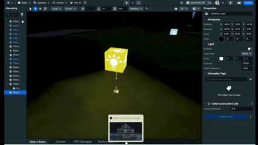 

#### :fire: The Script

```typescript
import { Component, World, Color, Vec3, DynamicLightGizmo } from 'horizon/core';

/**
 * FlickerEffect - Creates realistic fire-like flickering
 * Perfect for: Torches, candles, campfires, fireplaces
 * Attach directly to a Dynamic Light Gizmo
 */
class FlickerEffect extends Component<typeof FlickerEffect> {
  static propsDefinition = {};
  
  // Store reference to the light we're controlling
  private lightGizmo?: DynamicLightGizmo;
  
  // Timer to control flicker frequency (not every frame for realism)
  private flickerTimer: number = 0;

  override start() {
    // Step 1: Get reference to the Dynamic Light this script is attached to
    this.lightGizmo = this.entity.as(DynamicLightGizmo);
    
    // Step 2: Safety check - ensure script is on correct entity type
    if (!this.lightGizmo) {
      console.error("FlickerEffect: Must be attached to a Dynamic Light Gizmo");
      return;  // Exit if not attached to a light
    }
    
    // Step 3: Ensure light starts in enabled state
    this.lightGizmo.enabled.set(true);

    // Step 4: Connect to world update for flicker timing
    // Updates every frame but only flickers when timer reaches zero
    this.connectLocalBroadcastEvent(World.onUpdate, (data) => 
      this.updateFlicker(data.deltaTime)
    );
  }

  private updateFlicker(deltaTime: number) {
    // Safety check in case light was removed
    if (!this.lightGizmo) return;

    // Step 5: Count down our timer
    // When it reaches 0, we'll create a new flicker
    this.flickerTimer -= deltaTime;

    // Step 6: Check if it's time to flicker
    if (this.flickerTimer <= 0) {
      // Step 7: Set next flicker timing (random for natural effect)
      // Between 100-250ms creates realistic fire movement
      this.flickerTimer = Math.random() * 0.15 + 0.1;

      // Step 8: Generate random fire color
      // Fire colors range from yellow (0.05) to orange (0.10) on HSV wheel
      const fireHue = 0.05 + Math.random() * 0.05;
      // Saturation at 0.9 (not fully saturated) for realistic fire
      const fireColor = Color.fromHSV(new Vec3(fireHue, 0.9, 1));
      this.lightGizmo.color.set(fireColor);

      // Step 9: Generate random intensity for flame height variation
      // Varies between 1.5 (low flame) to 3.0 (high flame)
      const randomIntensity = Math.random() * 1.5 + 1.5;
      this.lightGizmo.intensity.set(randomIntensity);
    }
  }
}

Component.register(FlickerEffect);
```
 

#### :art: Configuration Presets

| Fire Type | Falloff | Base Position | Visual Pairing |
|-----------|---------|---------------|----------------|
| **Candle** | 10-15 | On table/holder | Small flame particle |
| **Torch** | 20-25 | Wall mount +0.5m | Medium flame + smoke |
| **Campfire** | 30-35 | Ground level | Large flame + embers |
| **Fireplace** | 25-30 | Inside hearth | Logs + flame particles |
| **Lantern** | 15-20 | Hanging/carried | Glass container model |

#### :gear: Customization Options

**Flicker Speed Variations:**
```typescript
// In updateFlicker method, adjust timer range:

// Nervous candle (wind effect)
this.flickerTimer = Math.random() * 0.05 + 0.05;  // 50-100ms

// Standard torch
this.flickerTimer = Math.random() * 0.15 + 0.1;   // 100-250ms (default)

// Large bonfire (slower changes)
this.flickerTimer = Math.random() * 0.3 + 0.2;    // 200-500ms

// Dying fire (very slow)
this.flickerTimer = Math.random() * 0.5 + 0.5;    // 500-1000ms
```
 

#### :video_game: Use Cases

| Scene Type | Implementation | Pro Tip |
|------------|---------------|---------|
| **Medieval Castle** | Line corridors with torches every 5m | Sync flicker timing for realism |
| **Cozy Cabin** | Fireplace + 2-3 candles | Add warm static light for base glow |
| **Camping Scene** | Central campfire | Combine with sitting animations |
| **Horror Dungeon** | Sparse torches | Increase flicker speed for tension |
| **Romantic Dinner** | Table candles | Reduce intensity range for subtlety |

#### :bulb: Pro Tips

- **Layer lighting** - Add dim static light beneath for consistent base illumination
- **Particle pairing** - Always add flame particles above the light source
- **Sound sync** - Trigger crackling sounds with intensity spikes
- **Performance** - Flickers 4-10 times/second (not every frame) for efficiency
- **Multiple fires** - Same script on all torches creates natural variation

#### :warning: Troubleshooting

| Issue | Cause | Solution |
|-------|-------|----------|
| **No flickering** | Script not attached | Verify component on light |
| **Too rapid/jarring** | Timer too short | Increase minimum to 0.1 |
| **Looks fake** | No color variation | Ensure hue range is set |
| **Too dim** | Low intensity range | Increase base intensity |
| **Not visible** | Light disabled | Check enabled = true |

#### :chart_with_upwards_trend: Performance Notes

- **CPU Impact:** Very low - updates only when timer triggers
- **Update Rate:** 4-10 times per second (not 60fps)
- **Recommended Max:** 10-15 flickering lights per world
- **Optimization:** More efficient than color cycling

---

### 3.3 Pulsing Light System: Breathing Life into Static Scenes

**:clock3: Time:** 5 minutes | **:bar_chart: Difficulty:** Easy | **:star: Result:** Smooth, rhythmic lighting that adds life to machinery and environments


 

#### :heartbeat: Overview

Create lights that smoothly pulse between two intensity levels, perfect for indicating active machinery, warning systems, or adding subtle movement to static scenes. Unlike flickering (random), pulsing creates predictable, calming rhythms.

#### :video_game: Use Cases
- **Warning Lights:** Emergency systems, hazard indicators
- **Sci-Fi Machinery:** Power cores, energy fields, portals
- **Heartbeat Effects:** Tension building, health indicators
- **Sleeping Creatures:** Gentle breathing glow for dragons/monsters
- **Status Indicators:** Active/idle machinery, checkpoint saves

#### :page_with_curl: The Complete Script

```typescript
import { Component, PropTypes, World, DynamicLightGizmo } from 'horizon/core';

/**
 * PulsingLight - Creates smooth breathing/pulsing light effect
 * Uses sine wave mathematics for natural-looking transitions
 * Attach directly to a Dynamic Light Gizmo
 */
class PulsingLight extends Component<typeof PulsingLight> {
  static propsDefinition = {
    // Lowest intensity - the "exhale" of the breathing effect
    minIntensity: { type: PropTypes.Number, default: 2 },
    
    // Highest intensity - the "inhale" of the breathing effect  
    maxIntensity: { type: PropTypes.Number, default: 8 },
    
    // How fast to pulse (1 = one complete cycle per second)
    pulseSpeed: { type: PropTypes.Number, default: 1 },
  };

  // Store reference to the light we're controlling
  private lightGizmo?: DynamicLightGizmo;
  
  // Track elapsed time for sine wave calculation
  private time: number = 0;

  override start() {
    // Step 1: Get reference to the Dynamic Light this script is attached to
    this.lightGizmo = this.entity.as(DynamicLightGizmo);
    
    // Step 2: Safety check - ensure script is on correct entity type
    if (!this.lightGizmo) {
      console.error("PulsingLight: Must be attached to a Dynamic Light Gizmo");
      return;  // Exit if not attached to a light
    }
    
    // Step 3: Connect to update loop for smooth animation
    this.connectLocalBroadcastEvent(World.onUpdate, (data) => 
      this.updateIntensity(data.deltaTime)
    );
  }

  private updateIntensity(deltaTime: number) {
    // Safety check in case light was removed
    if (!this.lightGizmo) return;

    // Step 4: Advance our time counter based on speed setting
    // deltaTime ensures consistent speed regardless of framerate
    this.time += deltaTime * this.props.pulseSpeed;

    // Step 5: Generate sine wave value between -1 and 1
    // Math.sin() creates smooth wave pattern
    const sinWave = Math.sin(this.time * Math.PI * 2);

    // Step 6: Convert sine wave from [-1, 1] range to [0, 1] range
    // This makes it easier to work with for intensity
    const normalizedValue = (sinWave + 1) / 2;

    // Step 7: Map normalized value to our intensity range
    // At 0: use minIntensity, at 1: use maxIntensity
    const intensity = this.props.minIntensity + 
      (this.props.maxIntensity - this.props.minIntensity) * normalizedValue;

    // Step 8: Apply the calculated intensity to the light
    this.lightGizmo.intensity.set(intensity);
  }
}

Component.register(PulsingLight);
```

#### :hammer_and_wrench: Setup Instructions

| Step | Action | Details |
|------|--------|---------|
| **1. Add Light** | Build > Gizmos > Dynamic Light | Type: Point or Spot<br>Color: Based on use case |
| **2. Create Script** |   Scripts > (+) New Script | Name: "PulsingLight"<br>Copy code above |
| **3. Attach** | Select Light > Add Component | Search "PulsingLight" |
| **4. Configure** | Adjust properties panel | Set min/max/speed values |
| **5. Test** | Press Play | Watch smooth pulsing |

#### :art: Configuration Presets

| Effect Type | Min | Max | Speed | Color | Use Case |
|------------|-----|-----|-------|--------|----------|
| **Slow Breathing** | 2 | 6 | 0.3 | #87CEEB | Sleeping creature |
| **Heartbeat** | 1 | 8 | 1.2 | #FF0000 | Health critical |
| **Warning Light** | 0 | 10 | 2.0 | #FFA500 | Emergency alert |
| **Power Core** | 4 | 9 | 0.5 | #00FFFF | Sci-fi reactor |
| **Candle Glow** | 3 | 5 | 0.8 | #FFD700 | Subtle ambiance |
| **Alien Tech** | 1 | 7 | 1.5 | #9370DB | Mysterious artifact |
 

#### :rocket: Combining with Other Effects


**Multiple Synchronized Pulses:**
```typescript
 Place 3-4 lights with same speed but different min/max
 Creates layered breathing effect for large creatures
```

**Offset Pulsing for Waves:**
```typescript
// Add initial time offset to create wave patterns
private time: number = Math.random() * Math.PI * 2;  // Random start point
```

#### :bulb: Pro Tips

- **Subtlety is key** - Small intensity ranges (3-5) often look better than dramatic swings
- **Match the context** - Slow for calm scenes (0.3-0.5), fast for urgency (1.5-2.0)
- **Layer effects** - Combine with static lights for base illumination
- **Performance-friendly** - More efficient than flickering since it's predictable
- **Color matters** - Cool colors for tech, warm for organic

#### :warning: Troubleshooting

| Problem | Cause | Solution |
|---------|-------|----------|
| **No pulsing visible** | Min/max too similar | Increase difference to at least 3 |
| **Too fast/jarring** | Speed too high | Reduce to 0.5-1.0 |
| **Light turns off** | Min intensity = 0 | Keep min at least 0.5 |
| **Not smooth** | Frame rate issues | Check other scripts for performance |
| **Wrong entity** | Not on Dynamic Light | Must attach to Dynamic Light Gizmo |

#### :chart_with_upwards_trend: Performance Notes

- **CPU Impact:** Very low - simple sine calculation
- **Update Rate:** Every frame (smooth required)
- **Recommended Max:** 8-10 pulsing lights per world
- **Optimization:** Consider shared timing for synchronized effects
 
---

### 3.4 Follow-Me Light: Creating Tension Through Limited Vision

**:clock3: Time:** 10 minutes | **:bar_chart: Difficulty:** Intermediate | **:star: Result:** Dynamic lighting that creates tension through limited visibility

 


#### :flashlight: Overview

Create a "bubble of visibility" that follows the player through darkness - perfect for horror games, dungeon crawlers, or any experience where limited visibility enhances gameplay. By placing the light at the spawn point, it automatically attaches to the player from the start.

#### :video_game: Use Cases
- **Horror Games:** Only see what's immediately around you
- **Dungeon Exploration:** Torch/lantern mechanics  
- **Stealth Sections:** Light reveals your position to enemies
- **Underwater Scenes:** Limited visibility in deep water
- **Survival Games:** Day/night cycles where night requires light

#### :page_with_curl: The Complete Script

```typescript
import { Component, PropTypes, World, Player, Vec3 } from 'horizon/core';

/**
 * FollowPlayerHead - Makes a Dynamic Light follow the player
 * Perfect for: Horror games, dungeon exploration, survival games
 * Setup: Place at spawn point for automatic player tracking
 */
class FollowPlayerHead extends Component<typeof FollowPlayerHead> {
  static propsDefinition = {
    // Controls vertical offset from player's head
    // 0.5 = handheld torch, 1.0 = overhead lamp, 2.0 = ceiling follow
    heightOffset: { type: PropTypes.Number, default: 1.0 },
  };

  override start() {
    // Step 1: Connect to world update for real-time following
    // Runs 60 times per second to ensure smooth, lag-free tracking
    this.connectLocalBroadcastEvent(World.onUpdate, () => this.updatePosition());
  }

  private findNearestPlayer(): Player | null {
    // Step 2: Get all players currently in the world
    const players = this.world.getPlayers();
    
    // Step 3: Safety check - handle empty world scenario
    if (players.length === 0) return null;

    // Step 4: Get our current position for distance calculations
    const myPosition = this.entity.position.get();
    
    // Step 5: Initialize tracking variables
    let nearestPlayer: Player | null = null;
    let minDistanceSq = Infinity;  // Start with maximum possible distance

    // Step 6: Loop through all players to find the closest one
    for (const player of players) {
      // Step 7: Calculate squared distance (faster than regular distance)
      // distanceSquared avoids expensive square root calculation
      const distanceSq = myPosition.distanceSquared(player.position.get());
      
      // Step 8: Check if this player is closer than previous closest
      if (distanceSq < minDistanceSq) {
        minDistanceSq = distanceSq;
        nearestPlayer = player;
      }
    }
    
    // Step 9: Return the nearest player (or null if none found)
    return nearestPlayer;
  }

  private updatePosition() {
    // Step 10: Find the player to follow
    const player = this.findNearestPlayer();
    
    // Step 11: Only update if we found a player
    if (player) {
      // Step 12: Get player's head position for accurate tracking
      // Using head instead of player.position ensures light is at eye level
      // not at the player's feet
      const headPos = player.head.position.get();
      
      // Step 13: Calculate new light position with vertical offset
      // Create new Vec3 to avoid modifying the player's actual position
      const newPosition = new Vec3(
        headPos.x,                               // Same X as player
        headPos.y + this.props.heightOffset,    // Add height above head
        headPos.z                                // Same Z as player
      );
      
      // Step 14: Move our light to the calculated position
      this.entity.position.set(newPosition);
    }
  }
}

Component.register(FollowPlayerHead);
```

#### :hammer_and_wrench: Setup Instructions

##### **The Smart Setup: Spawn Point Placement**

| Step | Action | Why It Works |
|------|--------|--------------|
| **1. Environment** | Add Environment Gizmo<br>Select Night skydome<br>Exposure: 0.3<br>Fog Density: 0.02 | Creates darkness |
| **2. Find Spawn** | Locate the spawn point marker | Where player appears |
| **3. Add Light** | Place Dynamic Light ON spawn point<br>Type: Point<br>Intensity: 5<br>Falloff: 30 | Light "waits" for player |
| **4. Create Script** | Build > Scripts > New Script<br>Name: "FollowPlayerHead"<br>Paste code above | Must match class name |
| **5. Attach Script** | Select Dynamic Light<br>Add Component > "FollowPlayerHead" | Activates following |
| **6. Configure** | Height Offset: 1.0 | Adjust to preference |

> **:bulb: Why Spawn Placement Works:** When the player spawns, they're immediately the nearest player. The light finds them instantly and begins following - zero setup delay!

#### :art: Configuration Presets

| Effect Type | Height Offset | Intensity | Falloff | Color | Result |
|------------|---------------|-----------|---------|--------|---------|
| **Handheld Torch** | 0.5 | 4 | 25 | #FFA500 | Medieval dungeon feel |
| **Overhead Lantern** | 1.0 | 6 | 35 | #FFE4B5 | Stable exploration |
| **Floor Candle** | -0.5 | 3 | 15 | #FFD700 | Light from below |
| **Helmet Light** | 0.0 | 5 | 40 | #FFFFFF | Mining/cave explorer |
| **Ghost Light** | 2.0 | 7 | 30 | #E0FFFF | Supernatural guide |

#### :rocket: Optional: Multiplayer Support

For asymmetric multiplayer or specific player tracking, add target player name:

```typescript
// Add to propsDefinition:
targetPlayerName: { type: PropTypes.String, default: '' },

// Add new method:
private findTargetPlayer(): Player | null {
  const players = this.world.getPlayers();
  if (players.length === 0) return null;
  
  // Look for specific named player first
  if (this.props.targetPlayerName) {
    const named = players.find(p => p.name.get() === this.props.targetPlayerName);
    if (named) return named;
  }
  
  // Fallback to nearest player
  return this.findNearestPlayer();
}

// Change updatePosition() to use:
const player = this.findTargetPlayer();  // Instead of findNearestPlayer()
```

**Multiplayer Use Cases:**
- **"Monster" Mode:** Only monster player has darkness
- **Tour Guide:** Light follows "Guide" player  
- **VIP Lighting:** Special effects for specific player

#### :bulb: Pro Tips

- **Combine with static lights** at key locations (dim glows at doorways) so players aren't completely blind
- **Add sound triggers** that activate when enemies enter/leave the light radius
- **Create tension** by reducing falloff distance in dangerous areas
- **Hide collectibles** just outside the light radius to encourage exploration
- **Use color shifts** to indicate danger (red tint) or safety (blue tint)

#### :warning: Troubleshooting

| Problem | Cause | Solution |
|---------|-------|----------|
| **Light inside player head** | Height offset too low | Increase to 1.0 or higher |
| **Light not following** | Script not attached | Verify component on Dynamic Light |
| **Can't see anything** | Falloff too small | Increase to 30-40 |
| **Too bright** | Environment not dark | Lower exposure to 0.2-0.4 |
| **Jittery movement** | No smoothing | Add lerp smoothing (see enhancement) |

#### :chart_with_upwards_trend: Performance Notes

- **Update Frequency:** 60fps (can reduce for less critical uses)
- **CPU Impact:** Minimal - simple position calculations
- **Best Practice:** Limit to 1-2 following lights per world
- **Memory:** Negligible - stores only position data
 
---

# Part 4: Bringing It All Together
Time to combine everything you've learned into complete scenes. This section provides quick references and practical tools - we'll walk through one detailed example, then give you the building blocks for others. The rest is up to your imagination.
Think of these as recipes: follow them exactly, or use them as inspiration to create something entirely your own.

## 4.1 Complete Scene Tutorials

### :house: Cozy Interior Room

**:clock3: Time:** 15 minutes | **:bulb: Lights Used:** 5 | **:page_with_curl: Scripts:** Optional FlickerEffect

#### Step-by-Step Build

**Step 1: Environment Foundation**
```
- Add Environment Gizmo
- Skydome: Evening or Sunset
- Exposure: 0.8
- Fog: Off (indoor scene)
- Room dimensions: 10x10x3 meters
```

**Step 2: Layer 1 - Ambient Base**
| Component | Settings | Placement |
|-----------|----------|-----------|
| **Static Light** | Ellipsoid shape | Room center, 2.5m height |
| **Color** | #FFE4B5 (Warm white) | - |
| **Intensity** | 15 | - |
| **Scale** | 8x8x2 meters | Covers 80% of room |
| **Purpose** | Base illumination | Prevents harsh shadows |

**Step 3: Layer 2 - Window Light**
| Component | Settings | Placement |
|-----------|----------|-----------|
| **Static Light** | Rectangle shape | Outside each window |
| **Color** | #87CEEB (Sky blue) | - |
| **Intensity** | 8 | - |
| **Rotation** | 45° inward angle | Simulates outdoor light |
| **Scale** | Match window size | - |

**Step 4: Layer 3 - Fireplace Glow**
| Component | Settings | Placement |
|-----------|----------|-----------|
| **Dynamic Light** | Point type | Inside fireplace |
| **Color** | #FF6B35 (Fire orange) | - |
| **Intensity** | 5 | - |
| **Falloff** | 25 | - |
| **Script** | Attach FlickerEffect | Creates fire movement |

**Step 5: Layer 4 - Table Accent**
| Component | Settings | Placement |
|-----------|----------|-----------|
| **Dynamic Light** | Point type | On table, 0.5m above |
| **Color** | #FFD700 (Candle) | - |
| **Intensity** | 3 | - |
| **Falloff** | 15 | - |
| **Script** | Optional FlickerEffect | For candle realism |

**Visual Guide:**
```
    [Window Light]     [Window Light]
           ↘              ↙
         [Ambient Ellipsoid]
              (center)
                 |
    [Fireplace]--+--[Table Light]
```

**Pro Tips:**
- Start with ambient light at 50% intensity, then increase
- Test with/without window lights for time-of-day variation
- Add props (furniture) after lighting to see actual effect

---

### Additional Scene Blueprints

#### :performing_arts: Dramatic Stage Setup
**Core Concept:** Triangle of spotlights + backlight silhouette + fog for visible beams

**Quick Recipe:**
- **Environment:** Night sky, 0.4 exposure, 0.01 fog density
- **3 Dynamic Spots:** Front-facing at 45° down, intensity 8, arrange in triangle
- **1 Static Rectangle:** Behind stage for purple backlight silhouette
- **Optional:** Add ColorCycleLight to center spot for finale effect

**Key Insight:** Fog makes spotlight beams visible - essential for stage atmosphere

---

#### :european_castle: Mysterious Dungeon Crawler  
**Core Concept:** Player carries only light source through darkness

**Quick Recipe:**
- **Environment:** Night sky, 0.2 exposure, green fog for eeriness
- **1 Dynamic Point:** At spawn with FollowPlayerHead script (the tutorial's star feature!)
- **Sparse Torches:** Dynamic points with FlickerEffect every 10-15m
- **Color Language:** Red static lights = danger zones, gold = treasure

**Key Insight:** Limited visibility creates tension - darkness becomes a game mechanic

---

### Scene Lighting Quick Reference

| Want This Effect? | Use This Setup |
|------------------|----------------|
| **Cozy warmth** | Warm ellipsoid (center) + window rectangles + flickering fireplace |
| **Stage drama** | Spot triangle + backlight + fog for beams |
| **Horror tension** | Follow player light + sparse torches + colored danger zones |
| **Sci-fi clean** | White rectangles (strips) + pulsing point accents |
| **Natural outdoor** | Large overhead ellipsoid matching skydome sun position |

## 4.2 Master Troubleshooting Guide

### :wrench: Complete Problem/Solution Reference

| Category | Problem | Cause | Solution |
|----------|---------|-------|----------|
| **Performance** | Frame rate drops | Too many dynamic lights | Limit to 3-4 visible dynamics<br>Convert fixed lights to static |
| | Stuttering | Scripts updating too frequently | Reduce update rates<br>Use timers instead of every frame |
| | Load time slow | Too many large static lights | Reduce scale or combine nearby lights |
| **Visibility** | Too dark overall | Environment too dark | Increase exposure to 0.3+<br>Add ambient static light |
| | Can't see anything | Lights not reaching | Increase falloff distance<br>Check intensity (minimum 3) |
| | Too bright/washed out | Over-lighting | Reduce intensities<br>Remove overlapping lights |
| **Scripts** | Not working | Not attached properly | Verify component on Dynamic Light<br>Check console (F9) for errors |
| | ColorCycle broken | Wrong entity type | Must be on Dynamic Light Gizmo |
| | Player follow jittery | No smoothing | Add lerp code from enhancements |
| **Quality** | Light bleeding through walls | Position too close | Move light 0.5m away from surfaces |
| | Harsh shadows | Single bright source | Use multiple softer lights |
| | Flickering all lights | Performance issue | Reduce total light count |
| **Multiplayer** | Lights not syncing | Script client-side only | Ensure using networked properties |
| | Following wrong player | Name mismatch | Check exact player name spelling |

---
 
## 4.3 Learning Challenges

### :green_circle: Novice: Day/Night Cycle
**Goal:** Automatic lighting change every 30 seconds
**Hint:** Use 2 Environment Gizmos + Timer + Spawn Controller
**Success:** Visible difference between day/night moods

### :yellow_circle: Intermediate: Reactive Disco  
**Goal:** 4+ lights that react to player proximity
**Hint:** Mix ColorCycle, Pulsing, and Flicker scripts with Trigger Zones
**Success:** Different zones = different light patterns

### :red_circle: Advanced: Stealth Light Maze
**Goal:** Navigate past moving spot lights without detection
**Hint:** Mover Gizmos + Spot Lights + Detection script
**Success:** Player can complete maze; getting caught = reset

## 4.4 Performance Guidelines

### :chart_with_upwards_trend: Lighting Performance Budget

**Recommended Limits:**
| Light Type | Maximum | Ideal | Performance Impact |
|------------|---------|-------|-------------------|
| **Static Lights** | Unlimited* | 20-30 visible | Low (pre-calculated) |
| **Dynamic Lights** | 20 total | 3-4 visible | High (real-time) |
| **Scripted Lights** | 10-15 | 5-8 | Medium (CPU usage) |
| **Total Scene FPS** | 60 minimum | 90 target | - |

*Technically unlimited but be reasonable for load times

**Optimization Priority:**
1. **First:** Convert non-moving lights to static
2. **Second:** Reduce dynamic light falloff distances
3. **Third:** Disable distant dynamic lights
4. **Fourth:** Simplify scripts (reduce update frequency)
5. **Last Resort:** Remove lights entirely

**Testing Checklist:**
- [ ] Test in Preview mode (Desktop performance)
- [ ] Test in VR (if applicable)
- [ ] Use built-in performance measuring tools
- [ ] Test with maximum players expected
- [ ] Test on minimum spec hardware
- [ ] Monitor FPS counter during gameplay

---

## 4.5 Getting Help

 For any questions or further assistance, creators are encouraged to join the discussion on the Creator Forums or join live a mentor session.

[Meta Help Center](https://www.meta.com/help/quest/1191673084645599/?ref=www.meta.com%2Fhelp)

[Meta Developer Support](https://metahorizondevelopers.zendesk.com/hc/en-us)