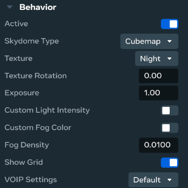
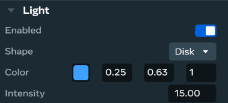
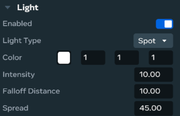
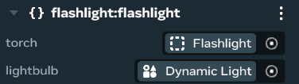

# Horizon Worlds Lighting Tutorial

## Introduction

Lighting in Horizon Worlds is how you control the brightness, color, and mood of your virtual space. It’s like painting with light—helping players feel something when they enter your world.
In Horizon Worlds, lighting is created using special tools called **gizmos**. These gizmos let you add sunlight, lamps, flashlights, and even lights that change when players interact with them.

---

## Outcomes

By the end of this tutorial, you'll be able to:
- Set up an environment skybox and ambient light using the Environment Gizmo
- Add static lights for consistent brightness in your scenes
- Create dynamic lights that respond to player actions or scripts
- Choose the right lighting type for different moods and gameplay
- Use basic scripting to control dynamic lights

---

## Prerequisites

Before starting this lighting tutorial, make sure you’ve completed these beginner guides:

➡️ [Building Your First World](https://github.com/MHCPCreators/worlds-documentation/blob/main/docs/creating-a-world/building-your-first-world.md)  
➡️ [TypeScript Basics for Horizon Worlds](https://github.com/MHCPCreators/worlds-documentation/blob/main/docs/getting-started-with-scripting/TypeScript-basics-beginner-friendly-session-for-Worlds.md)

---

## Why Lighting Is Important

Lighting isn’t just about seeing—it’s about feeling. Good lighting helps you:
- Set the mood (cozy, spooky, exciting)
- Guide players to important areas
- Make your world look more realistic or stylized
- Improve how players feel when they explore your space

<p align="center">
  <a href="https://www.youtube.com/watch?v=smmlgyXsLl4" target="_blank">
    
    <br>
    <span style="font-size:16px; font-weight:bold;">Watch Horizon World Lighting Video</span>
  </a>
</p>


Whether you're crafting a lounge, a dance floor, or an outdoor retreat, lighting sets the tone and makes your world memorable.

---

## 1. Environment Gizmo – Setting the Sky and Atmosphere

The **Environment Gizmo** controls the sky, fog, and overall brightness of your world.

### 🛠️ How to Use It
- Go to the **Build menu**, search for **Environment Gizmo**, and drag it into your world.
- Click on it to open the settings.

<details>
  <summary><strong>🔍 Properties</strong></summary>

  <br>

  

  - **Sky Type**: Choose a skybox (like night or sunset) or make your own gradient with colors.  
  - **Custom Light Intensity**: Add extra light manually  
  - **Custom Fog Color**: Change the color of the mist.  
  - **Fog Density**: Add mist to make things look dreamy or far away.  
  - **Show Grid**: Turns on a helper grid in the editor—helps with building, not seen in gameplay.  
  - **VOIP Settings**: Controls how voice chat works in your world.
</details>

 <p align="center">
    <a href="https://youtu.be/7CT8rjIgRnM" target="_blank">
      
      <br>
      <span style="font-size:16px; font-weight:bold;">Watch Environment Gizmo Video</span>
    </a>
  </p>


### 🧠 Tip
Use a darker sky and fog for spooky worlds, or bright skies for cheerful ones.

---

## 2. Static Light Gizmo – Lighting That Stays the Same

Static lights are great for areas that don’t need to change—like a lamp in a room or sunlight in a park.

### 🛠️ How to Use It
- Go to the **Build menu**, search for **Static Light Gizmo**, and drag it into your world.
- Click on it to open the settings.

<details>
  <summary><strong>🔍 Properties</strong></summary>

  <br>

  

  - **Enabled**: Turns the light on or off.
  - **Shape**: Choose the form of the light. There are **four shapes**:
    - **Cuboid**: A box-shaped light that shines evenly in all directions.
    - **Ellipsoid**: A soft, round light that glows gently without sharp edges.
    - **Disk**: A flat, circular light that shines in one direction—like a spotlight.
    - **Rectangle**: A wide, flat light that also shines directionally—great for walls or ceilings.
  - **Color**: Pick the color of your light.
  - **Intensity**: Controls how bright the light is. Higher numbers = stronger glow.

</details>

<p align="center">
  <a href="https://youtu.be/rOKbbA1FyQ4" target="_blank">
    
    <br>
    <span style="font-size:16px; font-weight:bold;">Watch Static Light Gizmo Video</span>
  </a>
</p>

### 🧠 Tip
Use warm colors (like orange or yellow) for cozy spaces, and cool colors (like blue or purple) for futuristic or calm areas.

---

## 3. Dynamic Light Gizmo – Lights That Move or React

Dynamic lights can change during gameplay. You can attach them to objects or use scripts to turn them on and off.

### 🛠️ How to Use It
- Go to the **Build menu**, search for **Dynamic Light Gizmo**, and drag it into your world.
- Click on it to open the settings.

<details>
  <summary><strong>🔍 Properties</strong></summary>

  <br>

  

  - **Enabled**: Activates the light in your scene.
  - **Light Type**: Set to **Spot** or **Point**.
  - **Color**: Uses RGB values to define the light’s hue.
  - **Intensity**: Controls the brightness of the light.
  - **Falloff Distance**: Determines how far the light travels before fading out.
  - **Spread**: Defines the angle of the spotlight cone.

</details>

<p align="center">
  <a href="https://www.youtube.com/watch?v=DVWjM8xwT7M" target="_blank">
    
    <br>
    <span style="font-size:16px; font-weight:bold;">Watch Dynamic Light Gizmo Video</span>
  </a>
</p>

### 🧠 Tip
Use dynamic lights for flashlights, glowing objects, or lights that change color when players interact.

---

## Light Interactions with Scripts
This code sample shows how a dynamic light can be turned off and on during gameplay.

<details>
  <summary><strong>🔍 Properties</strong></summary>

  <br>

  

  **Parameters**  
  - **torch**: The parent object of the light source  
  - **lightbulb**: The dynamic light

</details>

```typescript
import * as hz from 'horizon/core';

class flashlight extends hz.Component<typeof flashlight> {
  static propsDefinition = {
    torch: { type: hz.PropTypes.Entity },        // Grabbable torch object
    lightbulb: { type: hz.PropTypes.Entity }     // DynamicLightGizmo
  };

  private onOff: boolean = false;                // Tracks light state
  private isGrabbed: boolean = false;            // Tracks grab state

  start() {
    // When torch is grabbed
    this.connectCodeBlockEvent(this.props.torch!, hz.CodeBlockEvents.OnGrabStart, () => {
      this.isGrabbed = true;
      this.updateLight();
    });

    // When torch is released
    this.connectCodeBlockEvent(this.props.torch!, hz.CodeBlockEvents.OnGrabEnd, () => {
      this.isGrabbed = false;
      this.updateLight();
    });

    // When index trigger is pressed
    this.connectCodeBlockEvent(this.props.torch!, hz.CodeBlockEvents.OnIndexTriggerDown, () => {
      if (this.isGrabbed) {
        this.onOff = !this.onOff;
        this.updateLight();
      }
    });

    // Ensure light starts off
    this.updateLight();
  }

  private updateLight() {
    const light = this.props.lightbulb?.as(hz.DynamicLightGizmo);
    if (!light) return;
    light.enabled.set(this.isGrabbed && this.onOff);
  }
}

hz.Component.register(flashlight);
```

---

## Summary

Lighting is one of the easiest ways to make your Horizon World feel special. Start with the **Environment Gizmo** to set the mood, use **Static Lights** for steady glow, and add **Dynamic Lights** for fun effects and interaction.


