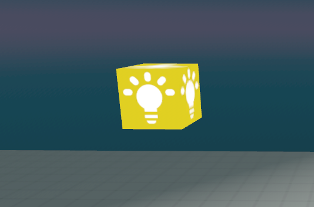

# Dynamic Lighting Systems for Horizon Worlds

**Implement interactive and event-driven lighting systems in Horizon Worlds.** This guide focuses on scripting dynamic lighting, proximity-based triggers, and network events for lighting control.

**Creator Skill Level**
Intermediate to Advanced

**Recommended Background Knowledge**
Understanding of lighting fundamentals from [lighting-fundamentals-basics.md](./lighting-fundamentals-basics.md) and TypeScript scripting fundamentals.

**Estimated Time to Complete**
45-60 minutes for core concepts, 30 minutes for implementation

## Table of Contents

1. [Interactive Lighting Triggers](#interactive-lighting-triggers)
2. [Network Event Systems](#network-event-systems)
3. [Advanced Lighting Scripts](#advanced-lighting-scripts)
4. [Performance Considerations](#performance-considerations)

## Interactive Lighting Triggers

### Proximity-Based Lighting

Proximity-based lighting creates immersive experiences by responding to player movement and interaction.



**Implementation Steps:**

1. **Create Trigger Zone**
   - Add Trigger Gizmo to your world
   - Configure size and position for desired interaction area

2. **Set Up Light Entity**
   - Add Dynamic Light Gizmo
   - Configure initial properties (color, intensity, falloff)

3. **Connect with Scripts**
   - Use TriggerBroadcaster to detect player entry/exit
   - Use LightChanger to modify lighting properties

**📖 For basic lighting setup**: See [lighting-fundamentals-basics.md#using-dynamic-lights](./lighting-fundamentals-basics.md#using-dynamic-lights)

---

## Network Event Systems

<iframe width="1378" height="775" src="https://www.youtube.com/embed/yZArJ26YJMQ" title="MHCP - TRIGGER LIGHTS" frameborder="0" allow="accelerometer; autoplay; clipboard-write; encrypted-media; gyroscope; picture-in-picture; web-share" referrerpolicy="strict-origin-when-cross-origin" allowfullscreen></iframe>


### Trigger Broadcasting System

The TriggerBroadcaster component detects when players enter or exit trigger zones and sends network events.

```typescript
import { Component, PropTypes, NetworkEvent, CodeBlockEvents, Player, Entity } from 'horizon/core';

// Define the network events. These should match the event names used by any receiving scripts.
const PlayerEntered = new NetworkEvent('PlayerEntered');
const PlayerExited = new NetworkEvent('PlayerExited');

export class TriggerBroadcaster extends Component<typeof TriggerBroadcaster> {
  static propsDefinition = {
    // The entity that will receive the network events.
    target: { type: PropTypes.Entity },
  };

  private playerCount: number = 0;

  override preStart() {
    // Connect to the trigger event that fires when a player enters.
    this.connectCodeBlockEvent(
      this.entity,
      CodeBlockEvents.OnPlayerEnterTrigger,
      (player: Player) => {
        this.handlePlayerEnter(player);
      }
    );

    // Connect to the trigger event that fires when a player exits.
    this.connectCodeBlockEvent(
      this.entity,
      CodeBlockEvents.OnPlayerExitTrigger,
      (player: Player) => {
        this.handlePlayerExit(player);
      }
    );
  }

  override start() {
    // No initialization needed in start for this script.
  }

  private handlePlayerEnter(player: Player) {
    this.playerCount++;

    // If this is the first player to enter the trigger, send the event.
    if (this.playerCount === 1) {
      if (this.props.target) {
        this.sendNetworkEvent(this.props.target, PlayerEntered, {});
      } else {
        console.error("TriggerBroadcaster: 'target' prop is not set.");
      }
    }
  }

  private handlePlayerExit(player: Player) {
    this.playerCount--;

    // If this was the last player to leave the trigger, send the event.
    if (this.playerCount === 0) {
      if (this.props.target) {
        this.sendNetworkEvent(this.props.target, PlayerExited, {});
      } else {
        console.error("TriggerBroadcaster: 'target' prop is not set.");
      }
    }
  }
}

Component.register(TriggerBroadcaster);
```

### Light Control System

The LightChanger component receives network events and modifies lighting properties accordingly.

```typescript
import { Component, PropTypes, NetworkEvent, DynamicLightGizmo, Color } from 'horizon/core';

// Define the network events that will trigger the light change.
const PlayerEntered = new NetworkEvent('PlayerEntered');
const PlayerExited = new NetworkEvent('PlayerExited');

export class LightChanger extends Component<typeof LightChanger> {
  static propsDefinition = {
    // The light entity that will change color.
    light: { type: PropTypes.Entity },
  };

  private originalColor?: Color;

  override preStart() {
    // Listen for the 'PlayerEntered' network event.
    this.connectNetworkEvent(this.entity, PlayerEntered, () => {
      this.setLightToWhite();
    });

    // Listen for the 'PlayerExited' network event.
    this.connectNetworkEvent(this.entity, PlayerExited, () => {
      this.restoreOriginalColor();
    });
  }

  override start() {
    if (this.props.light) {
      const lightGizmo = this.props.light.as(DynamicLightGizmo);
      if (lightGizmo) {
        // Save the original color of the light when the script starts.
        this.originalColor = lightGizmo.color.get();
      } else {
        console.error("LightChanger: The provided 'light' entity is not a DynamicLightGizmo.");
      }
    } else {
      console.error("LightChanger: 'light' prop is not set.");
    }
  }

  private setLightToWhite() {
    if (!this.props.light) return;

    const lightGizmo = this.props.light.as(DynamicLightGizmo);
    if (lightGizmo) {
      // Change the light's color to white.
      lightGizmo.color.set(new Color(1, 1, 1));
    }
  }

  private restoreOriginalColor() {
    if (!this.props.light || !this.originalColor) return;

    const lightGizmo = this.props.light.as(DynamicLightGizmo);
    if (lightGizmo) {
      // Restore the light's original color.
      lightGizmo.color.set(this.originalColor);
    }
  }
}

Component.register(LightChanger);
```

---

## Advanced Lighting Scripts

### Color Cycling System

<iframe width="1378" height="775" src="https://www.youtube.com/embed/NIRQQgtCBrU" title="MHCP - DISCO LIGHT" frameborder="0" allow="accelerometer; autoplay; clipboard-write; encrypted-media; gyroscope; picture-in-picture; web-share" referrerpolicy="strict-origin-when-cross-origin" allowfullscreen></iframe>

Create dynamic color transitions for atmospheric effects:

```typescript
import { Component, PropTypes, NetworkEvent, DynamicLightGizmo, Color } from 'horizon/core';

// Define the network events. These should match the events sent by the trigger script.
const PlayerEntered = new NetworkEvent('PlayerEntered');
const PlayerExited = new NetworkEvent('PlayerExited');

export class StaticLightChanger extends Component<typeof StaticLightChanger> {
  static propsDefinition = {
    // The light entity that will change color.
    light: { type: PropTypes.Entity },
  };

  private originalColor?: Color;
  private colorChangeInterval?: number;

  override preStart() {
    // Listen for the 'PlayerEntered' network event to start the color changes.
    this.connectNetworkEvent(this.entity, PlayerEntered, () => {
      this.startColorChange();
    });

    // Listen for the 'PlayerExited' network event to stop the color changes.
    this.connectNetworkEvent(this.entity, PlayerExited, () => {
      this.stopColorChange();
    });
  }

  override start() {
    if (this.props.light) {
      const lightGizmo = this.props.light.as(DynamicLightGizmo);
      if (lightGizmo) {
        // Store the original color of the light when the script starts.
        this.originalColor = lightGizmo.color.get();
      } else {
        console.error("StaticLightChanger: The provided 'light' entity is not a DynamicLightGizmo.");
      }
    } else {
      console.error("StaticLightChanger: 'light' prop is not set.");
    }
  }

  private startColorChange() {
    // Clear any existing interval to prevent duplicates.
    if (this.colorChangeInterval) {
      this.async.clearInterval(this.colorChangeInterval);
    }

    // Start a new interval to change the color every 3 seconds.
    this.colorChangeInterval = this.async.setInterval(() => {
      this.setRandomColor();
    }, 3000);
  }

  private stopColorChange() {
    // Clear the interval.
    if (this.colorChangeInterval) {
      this.async.clearInterval(this.colorChangeInterval);
      this.colorChangeInterval = undefined;
    }
    // Restore the light's original color.
    this.restoreOriginalColor();
  }

  private setRandomColor() {
    if (!this.props.light) return;

    const lightGizmo = this.props.light.as(DynamicLightGizmo);
    if (lightGizmo) {
      // Create a new random color.
      const randomColor = new Color(Math.random(), Math.random(), Math.random());
      lightGizmo.color.set(randomColor);
    }
  }

  private restoreOriginalColor() {
    if (!this.props.light || !this.originalColor) return;

    const lightGizmo = this.props.light.as(DynamicLightGizmo);
    if (lightGizmo) {
      lightGizmo.color.set(this.originalColor);
    }
  }

  override dispose() {
    // Ensure the interval is cleared if the component is destroyed.
    if (this.colorChangeInterval) {
      this.async.clearInterval(this.colorChangeInterval);
    }
  }
}

Component.register(StaticLightChanger);
```

### Intensity Pulsing System

Create breathing or pulsing light effects:

```typescript
import { Component, PropTypes, DynamicLightGizmo } from 'horizon/core';

export class IntensityPulser extends Component<typeof IntensityPulser> {
  static propsDefinition = {
    light: { type: PropTypes.Entity },
    minIntensity: { type: PropTypes.Number, defaultValue: 1 },
    maxIntensity: { type: PropTypes.Number, defaultValue: 8 },
    pulseSpeed: { type: PropTypes.Number, defaultValue: 1000 },
  };

  private pulseInterval?: number;
  private increasing = true;
  private currentIntensity: number;

  override start() {
    this.currentIntensity = this.props.minIntensity;
    this.startPulsing();
  }

  private startPulsing() {
    this.pulseInterval = this.async.setInterval(() => {
      this.updateIntensity();
    }, this.props.pulseSpeed / 60); // 60 steps per pulse cycle
  }

  private updateIntensity() {
    if (!this.props.light) return;

    const lightGizmo = this.props.light.as(DynamicLightGizmo);
    if (lightGizmo) {
      if (this.increasing) {
        this.currentIntensity += (this.props.maxIntensity - this.props.minIntensity) / 60;
        if (this.currentIntensity >= this.props.maxIntensity) {
          this.increasing = false;
        }
      } else {
        this.currentIntensity -= (this.props.maxIntensity - this.props.minIntensity) / 60;
        if (this.currentIntensity <= this.props.minIntensity) {
          this.increasing = true;
        }
      }
      
      lightGizmo.intensity.set(this.currentIntensity);
    }
  }

  override dispose() {
    if (this.pulseInterval) {
      this.async.clearInterval(this.pulseInterval);
    }
  }
}

Component.register(IntensityPulser);
```

---

## Performance Considerations

### Dynamic Light Limits

- **Maximum 20 dynamic lights per world**
- Use static lights and glow materials for ambient lighting
- Reserve dynamic lights for interactive elements only

### Scripting Performance

- Avoid heavy loops in lighting scripts
- Use efficient event handling
- Monitor performance with Real-time Metrics panel

**📊 For comprehensive performance analysis**: See [lighting-performance-optimization.md](./lighting-performance-optimization.md)

---

## Next Steps

- **Advanced Techniques**: Explore [advanced-lighting-techniques.md](./advanced-lighting-techniques.md)
- **Performance Optimization**: Study [lighting-performance-optimization.md](./lighting-performance-optimization.md)

---

**Summary**: This guide covers interactive lighting systems and scripting. For fundamentals, see [lighting-fundamentals-basics.md](./lighting-fundamentals-basics.md). For advanced techniques, see [advanced-lighting-techniques.md](./advanced-lighting-techniques.md).