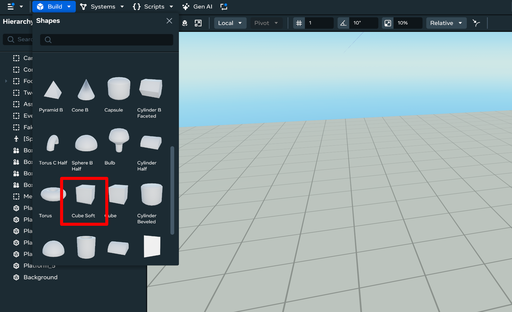
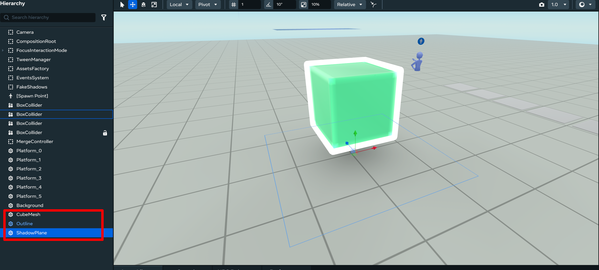
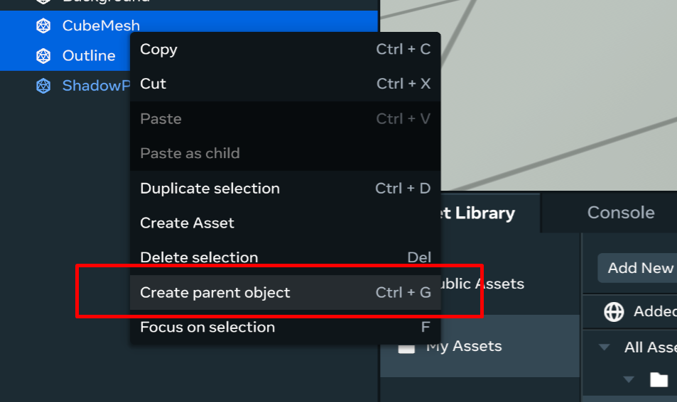
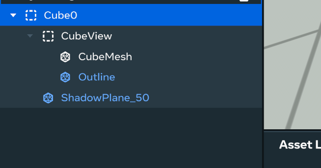
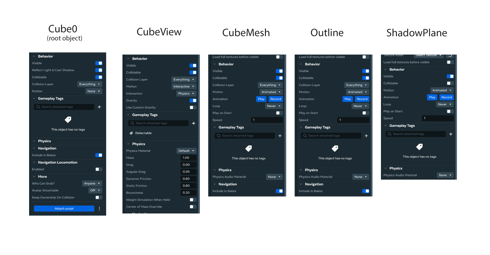
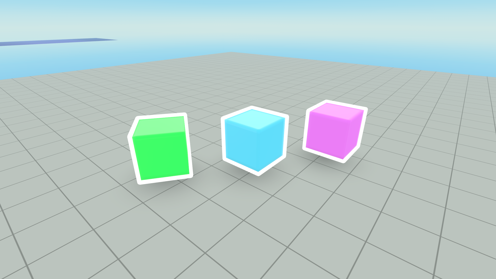
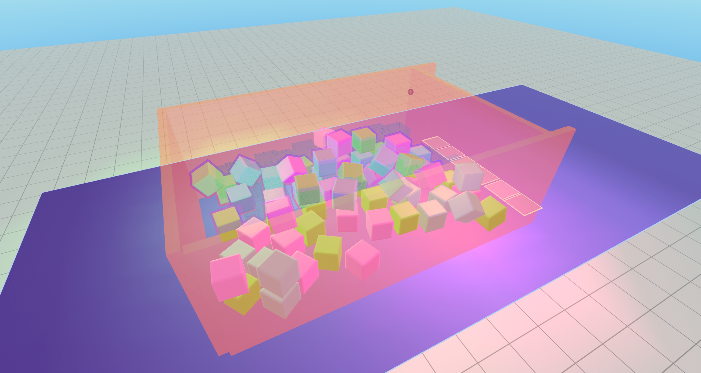

# Creating Fake Shadows for Animated Objects in Meta Horizon Worlds

Since the **Meta Horizon engine** doesn’t support dynamic shadows for non-static objects, we can create a **fake shadow system** instead. This guide walks you through the full setup and scripting required.

---

## Final Result

Here’s a demo of the final outcome. You can also explore it as a **remixable world**.


Full **remixable world** available at the [link](https://horizon.meta.com/world/24409713532013437) for in-depth look at the implementation 


---

## Step 1: Asset Setup

We need to create an **Asset Template** that will be spawned in the world.  
The hierarchy setup is important because:

- The object must be **physical**.
- The engine currently struggles with transformations of child objects.
- To make it work, we’ll use a **special structure**.

We’ll start with a simple **cube**.

---

### 1. Create the Cube Mesh
Spawn a cube and name it **`CubeMesh`**.



---

### 2. Add an Outline Mesh
For the outline, use a **custom mesh** created in a DCC app (Maya, Blender, etc.) with **inverted normals**.

- Import the mesh into Horizon Worlds with an **Unlit material**.
- More details: [Custom Models Import Documentation](https://developers.meta.com/horizon-worlds/learn/documentation/custom-model-import/creating-custom-models-for-horizon-worlds/materials-guidance-and-reference-for-custom-models)

---

### 3. Add the Shadow Plane
For the shadow, we’ll use a simple **alpha texture**.  
To apply this texture, you need a **plane model** with an **Unlit Blend Material**.

You can find the shadow texture in the tutorial’s **Content folder**:


Place this plane together with the cube and outline mesh:



Your setup should now include:

- `CubeMesh`
- `Outline`
- `ShadowPlane`

---

## Step 2: Hierarchy Setup

Now let’s organize the hierarchy properly.

1. Create a parent object for **CubeMesh** and **Outline**, call it **`CubeView`**.



2. Create another parent object for **CubeView** and **ShadowPlane**.

Your final hierarchy should look like this:



---

## Step 3: Motion Setup

Set the **motion parameters** for each object:



- `Cube0` (root object): unchanged
- `CubeView`: **Interactive**
- `CubeMesh` + `Outline`: **Animated**
- `ShadowPlane`: **Animated** (disable **Collidable**)

Here’s how it looks with **3 cubes**:



---

## Step 4: Scripts

The system uses **two scripts**:

1. **`ISelectable`** – attached to each cube. Stores data for outlines & fake shadows.
2. **`FakeShadows`** – performs the math and updates shadow positions.

---

### ISelectable Script

```ts
import { FakeShadows } from 'FakeShadows';
import * as hz from 'horizon/core';
import { PropTypes, Entity, Quaternion } from 'horizon/core';
import { Utils } from 'Utils';

export class ISelectable extends hz.Component<typeof ISelectable> {
  static propsDefinition = {
    outline: { type: PropTypes.Entity },
    shadow: { type: PropTypes.Entity },
    id: { type: PropTypes.Number }
  };

  private deltaRotation: Quaternion = Quaternion.zero;

  GetId(): number {
    return this.props.id;
  }

  start() {
  
    component.connectCodeBlockEvent(
        component.entity,
        CodeBlockEvents.OnPlayerEnterWorld,
           (player) => {
               component.entity.owner.set(player); // setting this object's ownership
           }
    );
    const localPlayer = component.world.getLocalPlayer();
    if (localPlayer === component.world.getServerPlayer()) return;
    
    var outline = this.props.outline?.as(Entity);
    FakeShadows.Register(this);
    outline?.visible.set(false);
  }
  
  ShadowPlane(): Entity {
    return this.props.shadow ?? this.entity;
  }

  DeltaRotation(): Quaternion {
    return this.deltaRotation;
  }

  ShowOutline() {
    this.props.outline?.as(Entity)?.visible.set(true);
  }

  HideOutline() {
    this.props.outline?.as(Entity)?.visible.set(false);
  }
}
hz.Component.register(ISelectable);
```

FakeShadows Script
```ts
Copy code
import * as hz from 'horizon/core';
import { Entity, Quaternion, World } from 'horizon/core';
import { ISelectable } from 'ISelectable';
import { Utils } from 'Utils';

export class FakeShadows extends hz.Component<typeof FakeShadows> {
  private static selectables: ISelectable[] = [];

  start(): void {}

  public static Register(selectable: ISelectable): void {
    this.selectables.push(selectable);
  }

  preStart() {
  
    component.connectCodeBlockEvent(
        component.entity,
        CodeBlockEvents.OnPlayerEnterWorld,
           (player) => {
               component.entity.owner.set(player); // setting this object's ownership
           }
    );
    const localPlayer = component.world.getLocalPlayer();
    if (localPlayer === component.world.getServerPlayer()) return;
    
    this.connectLocalBroadcastEvent(World.onUpdate, () => {
      FakeShadows.selectables.forEach(element => {
        this.update(element.entity, element.ShadowPlane(), element.DeltaRotation());
      });
    });
  }

  private GetYaw(q: Quaternion): Quaternion {
    const yaw = Math.atan2(
      2 * (q.y * q.w + q.x * q.z),
      1 - 2 * (q.y * q.y + q.z * q.z)
    );
    return new Quaternion(0, Math.sin(yaw / 2), 0, Math.cos(yaw / 2));
  }

  private update(parent: Entity, shadowPlane: Entity, deltaRotation: Quaternion): void {
    if (shadowPlane) {
      const position = parent.position.get();
      position.y = 0.1;
      shadowPlane.rotation.set(
        this.GetYaw(parent.rotation.get()).mul(this.GetYaw(deltaRotation))
      );
      shadowPlane.position.set(position);
    }
  }
}
hz.Component.register(FakeShadows);
```

What the Scripts Do (Quick Explanation)
ISelectable

## What the Scripts Do (Quick Explanation)

### ISelectable
- Attached to each cube.
- Keeps references to the **outline** and **shadow plane**.
- Registers itself in the **FakeShadows** system.
- Can **show/hide outlines** when cubes are selected.

### FakeShadows
- Runs in the background.
- Keeps a list of all registered **ISelectable** objects.
- On every frame (`World.onUpdate`), it:
    - Reads each cube’s **position & rotation**.
    - Calculates a flat **yaw-only rotation** (so the shadow doesn’t tilt).
    - Moves the shadow plane slightly above the ground (`y = 0.1`).
    - Rotates and positions the shadow plane under the cube.

---

**In short:**  
`ISelectable` = data holder per cube.  
`FakeShadows` = central system that makes shadows follow their cubes.  

---
### Scene Colliders Overview

This is how the scene looks in terms of overall structure. All cubes are locked between **colliders** that prevent them from overflowing outside the game field.



---

#### How do cubes pass through colliders when moving to the platform?

The answer is simple: at the moment they start moving via animation, we **turn off simulation** on `CubeView`.

```ts
let physical = selectable.entity!.as(PhysicalEntity);
physical.simulated.set(false);