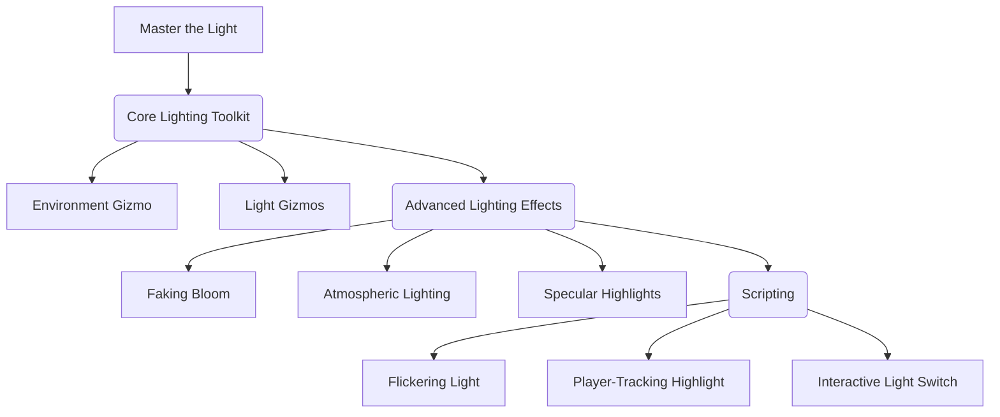
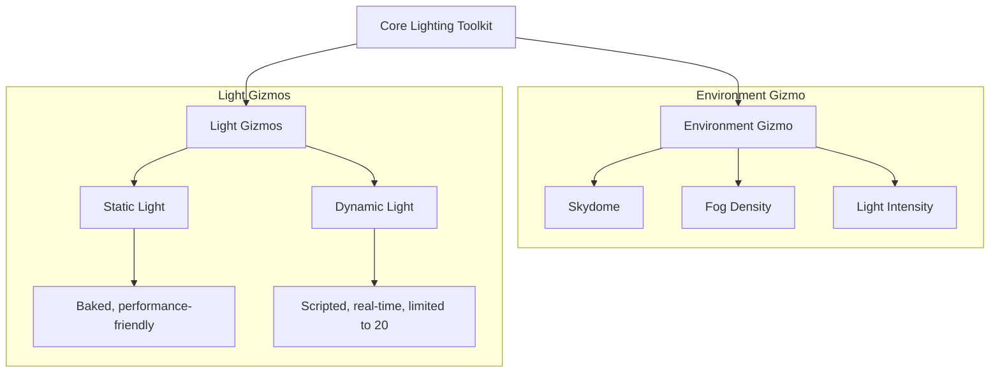
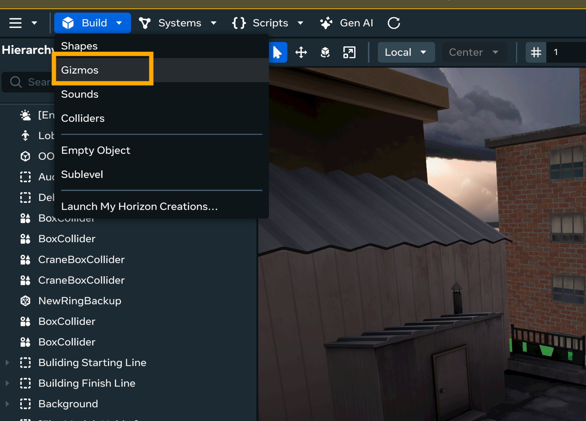
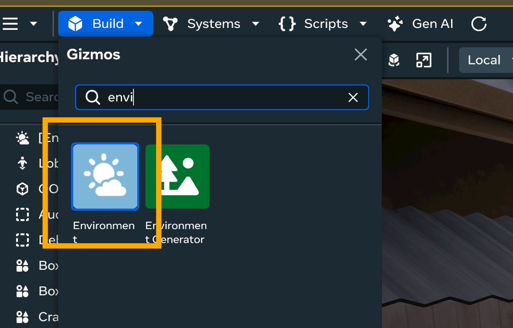
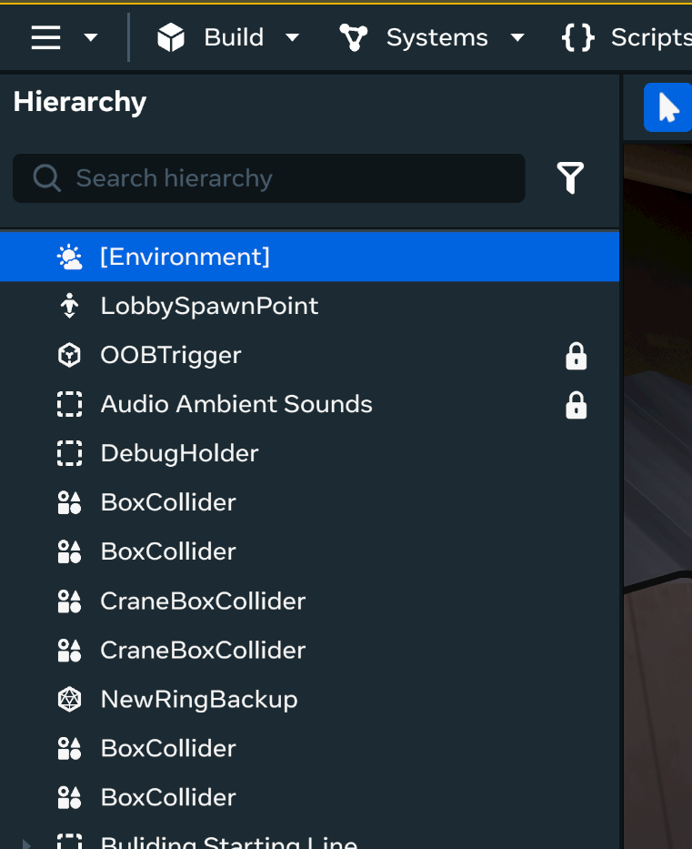
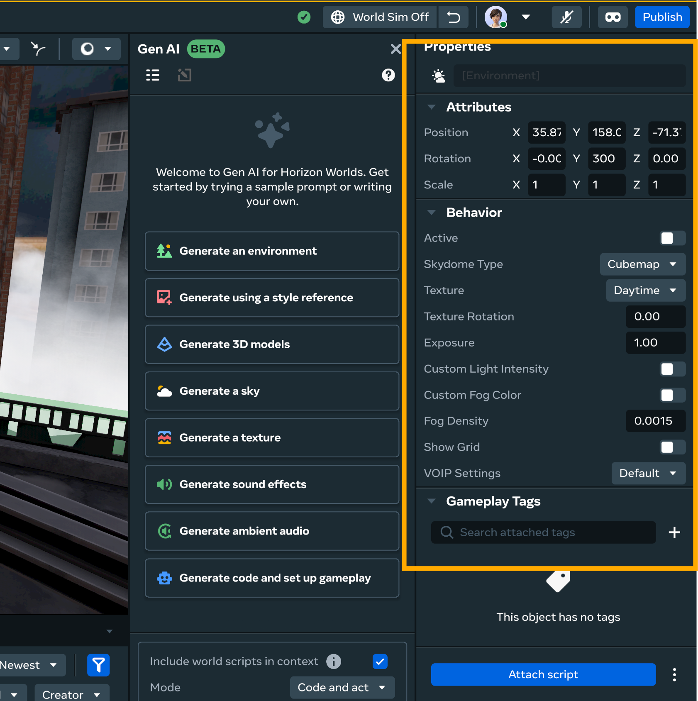
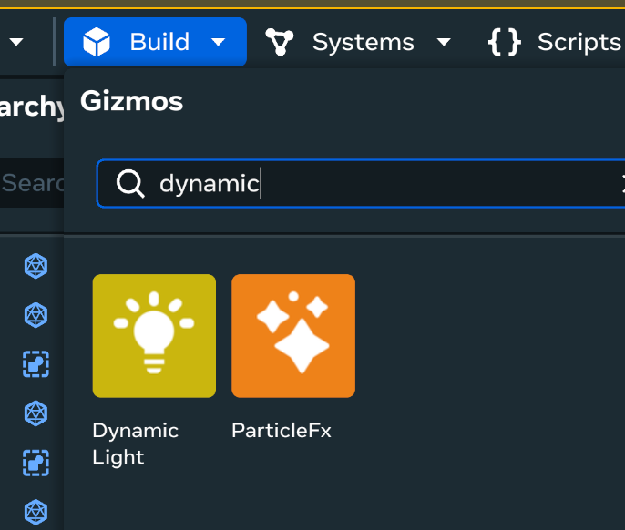
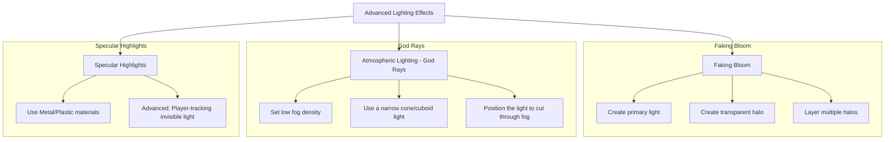

# **Master the Light: A Creator's Guide to Visually Stunning Horizon Worlds**

Welcome, fellow creators! Light is one of the most powerful tools in our world-building arsenal. It dictates mood, guides the eye, and transforms a simple collection of shapes into a breathtaking, immersive experience. This guide is designed to empower you with the knowledge to master lighting in the Worlds desktop editor, from the fundamental gizmos to advanced, scripted effects that will make your worlds truly shine. 

Below is the overview of core components



## **Section 1: The Core Lighting Toolkit**

Before crafting complex scenes, you must understand the essential tools at your disposal. All lighting in Horizon Worlds originates from three sources: the environment, dedicated light gizmos, and glowing objects.



### **1.1 The Environment Gizmo: Architect of Atmosphere**

This is your starting point. The Environment Gizmo controls the global "feel" of your world, including the sky, ambient light, and atmospheric effects like fog.

- **How to Use:** In the desktop editor, navigate to

Build > Gizmos



and drag the **Environment** gizmo into your scene. You only need one active gizmo per world.



Then you could see on the left panel there is environment


Double click on the environment and we could configure the environment on the right side of editor, and even can make some script to make awesome environment!



- **Key Properties:**
  - **Skydome:** This sets your skybox and is a primary source of ambient light.
  - **Fog Density:** A powerful tool for creating depth and mystery. Even a small amount can make distant objects feel farther away. Be subtle, as high values can obscure vision.
  - **Light Intensity:** Controls the overall brightness of the ambient light from the skydome.

You can tuning these parameters to create different times of day and weather conditions, dramatically changing the mood of your scene.

Now you could see the main bar, sidebar and main function buttons on the editor. You could navigate the interface easily, so would accelerate your building process with less detailed screenshots!

**Pro-Tip:** Start your lighting process by setting the Skydome to "Night Panorama." This dark environment makes your manually placed lights more dramatic and easier to control, preventing them from being washed out by bright ambient light.


### **1.2 Light Gizmos: Your Paintbrushes**

For precise illumination, Horizon Worlds provides two types of light gizmos.

- **Static Light Gizmo:** This is your workhorse. Its lighting is pre-calculated ("baked") into the world, making it the most performance-friendly option. Use static lights for 80-90% of your lighting needs, such as general scene illumination and architectural highlights.
- **Dynamic Light Gizmo:** This light can be moved and have its properties changed in real-time via scripts. It's perfect for interactive elements like flashlights, flickering torches, and special effects.
  - **Performance Note:** Use dynamic lights sparingly. You are limited to **20 dynamic lights per world** to ensure a smooth experience for all users.

**Pro-tip:** If you are still new to editor interface, most of main component lie in blue Build button. For example, like Dynamic lighting, you could do Build > Gizmos > Search for Dynamic Light. If you want to new shape, go to Build > Shapes. You could find most of the components in Build button.



**Creative Technique: The Black Box Interior** To gain total control over interior lighting, build a massive, non-collidable black box that completely envelops your interior scene. This blocks all external light from the Environment Gizmo, giving you full control over the lighting inside.


## **Section 2: Crafting Advanced Lighting Effects**

Now, let's move beyond the basics to create those eye-catching effects that will make your world stand out.




### **2.1 Faking Bloom: The Soft Glow of Bright Lights**

Bloom is an effect that mimics the way bright light seems to bleed or feather at the edges. While Horizon Worlds lacks a dedicated bloom slider, you can simulate it effectively.

1. **Create the Source:** Make your primary light source (e.g., a bright orb with a Glow material).
2. **Create the Halo:** Create a thin, flat cylinder or plane and place it directly in front of the light source. Make it non-collidable.
3. **Soften the Halo:** In its Style , give this shape a material of the same color as your light, but set its opacity to be very low (e.g., 5-15%).
4. **Layer for Effect:** Duplicate this transparent shape 2-3 times, slightly increasing the scale and transparency of each new copy. The overlapping, low-opacity shapes will build up to create a soft, layered glow that perfectly mimics a bloom effect.


### **2.2 Atmospheric Lighting: "God Rays"**

You can simulate light rays cutting through the air by combining fog with a focused light source.

1. **Set the Scene:** In your **Environment Gizmo**, set a low-to-moderate **Fog Density**. The fog is what will "catch" and make the light visible.
2. **Create the Beam:** Place a **Static or Dynamic Light Gizmo** and set its Shape to be a narrow cone (Spotlight) or a scaled cuboid.

3. **Position the Beam:** Aim this cone of light across a room, for example, through a window or a crack in the ceiling. The light will interact with the fog, creating a visible "god ray" or volumetric light effect.

### **2.3 Specular Highlights: Making Surfaces Shine**

Specular highlights are the shiny reflections on smooth surfaces.

- **The Easy Method (Materials):** The simplest way is to use the built-in **Metal** or **Plastic** materials from the Style. These have different levels of shininess and will realistically reflect your placed lights.

- **The Advanced Dynamic Technique (Player-Following Glint):** Create a highlight that follows the player, making surfaces like metal or wet floors look incredibly realistic.
    1. Create a tiny, un-collidable sphere. Apply a bright white texture to it and make it invisible (in Behavior, turn off "Visible").
    2. Attach the "Player-Tracking" script to this invisible sphere.
    3. As the player moves their head, this invisible light source will move with them, creating a traveling specular highlight on any nearby shiny surface.

## **Section 3: Bringing Lights to Life with Scripting**

Unlock the true potential of your lighting with Horizon's visual, block-based scripting system.

### **3.1 Script: Realistic Flickering Light**

Perfect for torches, campfires, or faulty electronics. Attach this script to a **Dynamic Light Gizmo**. It works by repeatedly toggling the light's state and randomizing its brightness for an organic effect.

```code
import { Component, World } from '@meta/horizon-worlds-api';

export default class IntensityFlicker extends Component {
  static propsDefinition = {
    minIntensity: { type: 'number', default: 0.8 },
    maxIntensity: { type: 'number', default: 1.5 },
    flickerSpeed: { type: 'number', default: 0.1, description: 'Time in seconds between intensity changes.' },
  };

  private flickerInterval: number | null = null;

  start() {
    this.flickerInterval = World.setInterval(() => {
      // Get a random intensity value within the specified range.
      const newIntensity = this.props.minIntensity + Math.random() * (this.props.maxIntensity - this.props.minIntensity);
      
      // Update the light's intensity property.
      this.entity.setLightIntensity(newIntensity);
      
    }, this.props.flickerSpeed * 1000); // Convert seconds to milliseconds
  }

  destroy() {
    if (this.flickerInterval !== null) {
      World.clearInterval(this.flickerInterval);
    }
  }
}
```

### **3.2 Script: Player-Tracking Specular Highlight**

This is the script for the technique described in Section 2.3. Attach this script to your tiny, invisible "specular dot" object. It continuously updates the object's position to match the local player's head.

```
import { Component, World, Entity, Player } from '@meta/horizon-worlds-api';

export default class PlayerTracking extends Component {
  // Define a property in the script's properties panel to assign the light source.
  // Although the script is attached to the light source itself, this is a good practice
  // for clarity and flexibility if you wanted to track another object.
  static propsDefinition = {
    trackedObject: {
      type: 'entity',
      default: null,
      description: 'The entity to move, e.g., your invisible light.'
    }
  };

  private localPlayer: Player | null = null;
  private onUpdateSubscription: (() => void) | null = null;

  start() {
    // Get the local player when the world starts.
    this.localPlayer = World.getLocalPlayer();

    // Subscribe to the world's update loop to continuously update the position.
    this.onUpdateSubscription = World.onUpdate(() => {
      // Ensure the local player exists and the tracked object is set.
      if (this.localPlayer && this.entity) {
        // Get the head position of the local player.
        const headPosition = this.localPlayer.headPosition;

        // Set the position of this script's entity to the head position.
        this.entity.position = headPosition;
      }
    });
  }

  destroy() {
    // Clean up the subscription to prevent memory leaks when the script is destroyed.
    if (this.onUpdateSubscription !== null) {
      this.onUpdateSubscription();
    }
  }
}
```

#### Explanation of the Code

  * **`import` Statements**: These lines import the necessary classes and functions from the Horizon Worlds API, such as `Component`, `World`, `Entity`, and `Player`.
  * **`static propsDefinition`**: This is a key part of the TypeScript system. It defines a property that will appear in the **script's properties panel** in the Horizon editor. This allows you to drag-and-drop the invisible light object onto the script to link it.
  * **`start()`**: This function runs once when the script is first enabled. It finds the local player and, most importantly, subscribes to the `World.onUpdate()` event. This event is called every single frame.
  * **`World.onUpdate()`**: This is the core of the tracking logic. The function inside this event gets the player's `headPosition` and then sets the `position` of the entity the script is attached to (`this.entity`) to that same position.
  * **`destroy()`**: This function is crucial for performance and memory management. It's called when the script is disabled or the entity is deleted. The `World.onUpdate()` subscription is unsubscribed to stop the loop from running, ensuring the system isn't wasting resources.

### **3.3 Script: Interactive Light Switch**

This practical script allows a player to turn a light on and off by entering a trigger zone. You could reference the following script:

```code
import { Component, Entity, World } from '@meta/horizon-worlds-api';

export default class LightSwitch extends Component {
  static propsDefinition = {
    // This property will appear in the script's properties panel.
    // Drag your Dynamic Light Gizmo here.
    lightToToggle: {
      type: 'entity',
      default: null,
      description: 'The Dynamic Light Gizmo to control.'
    },
    // The desired brightness when the light is "on".
    onIntensity: {
      type: 'number',
      default: 1.0,
      description: 'The intensity when the light is on.'
    },
    // The desired brightness when the light is "off".
    offIntensity: {
      type: 'number',
      default: 0.0,
      description: 'The intensity when the light is off.'
    }
  };

  private lightIsOn: boolean = false;

  start() {
    // Register the event listener for when a player enters the trigger.
    this.entity.onEnter(this.onPlayerEnter);
  }

  onPlayerEnter = () => {
    if (!this.props.lightToToggle) {
      console.warn('LightSwitch script: The lightToToggle property is not set.');
      return;
    }

    // Toggle the state.
    this.lightIsOn = !this.lightIsOn;

    // Set the light's intensity based on the new state.
    const newIntensity = this.lightIsOn ? this.props.onIntensity : this.props.offIntensity;
    this.props.lightToToggle.setLightIntensity(newIntensity);
  };

  destroy() {
    // Unregister the event listener to prevent memory leaks.
    this.entity.offEnter(this.onPlayerEnter);
  }
}

```

#### How the Script Works

1.  **`propsDefinition`**: This section defines the properties you'll see in the editor. You'll drag your `Dynamic Light Gizmo` to the **`lightToToggle`** field. You can also customize the `onIntensity` and `offIntensity` values.
2.  **`start()`**: When the world starts, this method sets up an event listener. `this.entity.onEnter()` is a function that registers a callback to be run whenever a player enters the trigger (since the script is attached to the trigger entity).
3.  **`onPlayerEnter()`**: This is the core logic. It's called every time a player walks into the trigger zone. It:
      * Toggles the **`lightIsOn`** boolean variable from `true` to `false` or vice versa.
      * Uses a [ternary operator](https://developer.mozilla.org/en-US/docs/Web/JavaScript/Reference/Operators/Conditional_operator) (`condition ? value_if_true : value_if_false`) to determine the new intensity based on the `lightIsOn` state.
      * Calls `setLightIntensity()` on the linked `lightToToggle` entity, changing its brightness.
4.  **`destroy()`**: This method cleans up the event listener to ensure the script doesn't continue running after it's been disabled or the entity is removed, which is good practice for performance.


Wow, you've made it to the end of this comprehensive guide! By mastering these lighting techniques and scripts, you're well on your way to creating visually stunning and immersive worlds in Horizon Worlds. Remember, lighting is an art form—experiment, iterate, and let your creativity shine. Happy building!
