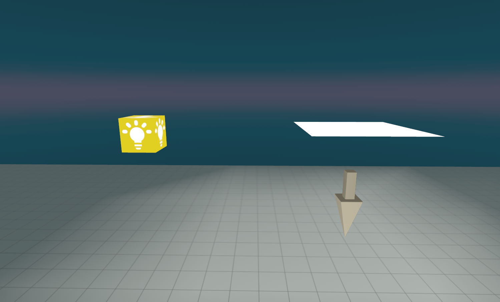

# Lighting Fundamentals: Understanding Light in Horizon Worlds

**Master the foundational principles of lighting to create compelling, atmospheric worlds:**

This guide covers the essential concepts of lighting theory, gizmo types, and basic setup techniques that form the foundation for all lighting work in Meta Horizon Worlds.

**Creator Skill Level:** Beginner

**Estimated Time to Complete:** 45-60 minutes for fundamentals, 30 minutes for basic setup

---

## Table of Contents

1. Understanding Light Theory and Creative Practice
2. Horizon Worlds Lighting Gizmo Types
3. Environment Gizmo
4. Static Versus Dynamic Lighting Fundamentals
5. Practical Setup: Effective Lighting Workflows
6. Color Temperature and Mood (Creative Theory)
7. Performance, Best Practices, and Common Mistakes
8. Next Steps and Official Resources

---

## 1. Understanding Light Theory and Creative Practice

Lighting is one of the most powerful tools in your world-building arsenal. It can transform a simple scene into something magical, guide player attention, and create emotional responses. Understanding how light works in the real world helps you create more convincing virtual environments.

**Key Concepts:**

- **Intensity:** Brightness of the light
- **Color:** Hue and warmth/coolness
- **Direction:** Where the light comes from
- **Quality:** How sharp or soft shadows are
- **Falloff:** How quickly light fades with distance

Creative principles such as three-point lighting, color harmony, and soft/hard light produce engaging scenes but must be adapted to the unique systems of Horizon Worlds.

**🎥 Watch: [Lighting Fundamentals Explained](https://www.youtube.com/watch?v=b_I9fVenRIo)**

---

## 2. Horizon Worlds Lighting Gizmo Types

**There are two main categories of lights:**

| Gizmo Type        | Variants                           | Properties                                                             | Usage Scenarios                  |
| ----------------- | ---------------------------------- | ---------------------------------------------------------------------- | -------------------------------- |
| **Static Light**  | Cuboid, Ellipsoid, Disk, Rectangle | Shape, Color, Intensity, Enabled                                       | Most world lighting              |
| **Dynamic Light** | Point, Spot                        | Type (Point/Spot), Intensity, Spread, Falloff Distance, Color, Enabled | Moving or scripted light effects |



**Static Light Gizmo:**

- For fixed, baked lighting (does not change at runtime)
- **Shapes:** Cuboid (omnidirectional), Ellipsoid (omnidirectional), Disk (directional), Rectangle (directional)
- **Properties:** Shape, Color, Intensity, Enabled toggle


**Dynamic Light Gizmo:**

- For interactive lighting (can be moved, transformed, or toggled via script at runtime)
- **Types:** Point (omnidirectional), Spot (cone-shaped)
- **Properties:** enabled (on/off), falloffDistance (0-100), intensity (0-10), spread (spot cone, 0-100), color, type (set in editor, not scripts)
- **Limit:** Maximum 20 dynamic lights per world. Consider performance.


**🎥 Watch: [Setting Up Lighting Gizmos](https://www.youtube.com/watch?v=dQw4w9WgXcQ) - Step-by-step gizmo setup guide**

**📖 For advanced dynamic lighting techniques**: See [dynamic-lighting-systems.md](./dynamic-lighting-systems.md)

---

## 3. Environment Gizmo

The Environment Gizmo controls the overall world lighting, fog, and atmosphere. For detailed setup instructions and advanced techniques, see [advanced-lighting-techniques.md#environment-gizmo-for-atmosphere](./advanced-lighting-techniques.md#environment-gizmo-for-atmosphere).

**Key Properties:**
- **Skydome**: Choose from preset environments (Daytime, Night, Sunrise, etc.)
- **Fog Density**: Adjust atmospheric fog (0.0-1.0, use very low values like 0.1)
- **Custom Gradient**: Create custom sky colors
- **Grid Visibility**: Show/hide floor grid

---

## 4. Static Versus Dynamic Lighting Fundamentals

| Feature      | Static Light Gizmo                          | Dynamic Light Gizmo                            |
| ------------ | ------------------------------------------- | ---------------------------------------------- |
| Movement     | Fixed (cannot move/change)                  | Movable and scriptable                         |
| Properties   | Shape, Color, Intensity                     | enabled, falloffDistance, intensity, spread    |
| Typing/Shape | 4 shapes, no "types" property               | 2 types (Point/Spot)                           |
| Scripting    | Can only toggle enabled state               | Can modify intensity, falloff, spread, enabled |
| Performance  | Lower impact, preferred                     | Higher cost, performance limits                |
| Editing      | All properties editable in Properties panel | Only some properties editable via script       |


**Important:**

- **Light type and color for dynamic lights are set ONLY in the editor, not via script.**
- **Static lights offer better runtime performance due to pre-baked rendering.**
- **Dynamic lights do NOT obey entity visibility settings; control through 'enabled' property.**

---

## 5. Practical Setup: Effective Lighting Workflows

### Basic World Lighting (Recommended Workflow)


1. **Open Build mode.** Add Static Light Gizmo from Gizmos.
2. **Choose Shape:** Cuboid or Ellipsoid for fill/general light; Disk/Rectangle for directional light.
3. **Set Color/Intensity:** Use color picker and intensity slider for mood.
4. **Toggle Enabled:** Activate/deactivate individual lights as needed.
5. **Position/Rotate:** Move lights to create desired effects.

#### b) Using Dynamic Lights (Advanced/interactive effects only)


1. **Add Dynamic Light Gizmo (Point/Spot).**
2. **Set properties in editor:** Type, color, initial intensity, falloff.
3. **Script basic controls:**

```typescript
const dlight = entity.as(DynamicLightGizmo);
dlight.intensity.set(8);
dlight.enabled.set(true);
```

- **Do not attempt to change type or color via script—this is unsupported.**
- Limit to 20 dynamic lights per world.

**📖 For complete scripting examples**: See [dynamic-lighting-systems.md](./dynamic-lighting-systems.md)

#### c) Three-Point Lighting Principle (Creative Theory)


Can be approximated with static and dynamic lights:

- Key: Directional Disk or Rectangle (static) or Spot (dynamic)
- Fill: Cuboid or Ellipsoid (static) or Point (dynamic)
- Rim: Use spot/point strategically (dynamic only if movement needed)

---

## 6. Color Temperature and Mood (Creative Application)


- **Warm (2500K-3000K):** Cozy, intimate (orange/yellow RGB)
- **Neutral (4000K-5500K):** Office, realistic daylight (white RGB)
- **Cool (6500K+):** Clinical, dramatic (blue RGB)

**In Horizon Worlds:** Set color in the Properties panel; creative use sets the mood but be consistent for realism.


**🎥 Watch: [Color Theory for Lighting](https://www.youtube.com/@LightingBotEducation/videos) - Understanding color temperature and mood**

---

## 7. Performance, Best Practices, and Common Mistakes

### Best Practices

- Use **static lights** for general/world lighting.
- Test **dynamic lights** only for interactive, moving effects.
- Minimize total number of lights (especially dynamic).
- Keep color temperature consistent.
- Test lighting in VR (looks different from desktop).

### Common Mistakes

- **Over-use of dynamic lights:** Major performance hit.
- **Trying to script light type or color:** Unsupported.
- **Ignoring static light shapes:** Shapes affect light direction and spread.
- **Ignoring visibility constraints:** Dynamic lights ignore entity visibility.

**🎥 Watch: [Avoiding Common Lighting Mistakes](https://www.youtube.com/watch?v=dQw4w9WgXcQ) - What not to do in Horizon Worlds**

**📊 For comprehensive performance analysis**: See [lighting-performance-optimization.md](./lighting-performance-optimization.md)

---

## 8. Next Steps and Official Resources

- Explore [Official Dynamic Light Gizmo Documentation](https://developers.meta.com/horizon-worlds/learn/documentation/code-blocks-and-gizmos/dynamic-light-gizmo)
- Consult [Static Light Gizmo Documentation](https://developers.meta.com/horizon-worlds/learn/documentation/code-blocks-and-gizmos/static-light-gizmo)
- Practice building sample scenes with both static and dynamic light gizmos.

---

**Summary Table: Lighting Gizmos in Horizon Worlds**

| Gizmo         | Runtime? | Scriptable?   | Variant                            | Key Properties                              | Performance |
| ------------- | -------- | ------------- | ---------------------------------- | ------------------------------------------- | ----------- |
| Static Light  | No       | Minimal       | Cuboid, Ellipsoid, Disk, Rectangle | Shape, Color, Intensity                     | Excellent   |
| Dynamic Light | Yes      | Yes (partial) | Point, Spot                        | enabled, falloffDistance, intensity, spread | Heavy cost  |

---

**Practice:**

1. Add three static lights with different shapes—observe effect.
2. Use a dynamic spot light for a moving/interactable object.
3. Experiment with color and intensity for different moods.
4. Test performance with more than 10 dynamic lights—observe frame rate impact.

**📖 Continue Learning**: 
- **Environment & Atmosphere**: [advanced-lighting-techniques.md](./advanced-lighting-techniques.md)
- **Interactive Systems**: [dynamic-lighting-systems.md](./dynamic-lighting-systems.md)
- **Performance Optimization**: [lighting-performance-optimization.md](./lighting-performance-optimization.md)
