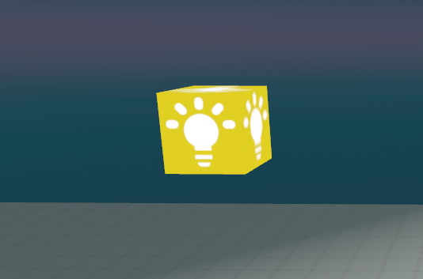
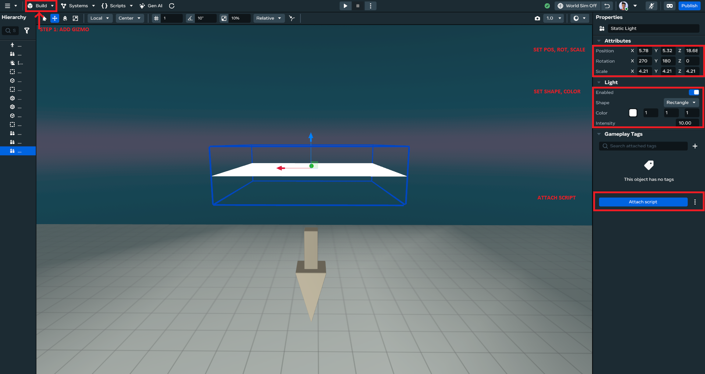
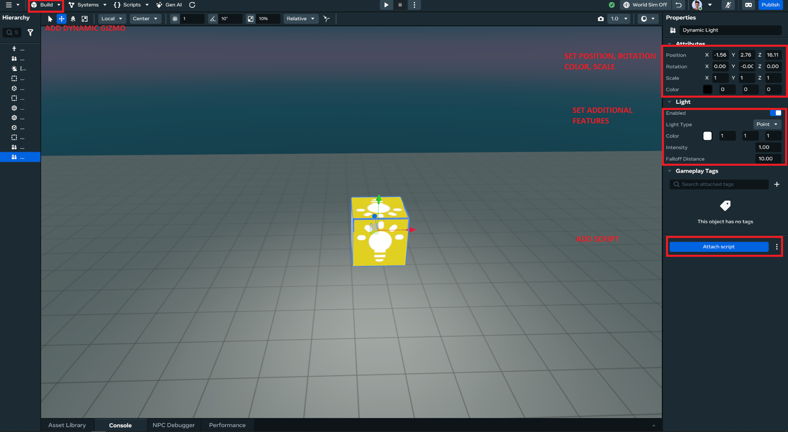

# Mastering Horizon Worlds Lighting: Complete Reference

**Transform your worlds with professional lighting techniques that work within Meta Horizon Worlds' actual capabilities.** This guide serves as a comprehensive reference with cross-links to detailed sections in other documents.

**Creator Skill Level**  
Intermediate to Advanced

**Recommended Background Knowledge**  
Familiarity with the Horizon Worlds Desktop Editor, basic world-building, and TypeScript scripting patterns.

**Estimated Time**  
2–3 hours for full tutorial, 30–45 minutes for basic setup

---

## Table of Contents

1. [Lighting Fundamentals](#lighting-fundamentals)
2. [Supported Lighting Gizmos](#supported-lighting-gizmos)
3. [Three-Point Lighting Setup](#three-point-lighting-setup)
4. [Interactive Lighting Systems](#interactive-lighting-systems)
5. [Environment Gizmo & Day/Night Transitions](#environment-gizmo--daynight-transitions)
6. [Performance Constraints & Best Practices](#performance-constraints--best-practices)
7. [Troubleshooting](#troubleshooting)
8. [Resources](#resources)

---

## Lighting Fundamentals

Great lighting guides the eye, sets mood, and enhances immersion. Horizon Worlds lighting relies on gizmos and manual environment settings; there is no programmatic API for advanced effects like volumetrics or procedural weather.


**Three Pillars of Good Lighting**

- **Key Light**: Main directional or point light, creates prominent shadows.
- **Fill Light**: Softer light that reduces contrast.
- **Rim Light**: Backlight that separates subjects from backgrounds.


**Color Temperature**

- _Warm_ (2000K–4000K): Cozy, intimate
- _Neutral_ (4000K–5500K): Balanced, natural
- _Cool_ (5500K–10000K): Tense, mysterious


**📖 For comprehensive fundamentals**: See [lighting-fundamentals-basics.md](./lighting-fundamentals-basics.md)

---

## Supported Lighting Gizmos

Horizon Worlds offers three dynamic light gizmos and static glow materials. All lighting properties are configured via the **Properties Panel**; scripting can only enable/disable lights and change color/intensity.


**TypeScript Pattern**

```typescript
import { Component, PropTypes, DynamicLightGizmo, Color } from 'horizon/core';

class WorldLightSystem extends Component<typeof WorldLightSystem> {
  static propsDefinition = {
    light: { type: PropTypes.Entity },
  };

  override start() {
    // Wait for 5000 milliseconds (5 second)
    this.async.setTimeout(() => {
      if (this.props.light) {
        const lightGizmo = this.props.light.as(DynamicLightGizmo);
        // Check if the entity is a DynamicLightGizmo and change its color
        if (lightGizmo) {
          lightGizmo.color.set(new Color(1, 0, 0)); // Set color to red
        }
      }
    }, 5000);
  }
}

Component.register(WorldLightSystem);
```



**📖 For detailed gizmo setup**: See [lighting-fundamentals-basics.md#horizon-worlds-lighting-gizmo-types](./lighting-fundamentals-basics.md#horizon-worlds-lighting-gizmo-types)

---

## Three-Point Lighting Setup


1. **Key Light**

   - Add **Directional Light Gizmo** (Shapes > Gizmos > Directional Light)
   - Intensity: 3–5 | Color: 255,248,220 | Cast Shadows: On

2. **Fill Light**

   - Add **Point Light Gizmo** opposite key light
   - Intensity: 1–2 | Color: 240,245,255 | Cast Shadows: Off

3. **Rim Light**
   - Add **Spot Light Gizmo** behind subject
   - Intensity: 2–3 | Angle: 15–25° | Cast Shadows: Off



Enter Play Mode, move around in VR, and fine-tune positions and intensities for balanced shadows and highlights.

**📖 For fundamentals of three-point lighting**: See [lighting-fundamentals-basics.md#three-point-lighting-principle](./lighting-fundamentals-basics.md#three-point-lighting-principle)

---

## Interactive Lighting Systems

### Proximity-Based and Event-Driven Lighting

```typescript
import { Component, PropTypes, NetworkEvent, CodeBlockEvents, Player, Entity } from 'horizon/core';

// Define the network event. This should match the event name used by the receiving script.
const PlayerEntered = new NetworkEvent('PlayerEntered');

export class TriggerBroadcaster extends Component<typeof TriggerBroadcaster> {
  static propsDefinition = {
    // The entity that will receive the network event.
    target: { type: PropTypes.Entity },
  };

  override preStart() {
    // Connect to the trigger event that fires when a player enters.
    this.connectCodeBlockEvent(
      this.entity,
      CodeBlockEvents.OnPlayerEnterTrigger,
      (player: Player) => {
        this.handlePlayerEnter(player);
      }
    );
  }

  override start() {
    // No initialization needed in start for this script.
  }

  private handlePlayerEnter(player: Player) {
    // Check if the target entity prop has been assigned in the editor.
    if (this.props.target) {
      // Send the 'PlayerEntered' network event to the target entity.
      this.sendNetworkEvent(this.props.target, PlayerEntered, {});
    } else {
      console.error("TriggerBroadcaster: 'target' prop is not set.");
    }
  }
}

Component.register(TriggerBroadcaster);
```

```typescript
import { Component, PropTypes, NetworkEvent, DynamicLightGizmo, Color } from 'horizon/core';

// Define the network event that will trigger the light change.
const PlayerEntered = new NetworkEvent('PlayerEntered');

export class LightChanger extends Component<typeof LightChanger> {
  static propsDefinition = {
    // The light entity that will change color.
    light: { type: PropTypes.Entity },
  };

  override preStart() {
    // Listen for the 'PlayerEntered' network event.
    this.connectNetworkEvent(this.entity, PlayerEntered, () => {
      this.changeLightColor();
    });
  }

  override start() {
    // Initialization logic can go here.
  }

  private changeLightColor() {
    if (!this.props.light) {
      console.error("LightChanger: 'light' prop is not set.");
      return;
    }

    // Cast the entity to a DynamicLightGizmo.
    const lightGizmo = this.props.light.as(DynamicLightGizmo);

    if (lightGizmo) {
      // Change the light's color to red.
      lightGizmo.color.set(new Color(1, 0, 0));
    } else {
      console.error("LightChanger: The provided entity is not a DynamicLightGizmo.");
    }
  }
}
```

**📖 For complete interactive lighting examples**: See [dynamic-lighting-systems.md](./dynamic-lighting-systems.md)

---

## Environment Gizmo & Day/Night Transitions

The Environment Gizmo controls world atmosphere, fog, and lighting presets. For detailed setup and advanced techniques, see [advanced-lighting-techniques.md#environment-gizmo-for-atmosphere](./advanced-lighting-techniques.md#environment-gizmo-for-atmosphere).


**Key Features:**
- **Skydome Presets**: Daytime, Night, Sunrise, Sunset, Space, Underwater
- **Fog Control**: Atmospheric depth (0.0-1.0, use very low values)
- **Custom Gradients**: Create unique sky colors
- **Grid Visibility**: Toggle floor grid for building


---

## Performance Constraints & Best Practices


### Key Performance Guidelines

- Favor **Glow Materials** for static lighting
- Limit **Dynamic Lights** to 20 per world maximum
- Use **Static Lights** for world lighting
- Monitor **Real-time Metrics** in VR for accurate performance data



**📊 For comprehensive performance analysis**: See [lighting-performance-optimization.md](./lighting-performance-optimization.md)

---

## Troubleshooting


### Common Issues

- **Lights not working**: Check enabled state and entity visibility
- **Performance problems**: Monitor real-time metrics, reduce dynamic light count
- **Shadows missing**: Verify shadow settings in Properties panel
- **Color not changing**: Dynamic light color/type only editable in editor

**📖 For detailed troubleshooting**: See [lighting-performance-optimization.md#performance-troubleshooting](./lighting-performance-optimization.md#performance-troubleshooting)

---

## Resources

### Official Documentation
- Official Lighting Guide: https://developers.meta.com/horizon-worlds/learn/documentation/desktop-editor/lighting
- Dynamic Light Gizmo: https://developers.meta.com/horizon-worlds/learn/documentation/code-blocks-and-gizmos/dynamic-light-gizmo
- Static Light Gizmo: https://developers.meta.com/horizon-worlds/learn/documentation/code-blocks-and-gizmos/static-light-gizmo

### Related Documentation
- **Fundamentals**: [lighting-fundamentals-basics.md](./lighting-fundamentals-basics.md)
- **Advanced Techniques**: [advanced-lighting-techniques.md](./advanced-lighting-techniques.md)
- **Dynamic Systems**: [dynamic-lighting-systems.md](./dynamic-lighting-systems.md)
- **Performance**: [lighting-performance-optimization.md](./lighting-performance-optimization.md)

---

## Summary

This guide provides a comprehensive overview of Horizon Worlds lighting capabilities. For detailed implementation of specific concepts, follow the cross-references to specialized documents.

**Key Takeaways:**
- Start with three-point lighting fundamentals
- Use static lights for world lighting, dynamic lights for interactivity
- Monitor performance with real-time metrics
- Environment gizmo controls atmosphere and mood

**Next Steps:**
Start with three-point lighting, incorporate interactive triggers, and always test performance in VR with the Real-time Metrics panel.
