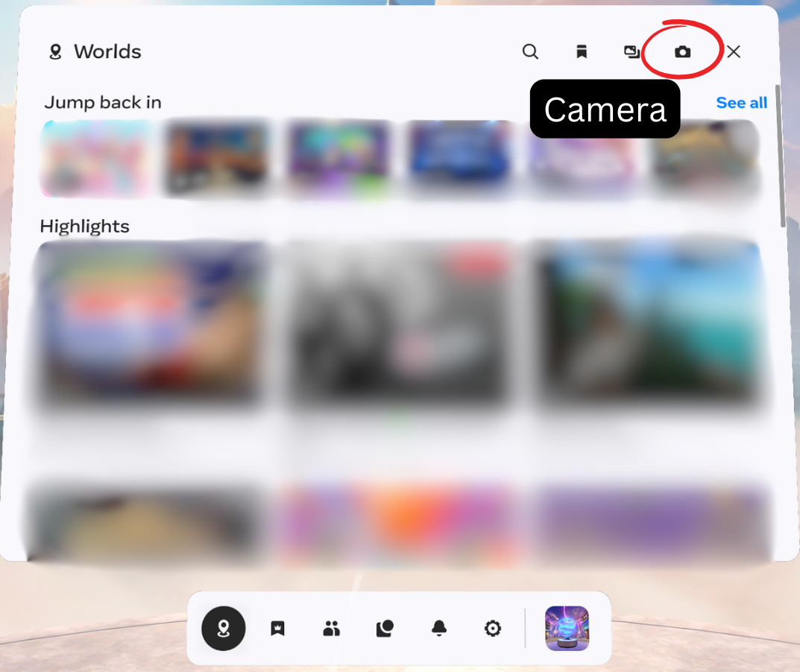
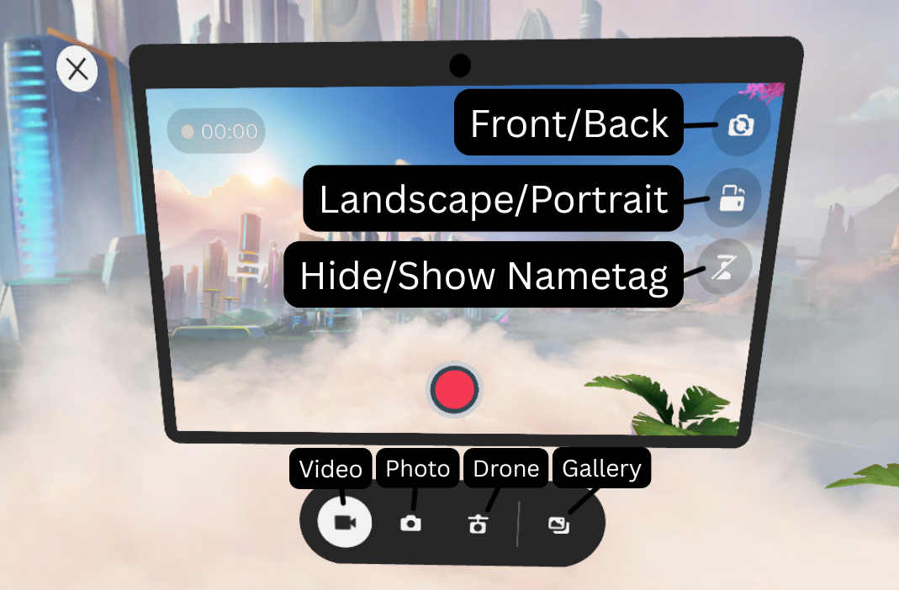
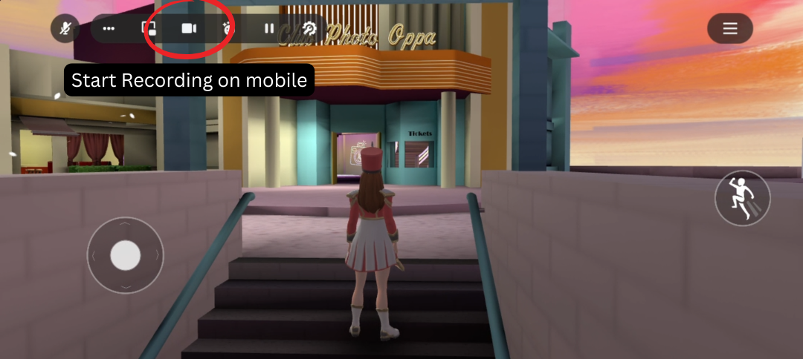
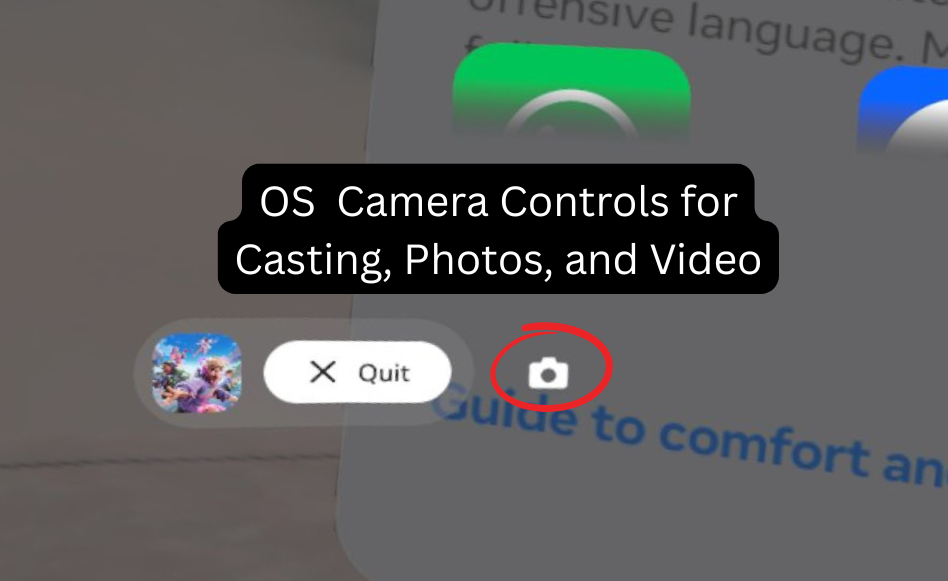
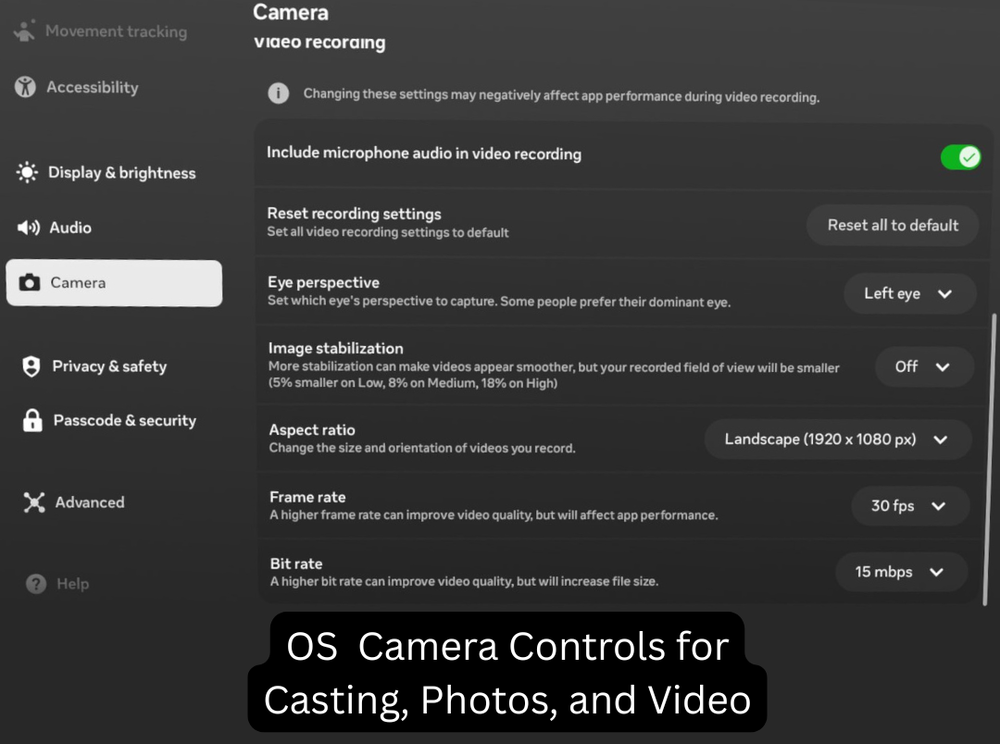

# How to Capture High-Quality Videos in Meta Horizon Worlds
*By Gungangoose*

*September 2025*

<iframe width="560" height="315" src="https://www.youtube.com/embed/BymCYIuQhNE?si=9Z4FDqyVqS4KaHeE" title="YouTube video player" frameborder="0" allow="accelerometer; autoplay; clipboard-write; encrypted-media; gyroscope; picture-in-picture; web-share" referrerpolicy="strict-origin-when-cross-origin" allowfullscreen></iframe>

---

So you just made your first world in Meta Horizon — congratulations! 🎉  
Now what? It’s time to show off your creation. Whether you want to:

- Make a short-form promo for social media
- Create an official world trailer for your world page
- Start producing content to grow your brand as a creator

You’ll need to know how to capture smooth, high-quality video.  
In this guide, I’ll walk you through **three main capture methods** and share best practices so you can make an informed decision based on your needs.

---

## 📹 The 3 Main Ways to Capture in Meta Horizon

- **Horizon In-App Camera** → Best for stable shots & self-filming  
- **Quest OS Capture** → Best for recording your POV in VR  
- **Desktop Editor / Web + OBS** → Best for highest-quality, cinematic footage  

Let’s break down when to use each one — and how.

---

# 1. Horizon In-App Camera *(Beginner-Friendly)*

  

The in-app camera is built directly into Horizon Worlds and gives you lots of control over framing and stability.

### **Best For**
- Filming yourself or your avatar
- Stable, smooth shots without head shake
- Switching between selfie mode and world shots

### **Key Features**
  

- Switch freely between portrait and landscape filming
- Hold the camera or place it in the world
- Toggle between selfie view and pointing away from you
- Hide name tags for cleaner footage
- Use **Drone Mode** *(landscape only)* and raycast to set angles
- **3-minute recording limit**

### **Pro Tip**  
If you’re using **face and eye tracking**, look at the **center of the camera screen** to maintain proper gaze direction — not at your avatar’s face.

---

### **How to Use It**
1. Open the **Camera Icon** from your wrist menu or main menu  
2. Grab it with the **Grip Button** to carry or place it  
3. Press **Record** and film  

---

### **Limitations**
- Auto-closes after **30 seconds** of inactivity
- Closes if you open your Horizon menu
- Closes if the camera owner’s avatar changes size
- VR capture is limited to **3 minutes**
- Mobile capture is limited to **1 minute**

 

---

### **Where Footage Goes**
All in-app captures save to your **Meta Quest Gallery** or the **Meta Horizon mobile app**.

---

# 2. Quest OS Camera *(Best for POV Footage)*

  

If you want to capture the **true VR experience**, use the built-in Quest OS capture.

### **Best For**
- Filming exactly what you see
- Fast setups — just point and record
- Capturing natural, immersive VR gameplay

---

### **Key Tips for POV Recording**
- Be mindful of **head motion** — excessive shaking can be nauseating
- Plan **large, sweeping turns** instead of quick spins
- Edit out abrupt turns when possible
- Consider sitting in a **swivel chair** for smoother rotations
- Some clips may need slight **rotation adjustments** to fix horizon alignment

---

### **How to Record**
1. Open the **Universal Menu**  
2. Select the **Camera App** *(found next to the Quit button in the Navigator menu)*  
   **Or use the shortcut:**  
   - Hold the **Meta / Oculus button** on the right controller  
   - While holding, **press and hold the right trigger** to start recording  
   - Repeat to **stop recording**  
3. Adjust **resolution, orientation, and eye preference** in the OS Settings  

  

---

### **Heads-Up**
- Very long videos (**>5 min**) may **fail to sync** to the Quest Cloud  
- For better quality:
 - **Link to a PC** via Quest Link Cable and record in OBS  
 - **Cast wirelessly** to a PC and capture in OBS  
   → Use [https://www.oculus.com/casting](https://www.oculus.com/casting)  
   → Find the casting icon in the camera controls next to app controls *(lower-left corner)*

---

# 3. Desktop Editor + OBS *(Highest Quality)*

This is my **preferred capture method** — especially for cinematic shots, trailers, and content where framing matters.

### **Best For**
- Professional-looking trailers
- Smooth, stable footage
- Full OBS control over **resolution, bitrate, and format**

---

### **Setup Steps**
1. Open your world in the **Horizon Desktop Editor**  
2. Place a **Spawn Point** for your “camera player”  
3. In the **Properties Panel**, set **Mobile Player View** to **First-Person**  
4. Test as a **Mobile Player** → now you’ve got a **clean POV camera feed**

---

### **In OBS**
- Add a **Window Capture** for the Desktop Editor  
- Crop out the UI  
- Set output to:  
 ```
 1080p / 60FPS / ~15–20Mbps bitrate
 ```
- Hit **Record**

---

### **Player Limitations**
- The Desktop Editor supports up to **4 players total** in build mode *(one can be your camera)*  
- If you need **more than 3 active actors**, you’ll need to **publish the world** and film live

---

### **Timeouts**
- **Web Preview**: Times out after ~**100 seconds** of inactivity  
→ Move your camera player every **90 seconds** if filming in a **published world**  
- **Desktop Editor Preview**: Does **not** time out

---

# 🎥 Use Our Free Remixable Filming World

Want an **optimized filming setup** without doing all the camera configuration yourself?  
**Proto_XR** and I built a free remixable **Live Studio Kit** designed for this exact workflow:

- Pre-set spawn points  
- Optimized camera positions  
- Ready-to-go settings for **trailers** & **shorts**

**Remix it, drop in your builds, and start capturing instantly.**  
https://horizon.meta.com/world/10172145192510634/?target=release&hwsh=BbLAkm2b5R

---

# Tips & Tricks for Smooth Footage

### **1. Turn Off Comfort Assistance for VR POV Capture**
Go to:  **Settings**→ **Safety and Comfort**
Set **Comfort Assistance** to **Off** *(default is “Low”)*.  
Otherwise, a **black vignette** will appear in OS or casting captures.  
You may need to **restart Meta Horizon Worlds** for settings to take effect.

---

### **2. Link Your World on Instagram**
If you’re posting clips to **Instagram**:

- If the video comes **directly from the Quest Gallery** → Instagram automatically adds a **“Go to World”** link  
- If editing elsewhere:
    1. Create a **fade-to-black ending**  
    2. Grab a **black screenshot** in Horizon  
    3. Post the **unedited black photo** at the **end of your video** in Instagram’s editor *(shortest possible duration)*  
    → Instagram detects it and **links your world automatically**

---

# Final Thoughts

Whether you’re a **VR cinematographer** chasing the perfect shot or a **game dev** wanting clean trailers, I hope this guide helps you **capture your worlds at their best**.  

Keep experimenting.  
Keep creating.  
And keep showing the Horizon community what you’ve built. 🚀


