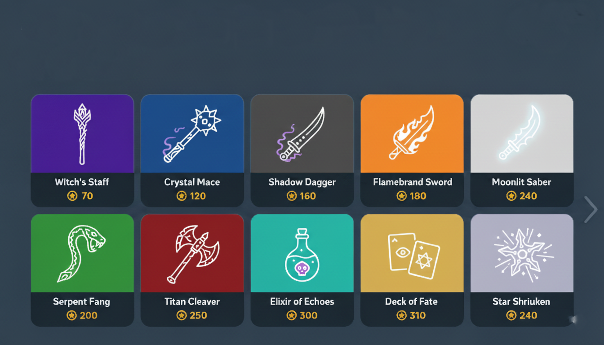

# Horizon Worlds Economics

Welcome to the guide on building a thriving economy in your Horizon Worlds creations! This page covers the essentials of monetization, in-world purchases, and proven economic strategies to help you turn your creativity into a sustainable business.

---

## Introduction

Monetization in Horizon Worlds marks a new era for creators. With the rise of immersive, social 3D spaces, you can now earn real income by designing engaging experiences and offering digital goods to your visitors. Whether you’re building games, social hangouts, or interactive art, Horizon Worlds provides tools to help you monetize through in-world purchases, creator programs, and more.

  <a href="https://youtu.be/x2XXiueAyX0" target="_blank">
    
     
    Watch Horizon Worlds Economics Video
  </a>

---

## Getting Started with Monetization

To monetize your world:
1. Join the **Meta Horizon Creator Program**.
2. Go to the Creator Page → Creator Program → In-World Purchases.
3. Review the terms and conditions.
4. Set up your payout account and business info.
5. Link a payment method.
6. Once approved, you’ll see the **Commerce Tab** in the Horizon Worlds editor.

From there, you can start creating, pricing, and publishing your IWPs.

---

## In-World Purchases

In-world purchases (IWPs) are the backbone of Horizon Worlds’ creator economy. They allow you to sell digital items directly to your visitors, enhancing their experience and supporting your creative work. There are two main types of IWPs:

  
<strong>🔍 Properties</strong>

   

  

 - **Name**: Give your item a short name so players know what it is.  
- **Description**: Add a short explanation about what your item does or why it’s cool.  
- **Thumbnail (optional)**: Upload an image to visually represent your item in the store. Helps it stand out.  
- **Meta Credits**: Turn this on to let players buy your item using Meta Credits (the platform’s virtual currency).  
- **Item Price**: Set how much your item costs. You can choose any value between 25 and 20,000 Meta Credits.  
- **Item Type**: Choose whether your item is a **Durable** or **Consumable**.  
- **Select Asset**: Pick the actual object or feature in your world that this item will unlock or activate.  

### Consumables

Consumables are single-use items that players can activate immediately or save for later. Once consumed, they must be purchased again to use. These are perfect for power-ups, hints, or temporary boosts.

#### Example Consumables in Horizon Worlds
| Item Name       | Description                                | In-Game Use Case                                                                 |
|-----------------|--------------------------------------------|----------------------------------------------------------------------------------|
| Glue Bomb       | Temporarily slows enemies in a tower defense game | Scripted to apply a movement debuff to nearby NPCs for 10 seconds               |
| Hint Token      | Reveals a clue in a puzzle or escape room     | Triggers a visual hint or voice-over when consumed                              |
| Speed Boost     | Increases player movement speed briefly       | Scripted to modify `player.moveSpeed` for 15 seconds                            |
| Flashlight Charge | Powers a flashlight for one use              | Required to toggle flashlight on; consumes one charge per activation            |
| Jump Jet        | Allows a one-time super jump                  | Scripted to temporarily increase `player.jumpSpeed` and apply upward force      |

### Durables

Durables are one-time purchases that stay in the player’s inventory. They can be used across sessions and often serve as cosmetic upgrades or access passes.

#### Example Durables in Horizon Worlds

| Item Name           | Description                                      | In-Game Use Case                                                                 |
|---------------------|--------------------------------------------------|----------------------------------------------------------------------------------|
|Chrono Compass       | A glowing compass that points toward time-sensitive secrets | Unlocks hidden quests, rotating puzzles, or rare events based on real-world time |
| Emote Pack: Dance Pro| Adds new avatar animations and emotes            | Unlocks custom dance moves usable in social hubs or mini-games                  |
| Portal Key           | Grants access to a secret realm or bonus level   | Scripted to teleport players to hidden zones when held or activated             |
| Voice Modulator      | Changes avatar voice pitch or adds effects       | Toggles voice filters in VOIP settings for roleplay or stealth missions         |

  <a href="https://youtu.be/vHrWcKuwjcQ" target="_blank">
    
     
    Watch In-World Purchase Video
  </a>

---

## Economics Strategy

Designing a successful economy in Horizon Worlds isn’t just about selling items—it’s about understanding player behavior, creating value, and building trust. Here’s how to do it right:

### 1. Freshness: Launch Monthly IWPs
Keep your world feeling alive by releasing new items regularly. This creates anticipation and gives returning players something fresh to explore. For example, a seasonal clothing or limited-edition skin tied to a Halloween can drive re-engagement.

### 2. Mix: Offer a Variety of IWPs
Don’t rely on one type of item. Mix items that help the player achieve the same set of goals. This gives players options and lets them choose how they want to engage. A enchanted battle game might sell both “Star Shurikens” (consumables) and “Moonlit Saber” (durables) as weapons.

### 3. Relevancy: Tie IWPs to Core Gameplay
Make sure your items feel meaningful. A “Time Saver Boost” that helps players skip a level is more valuable than a random cosmetic in a puzzle game. The best IWPs solve a problem or enhance the experience.

---

## Pricing Strategy

Horizon Worlds uses **Meta Credits**, ranging from 25 to 2,000 credits. Here’s how to price smart:

- **Different Prices for Everyone:** Sell items at a range of prices (low, medium, and high) so there's something for every budget.
- **Easy First Buys:** Offer cheap items to help new players feel comfortable with making their first purchase.
- **Making Other Items Look like a Good Deal:** Have a few very expensive items for sale. This makes the medium-priced items seem like a better value.
- **Deals for Leftover Coins:** Create special packages or bundles to help players use up the small amount of game coins they have left.

---

## ⚠️ Common Pitfalls to Avoid

- **Overpricing**: New users won’t spend 500 credits on an item they don’t understand. Start small.  
- **Under-delivering**: If your IWP doesn’t match its description or value, players won’t trust future purchases.  
- **Neglecting Updates**: A stale economy leads to drop-off. Keep your store fresh and relevant.  
- **Ignoring Analytics**: Track what sells and what doesn’t. Use that data to refine your strategy.

---

Ready to turn your creativity into currency? Let’s build worlds that inspire—and earn.
