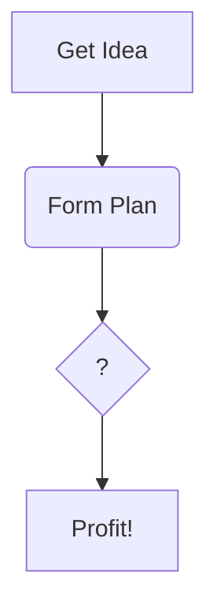

<!-- The title of your document -->
# Add Daily Reward to your world

<!-- Put your name, at least your Horizon Name, as the author -->
Thibaut Quentin (Tquentin)  
<!-- IMPORTANT: Put the date this document was last updated! This is
important information for people to tell how 'stale' this info might 
be.-->
September 05, 2025  

## Introduction

<!-- This section should describe what this document is going to cover. Try to provide some background and motivation as to why a creator would want to read your document. -->

Daily reward is a powerful way to make users come back regularly to your world. It can enhance your game loop with a specific bonus every day that will help achieve more playing time and help to build your monetization with the MHCP Bonus Program [time spent on mobile](https://developers.meta.com/horizon-worlds/learn/documentation/mhcp-program/monetization/bonus-program-overview#time-spent-on-mobile-bonus) and [time spent on headset](https://developers.meta.com/horizon-worlds/learn/documentation/mhcp-program/monetization/bonus-program-overview#time-spent-on-headset-bonus).

In this tutorial, we will learn how to use and set up the [Daily Rewards Asset Template](https://developers.meta.com/horizon-worlds/learn/documentation/code-blocks-and-gizmos/daily-rewards-asset-template) proposed by Meta.

### Prerequisites and Expectations

<!-- This section should indicate any expectations you have of your readers, such as other materials or concepts they should already be familiar with in order to get the most out of your document. -->

The [basic understanding](https://mhcpcreators.github.io/worlds-documentation/docs/understanding-the-desktop-editor/Worlds-desktop-tools-basics) of the Meta Horizon Wolrd desktop editor is needed. But you don't need to have a lot of understanding of TypeScript as everything will be explained with their TypeScript code.

As for every monetization doc, you need to be a member of MHCP and have accepted the monetization Terms of Service in the creator portal in order to create in-world items that we will use. Find out more about monetization [here](https://developers.meta.com/horizon-worlds/learn/documentation/mhcp-program/monetization/creator-monetization-partner-program)

Please note that this documentation is based on the version XXXX of the [Daily Rewards Asset Template](https://developers.meta.com/horizon-worlds/learn/documentation/code-blocks-and-gizmos/daily-rewards-asset-template) and could not work for newer versions.

### Document Organization

<!-- This is an optional section, but possibly useful if your document has an unusual document structure, or needs a table of contents with internal links because it is very long. -->

This document will show you step by step how to implement the daily reward and go further with it.

You can find the quick access link below to each part here:

* [Topic One](#topic-one)
* [Topic Two](#topic-two)
* [References](#references)

## Plan your reward

Before doing anything, you need to plan what you want to achieve with daily rewards, as the [Daily Rewards Asset Template](https://developers.meta.com/horizon-worlds/learn/documentation/code-blocks-and-gizmos/daily-rewards-asset-template) can be configured.

Here are some examples:
- Temporary bonus  
  Every day, the user can gain a one-time bonus, like:
  - a temporary speed boot
  - a daily (24h) coin boost with a multiplier for the user
  - a global (for the entire server) boost the highlight the user name that activated it (to engage more and add player interaction)
    
- Cosmetic  
  Specific cosmetics for users who come every day can be attractive to new users to come daily.
  
- In-game specific currency  
  Gain some in-game coin or experience every day.
  Note that it cannot give Meta Credit, but only your own currency, with a consumable Item that will give it once activated.

For more ideas and best practices, you can follow the [Plan your world guide](https://mhcpcreators.github.io/worlds-documentation/docs/manuals-and-cheat-sheets/plan-your-world-game-design-&-monetization-sheet/)

Once you know what you want for your daily reward, you can start to implement it with the items setup.

## Items setup

In this part, we will add consumable items to our world. If you have already created your item, you can skip this part. 

To add an item, follow the steps of [this official documentation](https://developers.meta.com/horizon-worlds/learn/documentation/mhcp-program/monetization/meta-horizon-worlds-inworld-purchase-guide#creating-an-item). Please note that you need to add every item in the 7-day windows of your daily reward.

## Setup the Daily Reward Asset

Once your items have been configured, we can now add the [Daily Rewards Asset Template](https://developers.meta.com/horizon-worlds/learn/documentation/code-blocks-and-gizmos/daily-rewards-asset-template) and configure it.

### Import 

### Setup persistent variable

This ID is the link with the storage of your world through the [Persistent variables](https://developers.meta.com/horizon-worlds/learn/documentation/desktop-editor/quests-leaderboards-and-variable-groups/variable-groups/managing-persistent-variables-associated-with-a-variable-group) system. It is what allow the world to know where the users are on the daily streak.  
  
It can be configured on the World Editor by going to the Systems > Variable Groups 
  
<photo>  
  
Then create a [Variable Group](https://developers.meta.com/horizon-worlds/learn/documentation/desktop-editor/quests-leaderboards-and-variable-groups/variable-groups/using-variable-groups) with an explicit name (like daily_reward) and add a description to remember what it does later.  
  
<photo>  
  
This group allows the creation of different variables that are linked to each user OR to the world. In this case, we will need to create a Player Persistent Variable (to store the state of the daily reward for each user). So click on the add button:  
  
<photo>  
  
Then choose "Player Persistent Variable", give it a unique name in the group, and select the Data Type "Object" like this:  
  
<photo>  
  
Once created, you will see the added variable in the group view:   
  
<photo>  
  
Finally, you have to click on the "copy" button to copy the complete ID of your variable (it is formatted with group_name:variable_name) and paste it in the Persistent object Variable field of the Daily Reward.
  
### Set the items


Day X Reward SKU: The SKU of an item you want to award the player for logging in on day X.
Day X Reward Quantity: The quantity of the chosen award item to be granted.
Day X Reward Thumbnail: The thumbnail of the chosen award item to be granted.

### Options

The options description can be found on the official documentation [here](https://developers.meta.com/horizon-worlds/learn/documentation/code-blocks-and-gizmos/daily-rewards-asset-template#visual-and-interaction).  

This is some additional information on the most important one that you need to configure: 

#### Id
It's the unique identifier for the current daily reward. If you want to have multiple ones (as detailed above), you need to differentiate each with a different ID.
The ID is a string; it can be whatever you want, but it must be unique.

#### Persistent Object Variable


Once done, your daily reward is now set up properly with your world!

#### Daily Rewards Activation

This indicates whether the daily rewards system is active or not. The daily reward is activated by default. You need to set it to false if you want to activate it dynamically with TypeScript, as detailed in the next sections.


## Configure a trigger

By default, the [Daily Rewards Asset Template](https://developers.meta.com/horizon-worlds/learn/documentation/code-blocks-and-gizmos/daily-rewards-asset-template) adds a UI button to open the reward menu. If you don't want to have this button on the UI, you can trigger it instead with minimal TypeScript code.  

This section will guide you through this process step by step.

The opening of the daily rewards menu is triggered via the event system of Meta Horizon World. To open, we need to send an event to the UI script attached to the desired player.
This is done through the ShowPanel event defined in the Daily Reward Script.
  
To do that, you need to import the PanelEvent in your script:
```ts

import { PanelEvents } from 'daily_rewards_ui';

```

This will allow your script to use the event system with 'PanelEvents.ShowPanel' and 'PanelEvents.HidePanel'.
Both of them require a Player object and a nullable String as id to select a specific one. Please note that if the id is null, every daily reward menu will be shown.  

Then we add the basic Trigger script :
```ts
class StartDailyRewardView extends hz.Component<typeof StartDailyRewardView>{

  start(){
  }
}
hz.Component.register(StartDailyRewardView);
```


But as we mentioned earlier, we need to have the id of the daily reward to be shown. To do this, we add a props definition with a string representing the ID:
```ts
static propsDefinition = {
  id: {type: hz.PropTypes.String},
};
```

Now we have to connect a code block event on our trigger that will send the event when entered in the start function:
```ts
this.connectCodeBlockEvent(this.entity, hz.CodeBlockEvents.OnPlayerEnterTrigger, (player) => {
  this.sendNetworkBroadcastEvent(PanelEvents.ShowPanel, {player: player, id: this.props.id})
})
```

And voilà! You now have a functional script that lets a Trigger Gizmos open your daily reward UI.

At the end, the script will look like that:

```ts

import { PanelEvents } from 'daily_rewards_ui';


/*
 * This class allow a trigger to open a daily reward view with the id in the props definition
 */
class StartDailyRewardView extends hz.Component<typeof StartDailyRewardView>{

  static propsDefinition = {
    id: {type: hz.PropTypes.String},
  };

  start(){
    //Send a showPanel event when a user enter the trigger to open the Daily Reward menu
    this.connectCodeBlockEvent(this.entity, hz.CodeBlockEvents.OnPlayerEnterTrigger, (player) => {
      this.sendNetworkBroadcastEvent(PanelEvents.ShowPanel, {player: player, id: this.props.id})
    })
  }
}
hz.Component.register(StartDailyRewardView);
```

Once done, you just have to add a trigger Gizmos in your world and attach it to ScriptName:StartDailyRewardView and set the id of your Daily Reward.
  

## Have multiple Daily Rewards

Currently, the [Daily Rewards Asset Template](https://developers.meta.com/horizon-worlds/learn/documentation/code-blocks-and-gizmos/daily-rewards-asset-template) could only have a 7-day window, but for some usage, it is not enough. Also, it may be needed to have more than one daily reward schedule with specific rewards each week (in a rotation of some weeks) or multiple rewards for different bonuses.  
This section discusses how to have multiple daily rewards and how to handle it properly.


## Go beyond with TypeScript

If you want more advanced control over what the [Daily Rewards Asset Template](https://developers.meta.com/horizon-worlds/learn/documentation/code-blocks-and-gizmos/daily-rewards-asset-template) does, you can edit the TypeScript file or use a custom script that will interact with your daily reward.


### Manage activated daily reward dynamically

```ts
function myFancyFunction(value: number) {
  console.log(`You chose ${value}!`);
}
```

## Topic One

This is where we discuss the *first* interesting topic of this document.  

### Lists

There might be lists

#### Unordered
- some
  - unordered
  - nested
    - lists
- of
- data

#### Ordered
1. some
   1. ordered
   1. nested
      1. lists
1. of
1. data

### Code

You will likely want to reference code:

```ts
function myFancyFunction(value: number) {
  console.log(`You chose ${value}!`);
}
```

### Images
It might have some images:


## Topic Two

This is where we discuss the **second** interesting topic of this document.

### Tables

An advanced formatting option is tables

| Heading 1 | Heading 2 | Heading 3 |
| --- | --- | --- |
| Data 1 | Data 2 | Data 3 |
| Data 4 | Data 5 | Data 6 |


### Diagrams

Diagrams are a very advanced markdown topic (and may not render correctly in non GitHub previews)



## References

<!-- this is the place to put useful supplementary information, such as references to other websites or documents in the github repo that are relevant to your topic -->

- https://medium.com/shecodeafrica/a-guide-to-technical-writing-7efcd0e70166
  - an article on writing good technical documentation
- https://docs.google.com/presentation/d/14pFo4zP9LvEP5-bG9i-iwCVK0kyMZwrl5VuuxEwtHJI/edit?usp=sharing
  - slidedeck presentation of "Fast-track your Docs with GitHub Templates" Build Along Workshop
