# NPC Enemy Wave System Tutorial

Author: @studiobill

Date: 09/02/2025

## Introduction

In this tutorial, you'll learn how to create **enemy wave systems** using TypeScript and the Horizons Desktop Editor. You'll build melee and ranged enemies that can track players, spawn enemies in “waves” (batches), and scale waves over time to create engaging, long-lasting games.

This tutorial is open to all, but we recommend some familarity with basic world building and coding. In any case, we’ll start from the ground up in an empty world.

- **Creator skill Level:** All levels
- **Required background knowledge:** None required, basic world building and coding recommended
- **Recommended background knowledge:** Horizon Desktop Editor, TypeScript, a code editor

## Learning Objectives

By the end of this tutorial, you’ll have:

- Learned the fundamental concepts of a wave system and why they are useful
- Created melee and ranged enemies that can track players
- Spawned enemies dynamically into the world
- Created your first wave
- Configured waves to spawn automatically and scale over time

## Table of Contents

- [NPC Enemy Wave System Tutorial](#npc-enemy-wave-system-tutorial)
  - [Introduction](#introduction)
  - [Learning Objectives](#learning-objectives)
  - [Table of Contents](#table-of-contents)
  - [Background](#background)
    - [Why wave systems?](#why-wave-systems)
    - [What's in a wave system?](#whats-in-a-wave-system)
  - [Getting Started](#getting-started)
  - [Creating Enemies](#creating-enemies)
    - [Building the melee enemy](#building-the-melee-enemy)
    - [Building the ranged enemy](#building-the-ranged-enemy)
    - [Tracking players](#tracking-players)
    - [Create enemy assets](#create-enemy-assets)
  - [Creating Waves](#creating-waves)
    - [Spawn Points](#spawn-points)
    - [Create a WaveManager](#create-a-wavemanager)
  - [How the Wave Works](#how-the-wave-works)
  - [You Have a Wave System!](#you-have-a-wave-system)
  - [What's Next?](#whats-next)
    - [Wave Scaling \& Progression](#wave-scaling--progression)
    - [Player Progression](#player-progression)
    - [Wave UI/UX](#wave-uiux)
  - [Advanced Techniques](#advanced-techniques)
  - [Thanks for Reading!](#thanks-for-reading)

## Background

Before we get started, let’s make sure we’re on the same page. What’s a wave?

- A **wave** is a game mechanic where entities are spawned in organized batches or “waves”.
- An **enemy wave** spawns entities that are hostile to players.
- A **wave system** is a framework that orchestrates the timing, composition, and progression of multiple waves throughout a gameplay experience.

This tutorial focuses on enemy wave systems, but you can apply the same principles to build any kind of wave system.

### Why wave systems?

We care about wave systems because they’re fun! It's really as simple as that. Waves create a natural sense of progression, and progression improves player engagement and retention.

If you’ve ever played Plants vs. Zombies, Boxhead, or tower defense games, you’re already familiar with wave-based games. Enemy wave systems are commonly used to build:

- **Tower Defense Games**: Waves of enemies follow paths toward your base
- **Survival/Rogue-like Games**: Players defend against increasingly difficult enemy assaults
- **Arena Shooters**: Continuous waves test player endurance and skill
- **Strategy Games**: Timed enemy reinforcements create tactical pressure

### What's in a wave system?

While wave system often differ in their exact details, they all share the same core characteristics.

- **Progressive Difficulty**: Each wave typically becomes more challenging than the last - more enemies, stronger enemies, or different enemy types
- **Breathing Room**: There's usually a brief pause between waves, giving players time to prepare, collect resources, or strategize
- **Enemy Types**: Waves draw from a core set of enemy types (e.g. melee, ranged, fast, slow, etc.), and enemies are designed to complement each other tactically.
- **Structured Spawning**: Instead of having all enemies appear at once, enemies are released in batches with specific timing

We'll keep these principles in mind as we build our own wave system.

## Getting Started

Let's start building! We recommend you start this tutorial in a new world and follow along with the tutorial in order.

1. Create a new world.
2. In `Scripts > Settings > API`, ensure that `horizon/navmesh` is enabled. We'll use this feature later to make our enemies track our players.

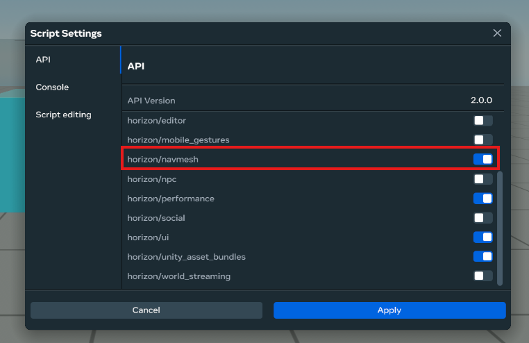

## Creating Enemies

To create our wave system, we need to create our enemies. We'll build two types of enemies: melee and ranged. Melee enemies will damage players on contact. Ranged enemies will fire a projectile at players.

Enemies will be modeled as fearsome 1x1x1 cubes. When they hit a player, they'll simply log a message to the debug console.

The simplicity here is intended to keep the tutorial focused on the wave system itself rather than specific game mechanics. You can get creative with models and hit point logic in your future games!

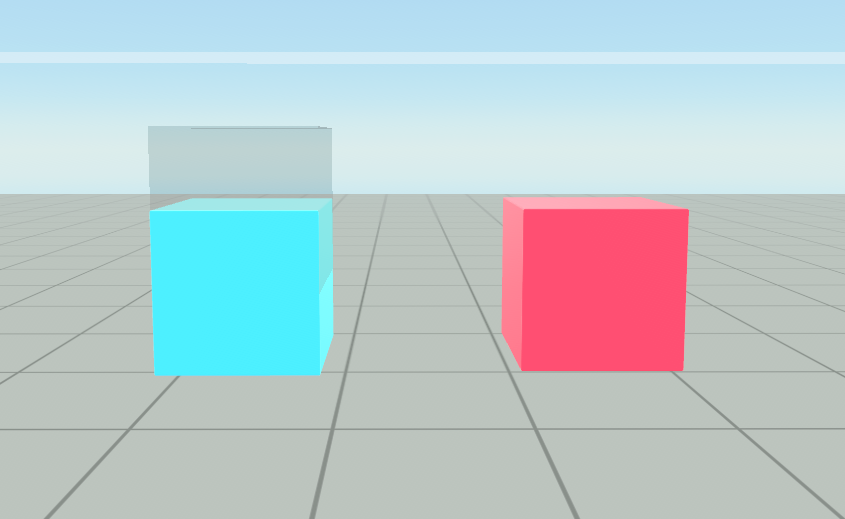

### Building the melee enemy

We'll start with the simpler of the two, the melee enemy. First, we make the enemy model.

1. Create a 1x1x1 cube
2. Color the cube red (just to distinguish it from the ranged enemy later)
3. Name the entity `MeleeEnemy`

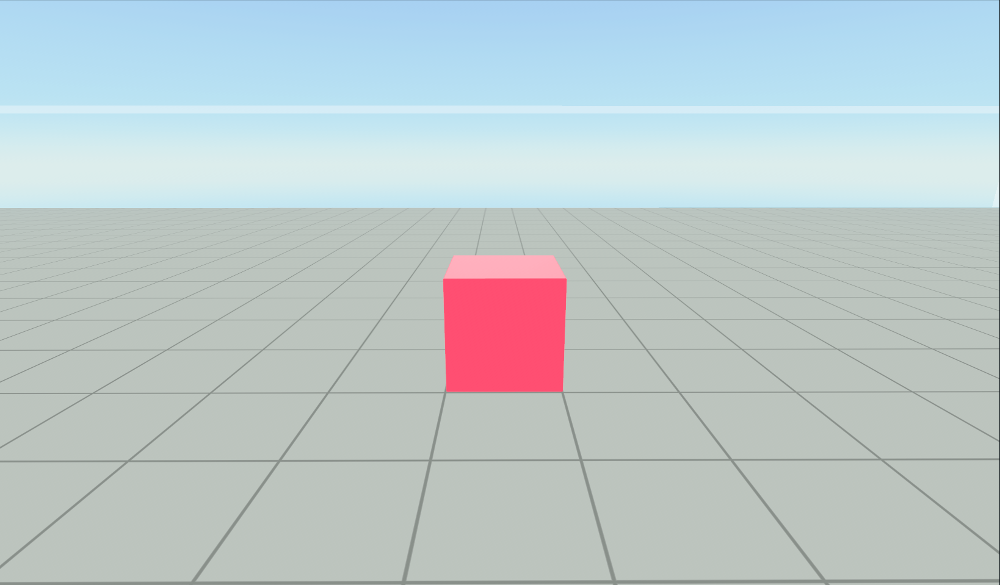

Now let's bring this wonderful, inanimate cube to life with a script!

1. Create a script named `EnemyController` and attach it to `MeleeEnemy`.
2. Use the following code for the script.

- You'll notice there are some commented lines. Ignore these for now. We'll enable and explain these in the later section on getting enemies to track players.

```typescript
import * as hz from "horizon/core";
// import { INavMesh, NavMeshAgent } from 'horizon/navmesh';

export class EnemyController<T> extends hz.Component<
  typeof EnemyController & T
> {
  targetPlayer: hz.Player | null = null;
  lastTargetSwitchTimeMs: number = 0;

  // Navigation - we'll add this later
  // agent!: NavMeshAgent;
  // navmesh!: INavMesh;

  static propsDefinition = {
    targetSwitchCooldown: { type: hz.PropTypes.Number, default: 1000 },
    // Examples of enemy properties that you can create and configure
    hp: { type: hz.PropTypes.Number, default: 100 },
    damage: { type: hz.PropTypes.Number, default: 10 },
  };

  start() {
    this.lastTargetSwitchTimeMs = Date.now();
    // this.agent = this.entity.as(NavMeshAgent)!;
    // this.agent.getNavMesh().then(mesh => {
    //   this.navmesh = mesh!;
    // });
    // this.agent.avoidanceMask.set(this.agent.avoidanceMask.get() & ~NavMeshAgent.Constants.LAYER_PLAYERS)
    // this.agent.avoidanceRadius.set(0.5)

    this.connectLocalBroadcastEvent(
      hz.World.onUpdate,
      this.onUpdate.bind(this)
    );

    // Deal damage on collision
    this.connectCodeBlockEvent(
      this.entity,
      hz.CodeBlockEvents.OnPlayerCollision,
      this.onPlayerCollision.bind(this)
    );
  }

  onUpdate() {
    // Find a target on every cycle
    this.targetPlayer = this.findPlayer();

    if (!this.targetPlayer) return;

    // let targetPos = this.targetPlayer.position.get();
    //
    // if (this.navmesh) {
    //   const nearest = this.navmesh.getNearestPoint(targetPos, 10);
    //   targetPos = nearest ?? targetPos;
    // }
    //
    // this.agent.destination.set(targetPos);
  }

  onPlayerCollision(player: hz.Player) {
    console.log(
      `Enemy hit player ${player.name.get()} for ${this.props.damage} damage`
    );
  }

  private findPlayer() {
    const players = this.world.getPlayers();
    if (players.length === 0) {
      return null;
    }
    const now = Date.now();
    const currentPosition = this.entity.position.get();

    // If we don't have a target, pick a random one
    if (!this.targetPlayer) {
      return this.selectRandomPlayer(players, now);
    }

    // Switch to nearest target if cooldown has passed
    if (now - this.lastTargetSwitchTimeMs >= this.props.targetSwitchCooldown) {
      // Find the nearest player
      let nearestPlayer = players[0];
      let nearestDistance = currentPosition.distance(
        nearestPlayer.position.get()
      );
      for (let i = 1; i < players.length; i++) {
        const distance = currentPosition.distance(players[i].position.get());
        if (distance < nearestDistance) {
          nearestDistance = distance;
          nearestPlayer = players[i];
        }
      }

      // Switch if different from current target
      if (nearestPlayer.id !== this.targetPlayer.id) {
        this.lastTargetSwitchTimeMs = now;
        return nearestPlayer;
      }
    }

    // Keep current target
    return this.targetPlayer;
  }

  private selectRandomPlayer(
    players: hz.Player[],
    currentTime: number
  ): hz.Player {
    const randomIndex = Math.floor(Math.random() * players.length);
    this.lastTargetSwitchTimeMs = currentTime;
    return players[randomIndex];
  }
}
hz.Component.register(EnemyController);
```

This script handles basic enemy behavior: enemies should find and target their nearest player, switch targets periodically, and cause damage when colliding with players. Let's break this down in more detail.

- In the `start()` method, we set up event listeners for the world update cycle and player collisions. On every world update, we determine which player to target.
  - The targeting logic is designed to be intelligent: if there's no current target, it picks a random player. If there is a target, we stay on them but can periodically switch to a nearer player after a cooldown period has elapsed. This prevents enemies from constantly switching targets when multiple players are nearby.
- When a player collision occurs, the `onPlayerCollision()` method logs the damage dealt.
  - In a real world game, the `onPlayerCollision()` could send a damage event to a game and player manager that would then deduct health points from the relevant player.
- The script also includes configurable properties like enemy health, damage, and target switch cooldown which allow you to easily tweak enemy characteristics from the editor. These properties aren't strictly necessary for this tutorial but are very helpful in practice.
- We've set this up as a useful base class: all enemies will need base stats and the ability to target players.
  - Different enemy types can then extend this class and override specific behaviors while inheriting the core targeting logic. We can create a variety of enemies without duplicating code.

Let's test it out! Press play and walk up to your cube. You should see a damage log message when you collide with it.


Now let's switch gears to the ranged enemy.

### Building the ranged enemy

We'll follow a similar process to build the range enemy. The main difference is that we'll add a projectile launcher to give the ranged enemy, well, its range.

1. Create a blue 1x1x1 cube and name it `RangeEnemyModel`
2. Create a projectile launcher gizmo and name it `RangeEnemyProjectileLauncher`

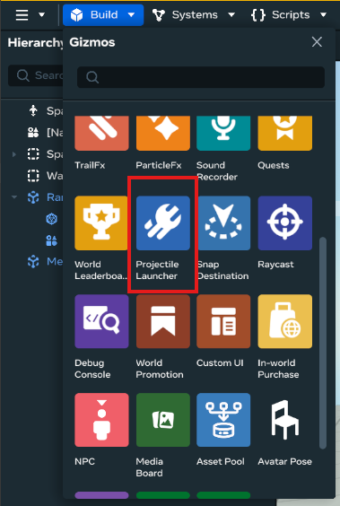

3. Configure the projectile launcher with the following settings. Our enemy will be firing sizable orange spheres: fireballs!

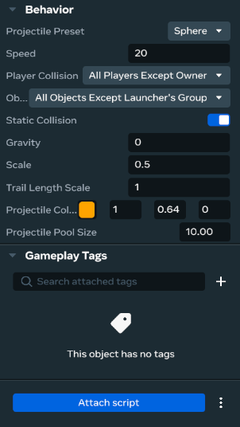

4. Select both model and launcher and group them together in a parent object (Ctrl + G). Name the parent object `RangeEnemy`.

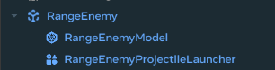

5. Create a script named `RangeEnemyController` and attach it to the parent object `RangeEnemy`. Add the following content to the script.

```typescript
import * as hz from "horizon/core";
import { EnemyController } from "EnemyController";

export class RangeEnemyController extends EnemyController<
  typeof RangeEnemyController
> {
  static propsDefinition = {
    ...EnemyController.propsDefinition,
    projectileLauncher: { type: hz.PropTypes.Entity },
  };

  private projectileLauncher!: hz.ProjectileLauncherGizmo;
  private lastAttackTime: number = 0;
  private attackIntervalSeconds: number = 2;

  start() {
    super.start();

    this.projectileLauncher = this.props.projectileLauncher!.as(
      hz.ProjectileLauncherGizmo
    );

    this.connectCodeBlockEvent(
      this.props.projectileLauncher!,
      hz.CodeBlockEvents.OnProjectileHitPlayer,
      this.onProjectileHitPlayer.bind(this)
    );
    this.connectLocalBroadcastEvent(
      hz.World.onUpdate,
      this.onRangeUpdate.bind(this)
    );
  }

  onProjectileHitPlayer(
    player: hz.Player,
    position: hz.Vec3,
    normal: hz.Vec3,
    headshot: boolean
  ) {
    console.log(
      `RangeEnemy hit player ${player.name.get()} for ${
        this.props.damage
      } damage`
    );
  }

  onRangeUpdate() {
    if (!this.targetPlayer) return;

    const currentTime = Date.now();
    if (
      currentTime - this.lastAttackTime >=
      this.attackIntervalSeconds * 1000
    ) {
      this.attack();
      this.lastAttackTime = currentTime;
    }
  }

  attack() {
    if (!this.targetPlayer) return;

    const targetPos = this.targetPlayer.position.get();
    this.projectileLauncher.lookAt(targetPos);
    this.projectileLauncher.launch({ speed: 12 });
  }
}
hz.Component.register(RangeEnemyController);
```

The RangeEnemyController script builds on our base `EnemyController` class and adds projectile-based combat functionality. By extending `EnemyController`, the range enemy inherits all the targeting and player detection logic we built earlier.

- For ranged combat, the `RangeEnemyController` adds a projectile launcher property to its props definition, allowing us to assign a launcher gizmo from the editor.
- In the `start()` method, we call `super.start()` to inherit the base enemy behavior. Then, we set up our projectile launcher and connect event listeners for projectile hits and our custom update loop.
- The `onRangeUpdate()` method implements a timed attack system
  - `attack()` is called on an interval. The `attack()` method handles the actual shooting: it gets the target player's position, aims the projectile launcher using `lookAt()`, and fires a projectile with a specified speed.
- When projectiles hit players, the `onProjectileHitPlayer()` method logs the damage dealt.
  - In a real game, this would emit an event that can be used to deduct health points and influence game state.

1. Attach the projectile launcher to the `RangeEnemy`'s projectile launcher property

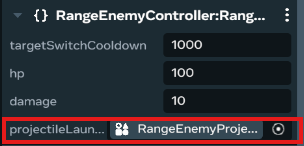

Let's test it out! Press play and stay still. You should see the blue cube firing orange projectiles at you every few seconds. When they hit, a damage log message should appear in the debug console.

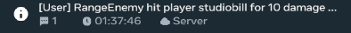

### Tracking players

Great work! We now have two deadly cubes. Unfortunately, they're completely static. We want enemies that track and follow players around the map.

We'll implement this behavior using Horizon's built-in NPC navigation tools. We'll just cover the basics here, but feel free to dive deeper and learn more in the [official navigation documentation](https://developers.meta.com/horizon-worlds/learn/documentation/desktop-editor/npcs/nav-mesh-agents).

1. In `Systems > Navigation`, create a `Navigation Profile` with the following settings.

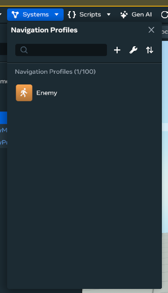

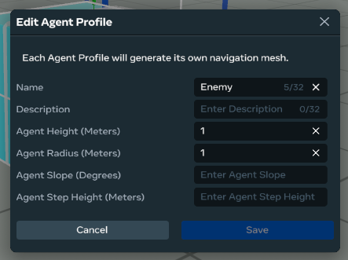

2. For both `MeleeEnemy` and `RangeEnemy`, enable Navigation Locomotion in their properties panel and use the settings in the screenshot below. Then, disable `Navigation > Include in Bakes`.

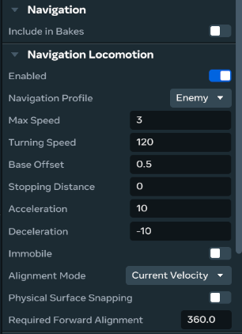

3. Uncomment the previously commented lines in the `EnemyController` script

```diff
import * as hz from 'horizon/core';
+import { INavMesh, NavMeshAgent } from 'horizon/navmesh';

export class EnemyController<T> extends hz.Component<typeof EnemyController & T> {
  targetPlayer: hz.Player | null = null;
  lastTargetSwitchTimeMs: number = 0;

+  // Navigation
+  agent!: NavMeshAgent;
+  navmesh!: INavMesh;

  static propsDefinition = {
    targetSwitchCooldown: { type: hz.PropTypes.Number, default: 1000 },
    // Examples of enemy properties that you can create and configure
    hp: { type: hz.PropTypes.Number, default: 100 },
    damage: { type: hz.PropTypes.Number, default: 10 },
  };

  start() {
    this.lastTargetSwitchTimeMs = Date.now();
+    this.agent = this.entity.as(NavMeshAgent)!;
+    this.agent.getNavMesh().then(mesh => {
+      this.navmesh = mesh!;
+    });
+    this.agent.avoidanceMask.set(this.agent.avoidanceMask.get() & ~NavMeshAgent.Constants.LAYER_PLAYERS)
+    this.agent.avoidanceRadius.set(0.5)

    this.connectLocalBroadcastEvent(hz.World.onUpdate, this.onUpdate.bind(this));

    // Deal damage on collision
    this.connectCodeBlockEvent(this.entity, hz.CodeBlockEvents.OnPlayerCollision, this.onPlayerCollision.bind(this));
  }

  onUpdate() {
    // Find a target on every cycle
    this.targetPlayer = this.findPlayer();

    if (!this.targetPlayer) return;

+    let targetPos = this.targetPlayer.position.get();
+
+    if (this.navmesh) {
+      const nearest = this.navmesh.getNearestPoint(targetPos, 10);
+      targetPos = nearest ?? targetPos;
+    }
+
+    this.agent.destination.set(targetPos);
  }
```

4. Create a Navigation Volume gizmo.

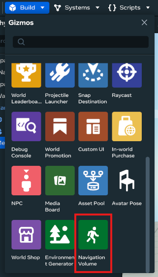

5. Configure the Navigation Volume with the following settings to center it at the origin and scale it to cover the entire map.

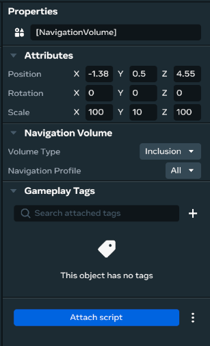

6. In `Systems > Navigation`, "bake" your navigation profile so it adheres to the new navigation volume. You can preview the resulting mesh by clicking the `eye` icon: if all is good, you'll see an orange space covering the entire map.

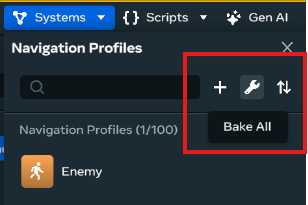

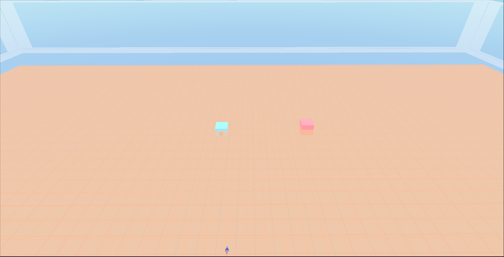

Ok, that was a lot! Let's break down the key concepts at a high level.

- **Navigation Volume**: This defines the 3D space where enemies are allowed to move. It's like drawing boundaries on a map. Enemies can pathfind within this area but won't try to go outside it.
- **Navigation Profile**: This defines basic properties (e.g. size) of an entity that will be used to calculate pathfinding within a navigation volume.
- **Navigation Locomotion**: This allows your entity to act as a navigation agent and defines its movement "personality". Configuring speed, turning, acceleration, etc. creates distinct styles of movement.
- **Agent Pathfinding**: In the script, we can simply give our enemy a destination to navigate towards. Under the hood, the navigation system calculates the best route to reach the target player, automatically avoiding walls and obstacles using the final navigation mesh.

We end up with enemy movement that looks natural and responds to your world without you having to manually implement pathfinding.

Start the game, and you should see the two enemies come alive! They'll follow you as you run around.

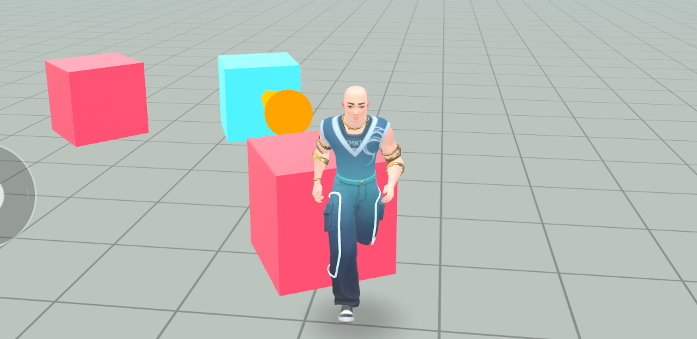

### Create enemy assets

Lastly, we'll need to turn our enemies into game assets. This will allow us to spawn enemies into the game dynamically. Right click on each enemy in the hierarchy menu and click "Create Asset". Once created, you'll be able to see the enemy assets in your Asset Library.

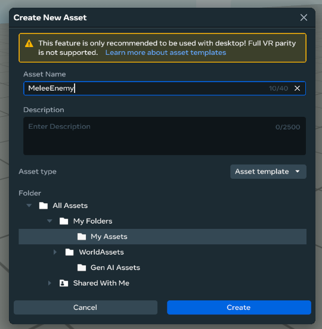

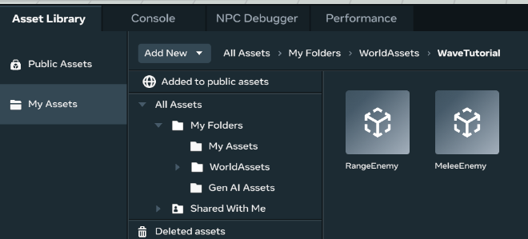

We can delete the enemies from our world for now. We'll spawn them in dynamically rather than have them pre-populated.

## Creating Waves

With our enemies constructed, we can start building our wave system!

### Spawn Points

First things first, our enemies need places to spawn. When deciding where to spawn enemies, keep these principles in mind:

- **Distance from Players**: Place spawn points far enough that players can't immediately attack or be attacked by spawning enemies
- **Multiple Angles**: Surround the play area to prevent predictable enemy approaches
- **Line of Sight**: Avoid placing spawn points behind walls where players can't see incoming threats
- **Accessibility**: Ensure spawned enemies can reach the play area without getting stuck

For the sake of this tutorial, we'll create 4 spawn points arranged around the default player spawn point.

- Create 4 empty objects.
- Label the objects `SpawnPosition1`, `SpawnPosition2`, and so on.

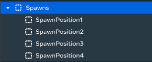

- Position one spawn at each of these coordinates (x, y, z)
  - [10, 0, -10]
  - [-10, 0, 10]
  - [-10, 0, -10]
  - [10, 0, 10]

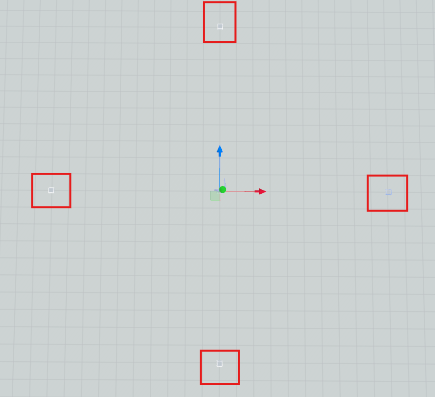

### Create a WaveManager

We have enemies and we have spawn points, and now we need to tie them together. We can do so with a script that manages spawning, wave timing, and wave scaling/progression. We'll call this script the **wave manager**.

- Create a script named `WaveManager` with the following contents.

```typescript
import * as hz from "horizon/core";

export type EnemyType = "melee" | "range";

export type Wave = {
  [enemyType in EnemyType]: number;
};

export class WaveManager extends hz.Component<typeof WaveManager> {
  static propsDefinition = {
    meleeEnemy: { type: hz.PropTypes.Asset },
    rangeEnemy: { type: hz.PropTypes.Asset },
    secondsBetweenWaves: { type: hz.PropTypes.Number, default: 10 },
    spawnDelay: { type: hz.PropTypes.Number, default: 2 },

    spawnPosition1: { type: hz.PropTypes.Entity },
    spawnPosition2: { type: hz.PropTypes.Entity },
    spawnPosition3: { type: hz.PropTypes.Entity },
    spawnPosition4: { type: hz.PropTypes.Entity },
  };

  currentWave: number = 0;
  lastWaveTime: number = 0;
  activeEnemies: hz.Entity[] = [];
  spawnPositions: hz.Vec3[] = [];
  despawnTime: number = 0;
  isWaitingToSpawn: boolean = false;

  start() {
    this.connectLocalBroadcastEvent(
      hz.World.onUpdate,
      this.onUpdate.bind(this)
    );

    this.spawnPositions = [
      this.props.spawnPosition1!.position.get(),
      this.props.spawnPosition2!.position.get(),
      this.props.spawnPosition3!.position.get(),
      this.props.spawnPosition4!.position.get(),
    ];
  }

  async onUpdate() {
    const now = Date.now();

    // Check if it's time to start a new wave cycle
    if (
      !this.isWaitingToSpawn &&
      now - this.lastWaveTime > this.props.secondsBetweenWaves * 1000
    ) {
      this.despawnTime = now;
      this.isWaitingToSpawn = true;
      this.despawnActiveEnemies();
    }

    // Check if spawn delay has passed after despawning
    if (
      this.isWaitingToSpawn &&
      now - this.despawnTime > this.props.spawnDelay * 1000
    ) {
      this.isWaitingToSpawn = false;
      this.lastWaveTime = now;
      this.spawnWave();
      this.currentWave++;
    }
  }

  spawnWave() {
    const wave = this.getWave();

    // Based on the wave configuration, create an array of enemies to spawn
    const enemies: EnemyType[] = [];
    for (let i = 0; i < wave.melee; i++) {
      enemies.push("melee");
    }
    for (let i = 0; i < wave.range; i++) {
      enemies.push("range");
    }

    // Spawn enemies
    for (let enemy of enemies) {
      const spawnPosition = this.getRandomSpawnPosition();
      // Add random position jitter to avoid enemies spawning on top of each other
      const jitter = new hz.Vec3(
        (Math.random() - 0.5) * 4,
        0, // Keep same height
        (Math.random() - 0.5) * 4
      );

      this.world
        .spawnAsset(
          enemy === "melee" ? this.props.meleeEnemy! : this.props.rangeEnemy!,
          spawnPosition.add(jitter)
        )
        .then((enemy) => {
          this.activeEnemies.push(enemy[0]);
          console.log(`Spawned enemy`, enemy, this.activeEnemies);
        });
    }
  }

  // This is where we configure waves.
  // This is the simplest configuration: simply increase the number of enemies in each wave according to the current wave number.
  // More advanced wave configuration is possible. For example, we could add randomness, customize enemy distribution per wave, define special boss waves, make enemies stronger per wave, and so on.
  getWave() {
    return {
      melee: this.currentWave + 1,
      range: this.currentWave + 1,
    };
  }

  getRandomSpawnPosition() {
    return this.spawnPositions[
      Math.floor(Math.random() * this.spawnPositions.length)
    ];
  }

  async despawnActiveEnemies() {
    for (let enemy of this.activeEnemies) {
      if (enemy.exists()) {
        this.world.deleteAsset(enemy).then(() => {
          this.activeEnemies = this.activeEnemies.filter((e) => e !== enemy);
        });
      }
    }
  }
}
hz.Component.register(WaveManager);
```

There's a lot going on here! We'll pick apart the details in the next section and focus on finishing the set up for now.

- Create an empty object labelled `WaveManager` and attach the wave manager script to the object.

- Configure the wave manager script properties with the enemy assets and spawn positions we defined.

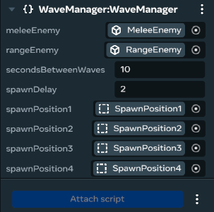

## How the Wave Works

Ok, let's break down what's going on in the script.

The WaveManager script serves as the central orchestrator for our entire wave system. It manages enemy spawning, wave timing, and progression.

- The script tracks key state information: current wave number, active enemies in the world, spawn positions, and timing data for wave cycles.
- In the `start()` method, we initialize spawn positions from the assigned entities and begin the first wave cycle.
- The `onUpdate()` method runs every frame and implements our wave timing logic. It checks if enough time has passed since the last wave, triggers enemy despawning, waits for a spawn delay, then spawns the next wave.
- The `spawnWave()` method uses the `getWave()` configuration to determine how many enemies to spawn, then creates them at random spawn positions with alternating enemy types.
- The `despawnActiveEnemies()` method cleans up existing enemies before starting a new wave, preventing the world from becoming overcrowded.
- The wave configuration in `getWave()` implements our progression system by scaling enemy counts based on the current wave number, creating the escalating difficulty that keeps players engaged.

The script follows the key principles of wave system design mentioned in the introduction:

- **Progressive Difficulty**: We increase the number of enemies per wave.
- **Breathing Room**: The 2 second pause between spawning waves.
- **Enemy Types**: We spawn melee and ranged enemies.
- **Structured Spawning**: Enemies are spawned in randomized order and released one after another.

## You Have a Wave System!

Press play and see your world come to life!

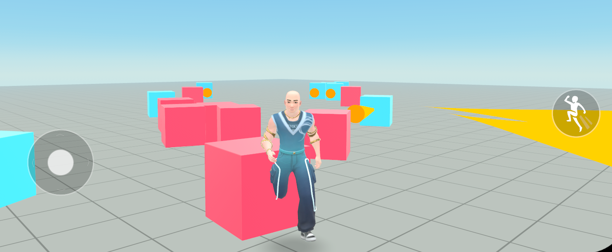

You now have all the basic building blocks of a wave system assembled: enemies that can track players, wave spawning, and a progression system. You can now take these fundamental principles and construct any wave-based game you'd like. Congrats!

## What's Next?

We're done with the world building and technical portion of this tutorial. From here on, we'll focus on giving you advice and inspiration for how you can extend the wave system going forward. These are just suggestions! The possibilities are endless, and you should explore what you find fun!

### Wave Scaling & Progression

Our wave scaling is incredibly simple at the moment. Here are a few examples of ways we can make our waves more interesting.

- **Enemy distributions**: Adjust which types of enemies appear in each wave to keep gameplay fresh and challenging. For example, you might start with only melee enemies in early waves, introduce ranged enemies in later waves, or alternate enemy types as the game progresses.

```typescript
// Example: Simple enemy distribution patterns
getWave(): Wave {
  const wave = this.currentWave + 1;

  if (wave <= 3) {
    // Early waves: only melee
    return { melee: wave, range: 0 };
  } else {
    // Later waves: mixed enemies
    return { melee: wave, range: Math.floor(wave / 2) };
  }
  // and so on ...
}
```

- **Upgrade enemies**: Gradually increase the strength of enemies as waves progress by upgrading their stats (such as health, damage, or speed) over time. This keeps the game challenging and ensures that players must adapt their strategies as enemies become tougher in later waves.

```typescript
// Example Code

/**
 * Returns simple buffed enemy stats for a given wave.
 * Health and damage both increase linearly with wave number.
 */
public getBuffedEnemyStats(waveNumber: number) {
  const hp = 100 + waveNumber * 20;
  const damage = 10 + waveNumber * 3;
  return { hp, damage };
}

// Example usage:
const stats = this.getBuffedEnemyStats(currentWave);
// Pass stats.hp and stats.damage to spawned enemies
```

- **Special waves and boss fights**: Introducing milestone waves (e.g. every 5th or 10th wave) adds excitement and variety. These can feature unique challenges like powerful boss enemies with special abilities, swarms of fast low-HP foes, or waves with altered enemy behaviors. Special waves break up the regular rhythm, test player adaptability, and provide memorable moments that keep gameplay engaging.

### Player Progression

As enemy waves become more challenging, it's important to give players opportunities to grow stronger as well. Consider implementing player progression systems—such as upgrades, new abilities, or power-ups—so players can keep up with increasing wave difficulty and stay engaged throughout the game. Here are a few specific examples:

- **Weapon Upgrades**: Allow players to unlock or purchase new weapons, such as a rapid-fire blaster, explosive grenades, or a powerful laser beam, each offering unique ways to deal with tougher enemy waves.
- **Ability Enhancements**: Introduce special abilities like temporary shields, speed boosts, or area-of-effect attacks that players can earn or upgrade between waves to help them survive as difficulty increases.
- **Health and Resource Pickups**: Place health packs, energy boosts, or ammo refills around the map or as rewards for defeating enemies, giving players a way to recover and prepare for the next wave.
- **Leveling Up**: Implement a player leveling system where players gain experience points (XP) for defeating enemies. Upon leveling up, increase the player's base stats (such as max health, movement speed, or damage output), making them more resilient and powerful as waves progress.

### Wave UI/UX

Wave systems benefit from informative user interfaces. Players can use a UI to track wave progress, see how many enemies remain, monitor countdowns to the next wave, and receive alerts about special events or boss appearances. A clear UI helps players strategize effectively and feel more engaged as the action unfolds. Here are some specific features to build:

- **Wave Indicator**: Show the current wave number and a countdown timer for the next wave, so players know what to expect and can prepare.
- **Enemy Counters**: Display the number of remaining enemies in the current wave, helping players track their progress.
- **Health and Status Bars**: Add visible health bars for both players and enemies, and use status icons or effects to indicate buffs, debuffs, or special enemy types.
- **Notifications and Alerts**: Use pop-up messages or banners to announce special waves, boss appearances, or when a new ability is unlocked.
- **Accessible Controls**: Ensure that UI elements are easy to read, well-positioned, and usable on different devices or screen sizes.

## Advanced Techniques

Wave systems can have significant impact on game performance, especially in later waves when there are many enemies. Spawning and despawning assets is expensive. Custom UIs are expensive. Consider the following techniques to optimize your worlds as they grow.

- **Spawn Pooling**: Rather than spawn and despawn throughout the game, spawn all enemy assets upfront in an asset pool at the start. Then, simply use enemies from this pool to populate the game (non-active enemies are rendered invisible and moved off screen).
- **UI optimizations**: UIs with many variable bindings and updates can be taxing. [Read this guide to understand best practices and avoid anti-patterns](https://developers.meta.com/horizon-worlds/learn/documentation/performance-best-practices-and-tooling/performance-best-practices/custom-ui-optimization).
- **Tracing**: For fine grained performance tuning, [record a trace](https://developers.meta.com/horizon-worlds/learn/documentation/performance-best-practices-and-tooling/performance-tools/tracing) and analyze it to understand where your game is spending most of its compute time.

## Thanks for Reading!

You made it all the way through, congratulations! We can't wait to see what amazing worlds you build.
